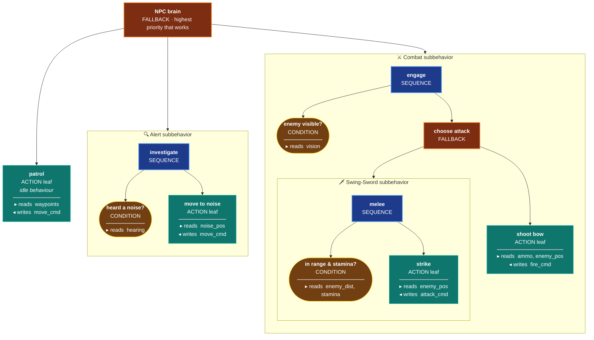
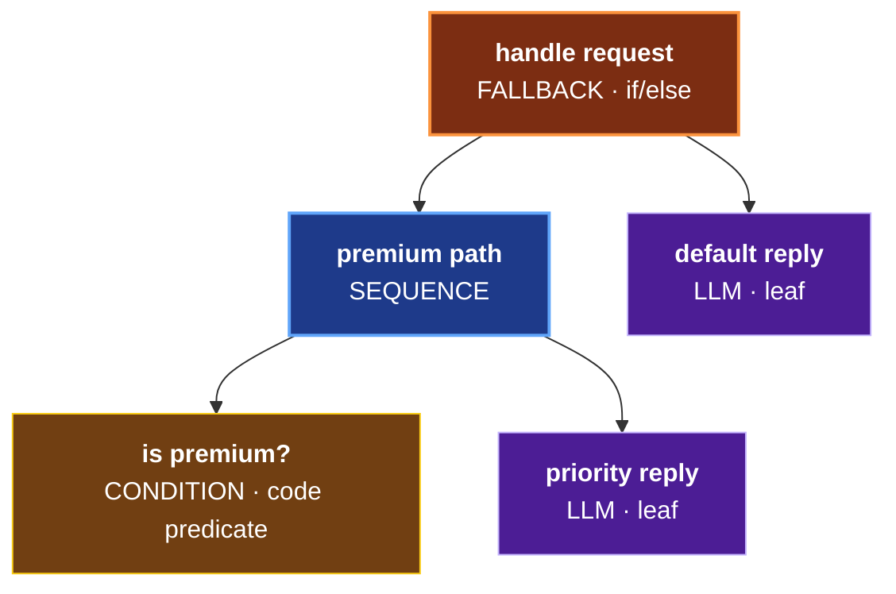
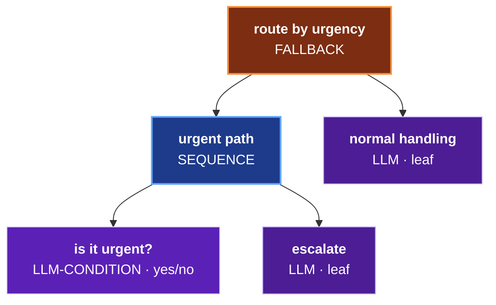

# ORC

**Orchestrator** — a behavior-tree workflow execution engine built on [Grain](https://github.com/ObneyAI/grain).

ORC provides composable primitives for building, executing, optimizing, and evaluating LLM-powered workflows. It's designed as a library that consumers pull in as a git dependency.

Behavior trees have run game NPCs and robots for decades. The tree ticks **top-down, root first**; every leaf **reads** the blackboard (sensor / world state) and **writes** an action or command — and whole behaviors *stack* as reusable subbehaviors (here a **Swing-Sword** tree nests inside **Combat**, which sits under the **brain**):



**ORC is the same machine for LLM work** — same composites, same top-down tick, same reads/writes contracts, same subbehavior stacking. The leaves just call an LLM or sandboxed code, the blackboard holds *your* data instead of joint angles, and a stacked subbehavior is a `:delegate`. Here's a real ORC workflow — note `route by type` (a `fallback`, like *choose attack*), the `repl-researcher` leaf, and the **NDA review** subbehavior peeked-inside (the `:delegate` equivalent of *Swing-Sword* nesting under *Combat*):

```mermaid
flowchart TB
  root["<b>contract-analysis</b><br/>FALLBACK"]:::fb
  root --> main
  root --> human["<b>escalate to human</b><br/>LLM · leaf<br/><i>hand off when unsure</i><hr/>▸ reads&nbsp;&nbsp;contract<br/>◂ writes&nbsp;&nbsp;summary"]:::llm
  subgraph MAIN["seq: analyze"]
    direction TB
    main["<b>analyze</b><br/>SEQUENCE"]:::seq
    main --> survey["<b>survey</b><br/>LLM · leaf 1<br/><i>extract key clauses</i><hr/>▸ reads&nbsp;&nbsp;contract<br/>◂ writes&nbsp;&nbsp;survey"]:::llm
    main --> diff["<b>diff vs prior</b><br/>LLM · leaf 2<br/><i>find changed terms</i><hr/>▸ reads&nbsp;&nbsp;survey<br/>◂ writes&nbsp;&nbsp;diff"]:::llm
    main --> route["<b>route by type</b><br/>FALLBACK · leaf 3"]:::fb
    main --> risk["<b>quantify risk</b> &#9662;<br/>REPL-RESEARCHER · leaf 4<br/><i>RLM designs + runs a subtree</i><hr/>▸ reads&nbsp;&nbsp;diff, survey<br/>◂ writes&nbsp;&nbsp;risk_class"]:::rlm
    main --> persist["<b>persist findings</b><br/>CODE · leaf 5<br/><i>write record via sci</i><hr/>▸ reads&nbsp;&nbsp;summary, risk_class<br/>◂ writes&nbsp;&nbsp;record"]:::code
    route --> isNDA{{"<b>is it an NDA?</b><br/>LLM-CONDITION<br/><i>route on yes / no</i><hr/>▸ reads&nbsp;&nbsp;contract"}}:::llmc
    isNDA --> NDA
    route --> summarize["<b>summarize clauses</b><br/>LLM · leaf<br/><i>plain-language brief</i><hr/>▸ reads&nbsp;&nbsp;diff<br/>◂ writes&nbsp;&nbsp;summary"]:::llm
    subgraph NDA["delegate → NDA review&nbsp;(peek inside) &#9662;"]
      direction TB
      ndaRoot["<b>NDA review</b><br/>SEQUENCE"]:::seq
      ndaRoot --> parties["<b>extract parties</b><br/>LLM · leaf<br/><i>who is bound</i><hr/>▸ reads&nbsp;&nbsp;contract<br/>◂ writes&nbsp;&nbsp;parties"]:::llm
      ndaRoot --> conf["<b>confidentiality check</b><br/>CODE · leaf<br/><i>required clauses present?</i><hr/>▸ reads&nbsp;&nbsp;contract<br/>◂ writes&nbsp;&nbsp;conf_ok"]:::code
    end
  end
  classDef fb fill:#7c2d12,stroke:#fb923c,color:#fff,stroke-width:2px;
  classDef seq fill:#1e3a8a,stroke:#60a5fa,color:#fff,stroke-width:2px;
  classDef llm fill:#4c1d95,stroke:#c4b5fd,color:#fff;
  classDef llmc fill:#5b21b6,stroke:#ddd6fe,color:#fff;
  classDef code fill:#0f766e,stroke:#5eead4,color:#fff;
  classDef rlm fill:#9d174d,stroke:#f9a8d4,color:#fff,stroke-width:2px;
```



*Game `condition` → ORC `llm-condition`; game `ACTION` → an `llm`/`code` leaf; game sensors/commands → blackboard keys you **read** and **write**; a stacked game subbehavior → a `:delegate`. If you can read the game tree, you can read the ORC one. That's the entire mental model — see the [full contract-analysis walkthrough](docs/GETTING-STARTED.md).*

> **Early-stage software.** ORC is under active development. Expect sharp edges and breaking changes — APIs, event schemas, and conventions may shift between commits. Pin to a specific `:git/sha` and review the diff before updating. Expect incomplete docs, use at your own peril!

## New here?

Start with **[docs/GETTING-STARTED.md](docs/GETTING-STARTED.md)** — a progressive contract-analysis walkthrough from bare behavior tree through judges, GEPA, ontology, and self-improvement.

## Pick your package

ORC ships as standalone packages — **you pull in exactly ONE package and it
bundles every component that capability needs** (transitively). You don't
assemble components by hand. Find the row that matches what you want, then add
one dependency: give it the lib name shown and point `:deps/root` at the project.

| I want… | Pull this package | Heavy deps |
|---|---|:--:|
| Just run behavior trees (the engine) | `obneyai/orc-service` → `projects/orc-service` | — |
| …plus LLM-as-judge evaluation | `obneyai/orc-evaluation` → `projects/orc-evaluation` | — |
| …plus GEPA prompt optimization | `obneyai/orc-gepa` → `projects/orc-gepa` | — |
| …plus concept graph + DJL embeddings | `obneyai/orc-ontology` → `projects/orc-ontology` | DJL (JVM) |
| …plus ColBERT retrieval (added to ontology) | also `obneyai/orc-colbert` → `projects/orc-colbert` | Python |
| …plus MCP-driven tree generation | `obneyai/orc-mcp-sheet-builder` → `projects/orc-mcp-sheet-builder` | — |
| **Everything** / the full self-improving loop | `obneyai/orc` → `projects/orc` | DJL + Python |

```clojure
;; deps.edn — pick ONE row above; use its lib name + :deps/root
obneyai/orc-evaluation {:git/url "https://github.com/ObneyAI/orc.git"
                        :git/sha "..."                    ;; pin to a reviewed commit
                        :deps/root "projects/orc-evaluation"}
```

Every non-leaf package bundles the engine (`orc-service`) transitively, so the
require namespaces are the same whichever you pick. The only time you add a
*second* package is ColBERT (pull `orc-ontology` **and** `orc-colbert` — distinct
lib names so the keys don't collide). Full per-package detail and the
ontology+colbert combination live in **[docs/PACKAGES.md](docs/PACKAGES.md)**; the
layer → internal-component mapping and dependency graph live in
**[docs/COMPONENT-MAP.md](docs/COMPONENT-MAP.md)**.

> **Self-improving loop is alpha-stage.** The full loop (`:auto-classify?` +
> `:recursive?`) works end-to-end on workflows that align with the shipped seed
> corpus, but force-fit classifications appear on out-of-distribution tasks. It
> needs the ColBERT Python bridge. See [docs/SELF-IMPROVING-LOOP.md](docs/SELF-IMPROVING-LOOP.md)
> for an honest current-state breakdown.

> **RLM recursive mode is now the default.** `:repl-researcher` nodes default to
> `{:rlm {:recursive? true}}`; terminal mode (`:rlm true` / `:rlm {:recursive? false}`)
> is deprecated and will be removed.

## Quick Start

Add the package you picked above to your `deps.edn`. The umbrella (`obneyai/orc`
→ `projects/orc`) gives you everything to start experimenting; swap it for a
leaner package (e.g. `obneyai/orc-service`) once you know which layers you need:

```clojure
obneyai/orc {:git/url "https://github.com/ObneyAI/orc.git"
             :git/sha "..."
             :deps/root "projects/orc"}
```

```clojure
(require '[ai.obney.orc.orc-service.interface :as orc])

;; Define a workflow using the DSL
(def my-workflow
  (orc/workflow "summarizer"
    (orc/blackboard
      {:input   :string
       :summary :string})
    (orc/sequence "main"
      (orc/llm "summarize"
        :instruction "Summarize the input text in 2 sentences."
        :reads [:input]
        :writes [:summary]))))

;; Build it (idempotent — no-op if definition hasn't changed)
(orc/build-workflow! ctx my-workflow)

;; Execute it
(orc/execute ctx sheet-id {:input "Long article text..."})
;; => {:status :success, :outputs {:summary "..."}, :duration-ms 1234}
```

## Components

The full opt-in layer table, dependency graph, and known issues live in **[docs/COMPONENT-MAP.md](docs/COMPONENT-MAP.md)**. For judge architecture, rubric design, and custom judge patterns see **[docs/JUDGE-ARCHITECTURE.md](docs/JUDGE-ARCHITECTURE.md)**.

| Component | Namespace | Purpose |
|-----------|-----------|---------|
| **orc-service** | `ai.obney.orc.orc-service` | Core behavior tree execution, DSL, versioning, event sourcing |
| **gepa** | `ai.obney.orc.gepa` | LLM instruction optimization with Pareto frontier selection |
| **evaluation** | `ai.obney.orc.evaluation` | LLM-as-judge evaluation (grounding, reasoning, completeness) |
| **colbert** | `ai.obney.orc.colbert` | Late-interaction retrieval via Python ColBERT bridge |
| **ontology** | `ai.obney.orc.ontology` | Three-layer concept graph with embeddings and pattern discovery |
| **mcp-sheet-builder** | `ai.obney.orc.mcp-sheet-builder` | Dynamic workflow generation from MCP tool schemas |
| **langfuse** | `ai.obney.orc.langfuse` | Observability and tracing integration |

## Architecture

ORC is built on the **Grain** event-sourcing framework (CQRS pattern):

```
Commands -> Events -> Read Models -> Queries
               |
               v
         Todo Processors (side effects)
```

- **Sheets** are behavior trees stored as event streams
- **Nodes** are composable: `sequence`, `fallback`, `parallel`, `map-each`, `llm`, `code`, `condition`, `repl-researcher`
- **Execution** dispatches through the command processor, runs asynchronously via todo processors, and delivers results through a completion registry
- **Versioning** supports draft/published modes with stash/restore
- **The DSL** provides a declarative API for building workflows without touching events directly

### Execution Flow

```
1. orc/execute dispatches :sheet/tick-tree command
2. Command creates execution snapshot (isolated blackboard)
3. Event triggers todo processor (async)
4. Processor walks the behavior tree:
   - sequence: run children in order, fail on first failure
   - fallback: run children in order, succeed on first success
   - parallel: run children concurrently
   - llm: call LLM via DSCloj
   - code: evaluate Clojure via SCI
   - repl-researcher: iterative code generation + MCP tool calling
5. Result delivered via completion promise
```

### Optimization Loop (GEPA)

```
1. Define metric functions (exact-match, contains, judge-based)
2. Start optimization with training examples
3. GEPA proposes instruction variants
4. Evaluates candidates against metrics
5. Pareto frontier selection (multi-objective)
6. Repeat until budget exhausted
```

## Node Types

| Node | Type | Description |
|------|------|-------------|
| `orc/sequence` | Composite | Run children in order. Fails on first failure. |
| `orc/fallback` | Composite | Run children in order. Succeeds on first success. |
| `orc/parallel` | Composite | Run all children concurrently. |
| `orc/map-each` | Composite | Map a subtree over a collection input. |
| `orc/llm` | Leaf | Call an LLM with instruction + inputs -> outputs. |
| `orc/code` | Leaf | Execute Clojure code (SCI sandbox). |
| `orc/condition` | Leaf | Branch based on code predicate. |
| `orc/llm-condition` | Leaf | Branch based on LLM yes/no judgment. |
| `orc/repl-researcher` | Leaf | Iterative: generate code, call MCP tools, refine. |
| `orc/delegate` | Leaf | Execute another workflow with isolated blackboard. |

These compose into real control flow. A `fallback` that tries a guarded `sequence` first and falls back to a default sibling is classic if/else:



Swap the code `condition` for an `llm-condition` and the same shape becomes LLM-driven routing:



And the flagship leaf, `repl-researcher`, is a whole two-phase reasoning loop that drops into a tree like any other node — see the [RLM Guide](docs/RLM-GUIDE.md):

```mermaid
flowchart TB
  seq["<b>pipeline</b><br/>SEQUENCE"]:::seq
  seq --> prep["<b>prep input</b><br/>LLM · leaf<br/><i>normalize the request</i>"]:::llm
  seq --> rlm["<b>investigate</b> &#9662;<br/>REPL-RESEARCHER · leaf<br/><i>two-phase: designs + runs its own subtree</i>"]:::rlm
  seq --> fin["<b>finalize</b><br/>CODE · leaf<br/><i>assemble the answer</i>"]:::code
  classDef seq fill:#1e3a8a,stroke:#60a5fa,color:#fff,stroke-width:2px;
  classDef llm fill:#4c1d95,stroke:#c4b5fd,color:#fff;
  classDef code fill:#0f766e,stroke:#5eead4,color:#fff;
  classDef rlm fill:#9d174d,stroke:#f9a8d4,color:#fff,stroke-width:2px;
```



## Development Setup

### Prerequisites

- **Java 21+** (with module access for LMDB)
- **Clojure CLI** (`brew install clojure/tools/clojure`)
- **Python 3.10+** (optional, for ColBERT semantic search)

### Getting Started

```bash
# Clone
git clone git@github.com:ObneyAI/orc.git && cd orc

# Start nREPL (includes JVM flags for LMDB)
./scripts/nrepl.sh
```

### Running Tests

```bash
clj -M:poly test                     # changed bricks only
clj -M:poly test :all-bricks         # all bricks
clj -M:poly test brick:orc-service   # specific brick
```

### ColBERT Setup (Optional)

ColBERT provides late-interaction semantic retrieval. It requires a separate Python environment:

```bash
./scripts/setup-colbert.sh
```

This creates `.venv-colbert/` with RAGatouille, PyTorch, and sentence-transformers. The Clojure `colbert` component communicates with Python via `scripts/colbert_bridge.py` (subprocess JSON-RPC).

### Project Structure

```
orc/
├── CLAUDE.md                  # AI assistant instructions
├── README.md
├── deps.edn                   # Dev alias + Polylith config
├── workspace.edn              # Polylith workspace (top-ns: ai.obney.orc)
├── python.edn                 # libpython-clj config
├── requirements.txt           # Python dependencies
├── scripts/
│   ├── colbert_bridge.py      # ColBERT Python subprocess
│   └── setup-colbert.sh       # ColBERT environment setup
├── components/
│   ├── orc-service/           # Core execution engine
│   ├── gepa/                  # Prompt optimization
│   ├── evaluation/            # LLM-as-judge
│   ├── colbert/               # Semantic retrieval
│   ├── ontology/              # Concept graph
│   ├── mcp-sheet-builder/     # MCP workflow generation
│   ├── langfuse/              # Observability
│   └── grain-test-utils/      # Test infrastructure
├── projects/
│   └── orc/                   # Publishable project (git dep target)
├── development/
│   └── src/dev.clj            # REPL entry point
└── docs/                      # Component guides and architecture
```

## Consumer Requirements

ORC is a library — consumers provide:

- **Grain infrastructure**: event store (in-memory or Postgres), LMDB cache, control plane
- **LLM provider**: DSCloj configuration (`:dscloj-provider` in context)
- **Optional**: Langfuse client for tracing, MCP servers for tool calling, Python for ColBERT

## Documentation

| Guide | Description |
|-------|-------------|
| [**Getting Started**](docs/GETTING-STARTED.md) | Progressive onboarding: core → judges → GEPA → ontology → self-improvement |
| [**Packages**](docs/PACKAGES.md) | Standalone packages — pull in only the layer you need |
| [**Component Map**](docs/COMPONENT-MAP.md) | Opt-in layer table, full dependency graph, known issues |
| [**Judge Architecture**](docs/JUDGE-ARCHITECTURE.md) | Rubric design, judge types, custom judges, scale design, composite scoring |
| [ORC Principles](docs/ORC-PRINCIPLES.md) | Framework-level principles: node palette, `:delegate` composition, events-first discipline |
| [ORC Service Guide](docs/ORC-SERVICE-GUIDE.md) | Core execution engine and DSL reference |
| [DSL Reference](docs/DSL-REFERENCE.md) | Complete DSL reference — Core Concepts section is the newcomer entry point |
| [**RLM Guide**](docs/RLM-GUIDE.md) | Recursive Language Model — two-phase execution, recursive `emit-tree!`, drill-down primitives, and the Phase 2 tree DSL |
| [Architecture](docs/ARCHITECTURE.md) | System architecture and design decisions |
| [GEPA Guide](docs/GEPA-GUIDE.md) | Prompt optimization with GEPA |
| [Evaluation](docs/EVALUATION-COMPONENT.md) | LLM-as-judge evaluation framework |
| [ColBERT Integration](docs/COLBERT-INTEGRATION.md) | Semantic retrieval setup |
| [Ontology](docs/ONTOLOGY.md) | Concept graph and pattern discovery |
| [MCP Sheet Builder](docs/MCP-SHEET-BUILDER-GUIDE.md) | Dynamic workflow generation |
| [Self-Improving Loop](docs/SELF-IMPROVING-LOOP.md) | Alpha-stage: auto-classify, pattern evolution, behavior minting |
| [Event Store Patterns](docs/EVENT-STORE-PATTERNS.md) | Grain event sourcing patterns |
| [Contributor Grain Patterns](docs/contributors/CONTRIBUTOR-GRAIN-PATTERNS.md) | Complete pattern reference (contributors) |

### Benchmarks

| Document | Description |
|---|---|
| [Bench README](development/bench/README.md) | How to run the 5-task generalization benchmark suite |
| [Bench RESULTS](development/bench/RESULTS.md) | Headline report — RLM designs 4 distinct tree patterns + 1 "no-tree" decision across structurally different tasks; zero hallucinations across 37+ spot-checks |

## License

MIT. See [LICENSE](LICENSE).
