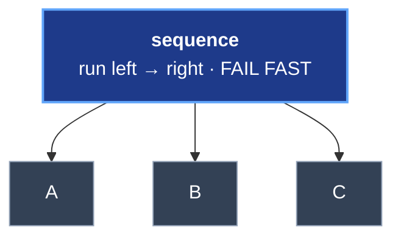
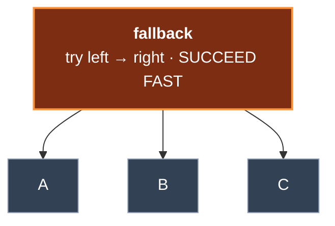
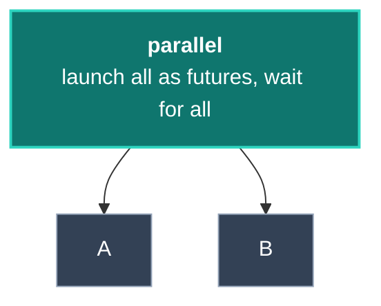
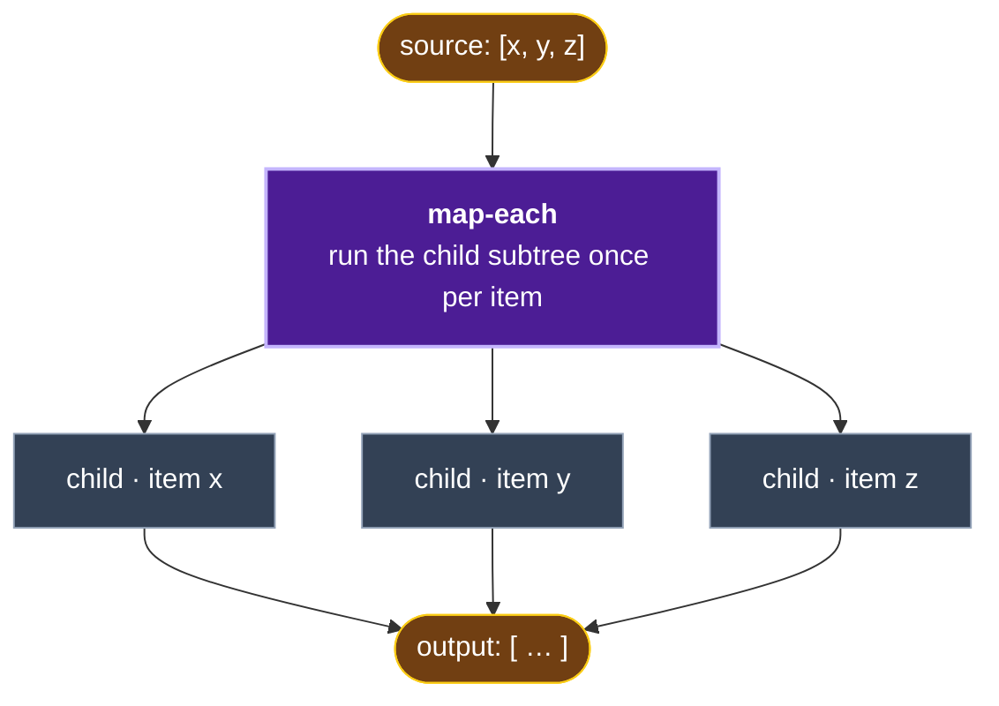

# ORC + Grain Architecture Reference

> For onboarding see [GETTING-STARTED.md](GETTING-STARTED.md); for the dependency map see [COMPONENT-MAP.md](COMPONENT-MAP.md). This doc covers internal execution mechanics.

> For the dependency decision table see [COMPONENT-MAP.md](COMPONENT-MAP.md). This doc covers internal execution mechanics and component boundary details.

## Overview

This document provides a comprehensive architectural reference for understanding how ORC (behavior trees) and Grain (event sourcing) integrate in the ORC library.

---

## High-Level Architecture

```
┌─────────────────────────────────────────────────────────────────┐
│              Consumer Code (cp/process-command, defquery)        │
└────────────────────────────┬────────────────────────────────────┘
                             │
              ┌──────────────┴──────────────┐
              ▼                              ▼
┌──────────────────────┐          ┌──────────────────────┐
│   COMMANDS           │          │    QUERIES           │
│   (mutations)        │          │    (reads)           │
└──────────┬───────────┘          └──────────┬───────────┘
           │                                  │
           ▼                                  ▼
┌──────────────────────┐          ┌──────────────────────┐
│   EVENTS             │          │   READ MODELS        │
│   (event store)      │          │   (projections)      │
└──────────┬───────────┘          └──────────────────────┘
           │
           ▼
┌──────────────────────┐
│   TODO PROCESSORS    │
│   (side effects)     │
└──────────────────────┘
           │
           ▼
┌─────────────────────────────────────────────────────────────────┐
│                    SHEET SERVICE (ORC)                           │
│               Behavior Tree Execution Engine                     │
│     /components/orc-service/core/{runtime,executor,dsl}       │
└────────────────────────────┬────────────────────────────────────┘
                             │
              ┌──────────────┴──────────────┐
              ▼                              ▼
┌──────────────────────┐          ┌──────────────────────┐
│   CODE EXECUTOR      │          │    AI EXECUTOR       │
│   (Clojure fns)      │          │    (LLM layer)       │
└──────────────────────┘          └──────────┬───────────┘
                                             │
                                             ▼
                               ┌──────────────────────────┐
                               │   orc's LLM layer        │
                               │   → configured provider  │
                               │     (e.g. OpenRouter)    │
                               └──────────────────────────┘
```

---

## The Three Pillars

### 1. ORC (Behavior Trees)

**Purpose:** Declarative AI workflow orchestration

**Core Concepts:**
- **Workflow**: Named container with deterministic UUID v5 identity
- **Blackboard**: Typed shared state (Malli schemas)
- **Nodes**: Execution units forming a tree

**Node Types:**

| Type | Behavior |
|------|----------|
| `sequence` | Run children in order; fail fast |
| `parallel` | Run children concurrently; configurable success/failure policies |
| `fallback` | Try children until one succeeds (selector) |
| `map-each` | Iterate over collection with optional parallelism |
| `llm` | Call LLM via orc's LLM layer |
| `code` | Execute Clojure function |
| `condition` | Static boolean check on blackboard |
| `llm-condition` | LLM-evaluated yes/no question |
| `delegate` | Execute another workflow with isolated blackboard |

**Key Files:**
- `orc-service/core/dsl.clj` - DSL builders (`workflow`, `llm`, `code`, etc.)
- `orc-service/core/runtime.clj` - Synchronous tree execution
- `orc-service/core/executor.clj` - AI and code execution
- `orc-service/interface/schemas.clj` - Node and event schemas

### 2. Grain (Event Sourcing)

**Purpose:** Persistence, auditability, event-driven side effects

**Core Concepts:**
- **Commands**: Intentions that emit events on success
- **Events**: Immutable facts stored in event store
- **Read Models**: Projections built by reducing events
- **Todo Processors**: React to events (policies/side effects)

**Event Flow:**
```
Command → Validation → Events → Event Store
                                    │
                    ┌───────────────┼───────────────┐
                    ▼               ▼               ▼
              Read Models    Todo Processors   Tracing
              (projections)  (side effects)   (Langfuse)
```

**Key Events (orc-service):**
- `:sheet/sheet-created`, `:sheet/node-created`
- `:sheet/node-executor-set`, `:sheet/key-declared`
- `:sheet/judge-declared`, `:sheet/node-judges-set`
- `:sheet/tree-tick-started`, `:sheet/node-execution-completed`
- `:sheet/execution-traced`

**Key Files:**
- `orc-service/core/commands.clj` - Command handlers (validate via `rmp/project`, emit events)
- `orc-service/core/queries.clj` - Query handlers (read from cached projections)
- `orc-service/core/read_models.clj` - `defreadmodel` registrations with L1/L2 caching and partitioning
- `orc-service/core/todo_processors.clj` - Event-driven side effects

### 3. LLM Layer (Primary AI Path)

**Purpose:** Structured LLM calls with Clojure-native execution

**Integration Stack:**
```
ORC → orc's LLM layer → configured provider (e.g. OpenRouter) → LLMs
```

**Module Building:**
- Malli schemas → human-readable field descriptions
- Node `:reads` → module inputs
- Node `:writes` → module outputs
- Node `:instruction` → module instructions

**Key Files:**
- `bases/orc-dev/core.clj` - LLM layer initialization
- `executor.clj:109-140` - `build-module` (schema → typed module)
- `executor.clj:264-354` - `execute-ai` (call LLM predictor)
- `executor.clj:27-82` - `malli-schema->description`

---

## Execution Flow Detail

### 1. Build Phase (`sheet/build-workflow!`)

```clojure
;; User defines workflow
(def my-workflow
  (sheet/workflow "my-workflow"
    (sheet/blackboard {:input :string :output :string})
    (sheet/sequence "main"
      (sheet/llm "process" ...))))

;; Build stores in event store
(def sheet-id (sheet/build-workflow! ctx my-workflow))
```

**What happens:**
1. Generate deterministic sheet-id via UUID v5 from name
2. Compute SHA-256 content hash of the workflow definition
3. If sheet exists with matching content hash: **no-op** (return sheet-id, zero events)
4. If sheet exists with different hash: clear and rebuild, then store new hash
5. If new: create sheet, build content, store hash
6. Events emitted on first build/change: `:sheet/sheet-created`, `:sheet/key-declared`, `:sheet/node-created`, `:sheet/node-executor-set`, `:sheet/content-hash-set`

This makes `build-workflow!` safe to call on every application startup — unchanged workflows produce zero events.

### 2. Execute Phase (`sheet/execute`)

```clojure
(sheet/execute ctx sheet-id {:input "hello"})
;; => {:status :success :outputs {:output "result"} :duration-ms 1234}
```

**What happens:**
1. Create isolated execution blackboard (copy, not mutate)
2. Generate trace IDs for observability
3. Call `execute-node-sync` on root node
4. Dispatch based on node type:

```clojure
(case node-type
  :leaf      → execute-leaf-sync
  :sequence  → execute-sequence-sync (left-to-right, fail fast)
  :fallback  → execute-fallback-sync (try until success)
  :parallel  → execute-parallel-sync (concurrent via futures)
  :map-each  → execute-map-each-sync (iterate with :parallel N)
  :condition → execute-condition-sync (static check)
  :llm-condition → execute-llm-condition-sync (LLM yes/no)
  :delegate  → execute-delegate-node (run subworkflow))
```

5. For leaf nodes, dispatch to executor:
   - `:ai` → `execute-ai` → LLM layer → LLM
   - `:code` → `execute-code` → resolve and call Clojure fn

6. Merge outputs into blackboard with version tracking
7. Return final outputs + duration + trace-id

---

## Blackboard Data Flow

**Structure:**
```clojure
{:key-name {:key :key-name
            :schema [:vector :string]
            :value ["item1" "item2"]
            :version 3}}
```

**Input Gathering:**
```clojure
(defn gather-inputs [node blackboard]
  (reduce (fn [acc key-name]
            (if-let [entry (get blackboard key-name)]
              (assoc acc key-name (:value entry))
              acc))
          {}
          (:reads node)))
```

**Output Merging:**
- After node execution, outputs written with incremented version
- Parallel nodes use version to detect conflicts (last write wins)
- Map-each tracks written keys to build result collection

---

## Code Executor Pattern

```clojure
;; Define executor function
(defn my-processor
  [{:keys [inputs]}]
  (let [input-val (:input-key inputs)]
    {:output-key (process input-val)}))

;; Reference in workflow
(sheet/code "process-step"
  :fn "my.ns/my-processor"
  :reads [:input-key]
  :writes [:output-key])
```

**Key points:**
- Function receives `{:inputs {:key value}}` map
- Function returns `{:output-key value}` map
- Keys are keywords
- Multiple outputs supported

---

## Node Execution Behaviors

### Sequence



- Run children left-to-right
- **Fail fast** — stop on first failure
- Return the final blackboard on success

### Fallback



- Try children left-to-right
- **Succeed fast** — stop on first success
- Return failure only if ALL children fail

### Parallel



- Launch all children as futures; wait for all to complete
- Merge blackboards by version (highest wins)
- Policies — `success-policy: :all | :any | :majority`, `failure-policy: :any | :all`

### Map-Each



- Iterate over the `source-key` collection; set `item-key` per iteration
- Execute the child subtree per item; collect outputs into `output-key`
- Respects `:max-concurrency` (batched parallel)

---

## Condition Operators

| Operator | Check |
|----------|-------|
| `:equals` | `(= bb-value value)` |
| `:not-equals` | `(not= bb-value value)` |
| `:gt` | `(> bb-value value)` |
| `:lt` | `(< bb-value value)` |
| `:gte` | `(>= bb-value value)` |
| `:lte` | `(<= bb-value value)` |
| `:contains` | `(.contains bb-value value)` |
| `:exists` | `(some? bb-value)` |
| `:truthy` | `(boolean bb-value)` |

---

## Tracing & Observability

**Two trace systems run in parallel:**

1. **Internal Trace** (always on)
   - Stored in event store as `:sheet/execution-traced`
   - Full node-by-node execution history
   - Used for analytics and debugging

2. **Langfuse Trace** (optional)
   - External observability platform
   - Real-time monitoring
   - Token usage tracking

**Trace Data Per Node:**
```clojure
{:node-id uuid
 :trace-instance-id uuid
 :parent-trace-instance-id uuid
 :node-name "analyze-lead"
 :node-type :leaf
 :path ["main" "track-1" "analyze-lead"]
 :child-index 0
 :status :success
 :started-at inst
 :completed-at inst
 :duration-ms 450
 :inputs {:key value}
 :outputs {:key value}
 :error nil}
```

---

## LLM layer

orc's LLM layer is built on **DSCloj** — the Clojure implementation of [DSPy](https://github.com/stanfordnlp/dspy)-style structured prompting that orc uses as its LLM base. When a leaf node dispatches to the AI executor, that layer turns the node's declared shape into a structured call and parses the response back into typed blackboard values:

1. **Build a typed module from the node.** The node's blackboard schema (Malli) plus its `:instruction` are compiled into a typed module — `:reads` become typed input fields (with human-readable descriptions derived from the schema), `:writes` become typed output fields, and `:instruction` becomes the module instruction.
2. **Call the configured provider.** The module and the gathered input values are sent to the provider configured for the deployment (e.g. OpenRouter), along with call options such as temperature.
3. **Parse structured output.** The provider's response is parsed back into the declared output fields and validated against their schemas, yielding typed values that are merged into the blackboard.

This keeps the LLM call shape-driven: the same Malli schemas that define the blackboard also define the request/response contract, so structured outputs round-trip into versioned blackboard entries without hand-written prompt plumbing.

---

## Evaluation Judges

### Architecture

Judges are defined at the workflow level (paralleling `sheet/blackboard`) and stored in the event store:

```
┌─────────────────────────────────────────────────────────────┐
│  Workflow Definition                                         │
│  sheet/judges → {:judge-name {:type :grounding ...}}        │
└────────────────────────────┬────────────────────────────────┘
                             │
                             ▼
┌─────────────────────────────────────────────────────────────┐
│  Build Phase                                                 │
│  Emit :sheet/judge-declared for each judge                  │
│  Emit :sheet/node-judges-set for nodes with :judges param   │
└────────────────────────────┬────────────────────────────────┘
                             │
                ┌────────────┴────────────┐
                ▼                         ▼
┌──────────────────────┐  ┌──────────────────────────────────┐
│  Retrospective       │  │  Inline (per-event runtime)       │
│  Batch evaluation    │  │  Added 2026-06 via Gap-1.         │
│  via                 │  │  When Living Description flag is  │
│  evaluation-suite    │  │  on, :evaluation/on-node-         │
│  on historical       │  │  execution-completed processor    │
│  traces.             │  │  fires attached judges (default + │
│                      │  │  custom :type) in parallel via    │
│                      │  │  futures.                         │
└──────────────────────┘  └──────────────────────────────────┘
```

### Judge Types

| Type | Configured Weight | Evaluates |
|------|----------------|-----------|
| `:grounding` | 35% (advisory) | Hallucination detection - claims supported by inputs? |
| `:instruction-following` | 25% (advisory) | Task compliance - did LLM follow instruction? |
| `:reasoning` | 20% (advisory) | Logical coherence - reasoning clear and valid? |
| `:completeness` | 20% (advisory) | Coverage - all required aspects addressed? |
| `:heuristic-structural` | n/a | (added 2026-06) Deterministic Clojure heuristic that grades the SHAPE of trees the model produces. No LLM call. |
| `:custom` | n/a | (added 2026-06) References a consumer-built eval sheet via `:sheet-id`. Sub-executes the eval workflow against the host node's outputs. See [`RLM-GUIDE.md`](RLM-GUIDE.md#building-a-custom-judge). |

> **Note on weights:** The `%` column is *advisory* — those specific numbers aren't applied as defaults. When multiple judges attach to a node, a `:judge/composite-score-computed` event is emitted per tick with a weighted composite. Default policy: even-weight (1/N) when no explicit weights; consumer-set `:weight` values normalize to sum to 1.0. The per-judge `:judge-averages` in the consolidator's reflection input stays alongside the composite — both signals are available.

### Events

- `:sheet/judge-declared` - Judge definition stored (name, type, criteria, weight)
- `:sheet/node-judges-set` - Node's judge references stored
- `:sheet/judge-criteria-evolved` - Criteria updates (future GEPA integration)

### Key Files

| Purpose | Path |
|---------|------|
| DSL (`judges` fn) | `orc-service/core/dsl.clj` |
| Commands | `orc-service/core/commands.clj` |
| Read Models | `orc-service/core/read_models.clj` |
| Schemas | `orc-service/interface/schemas.clj` |

### Usage Pattern

```clojure
(sheet/workflow "my-workflow"
  (sheet/blackboard {...})

  ;; Define judges at workflow level
  (sheet/judges
    {:my-grounding
     {:type :grounding
      :criteria "All claims must trace to input fields"
      :weight 0.5}
     :my-completeness
     {:type :completeness
      :criteria "Must include: X, Y, Z"
      :weight 0.5}})

  ;; Nodes reference judges by name
  (sheet/llm "analyze"
    :judges ["my-grounding" "my-completeness"]
    ...))
```

---

## Quick Reference: Key Files

| Purpose | Path |
|---------|------|
| Public API | `orc-service/interface.clj` |
| DSL Builders | `orc-service/core/dsl.clj` |
| Tree Execution | `orc-service/core/runtime.clj` |
| AI/Code Dispatch | `orc-service/core/executor.clj` |
| Event Schemas | `orc-service/interface/schemas.cljs` |
| Commands | `orc-service/core/commands.clj` |
| Queries | `orc-service/core/queries.clj` |
| Read Models | `orc-service/core/read_models.clj` |
| Todo Processors | `orc-service/core/todo_processors.clj` |
| Tracing | `orc-service/core/tracing.clj` |
| System Setup | `bases/orc-dev/core.clj` |

---

## Component boundaries

| Component | Public namespace | Direct compile deps | Emits events |
|-----------|-----------------|---------------------|--------------|
| `orc-service` | `ai.obney.orc.orc-service.interface` | LLM layer, mulog, sci | `:sheet/*`, `:rlm/*` |
| `evaluation` | `ai.obney.orc.evaluation.interface` | orc-service, LLM layer, cheshire | `:judge/score-emitted`, `:judge/composite-score-computed` |
| `gepa` | `ai.obney.orc.gepa.interface` | evaluation, mulog | `:gepa/optimization-*` |
| `ontology` | `ai.obney.orc.ontology.interface` | ai.djl/api, ai.djl.huggingface/tokenizers, ai.djl.pytorch/pytorch-engine, data.csv, data.json, sqlite-jdbc | `:ontology/*`, `:evolutionary/*` |
| `colbert` | `ai.obney.orc.colbert.interface` | mulog, data.json [+Python subprocess] | `:colbert/*` |
| `mcp-sheet-builder` | `ai.obney.orc.mcp-sheet-builder.interface` | clj-http, cheshire, sci | none |
| `langfuse` | `ai.obney.orc.langfuse.interface` | (none) | none |

For the full opt-in hierarchy and Python requirements, see [COMPONENT-MAP.md](COMPONENT-MAP.md).

---

## Demo Files

| File | Description |
|------|-------------|
| `development/src/lead_qualification_demo.clj` | CRM lead qualification with parallel tracks |
| `development/src/chatbot_demo.clj` | All node types + versioning |
| `docs/DSL-REFERENCE.md` | Comprehensive DSL reference |

---

## Research Integration Points

From Obsidian vault research:

### GEPA Optimization
- Each node can be a trainable, optimizable module
- `ScoreWithFeedback(score=..., feedback=...)` pattern
- Reflective mutation: LLM analyzes failures, proposes fixes
- 35x fewer rollouts than RL methods

### Read Model Proposals
- Nodes propose: "If I had access to X, accuracy improves Y%"
- Enables adaptive context exposure
- Event sourcing captures all proposals for analysis

### Future Architecture
```
Neuromorphic LLMs (edge deployment)
        ↓
Grain Framework (execution engine)
        ↓
Ontology Exploration (RDF/semantic)
        ↓
GEPA (optimization)
```
