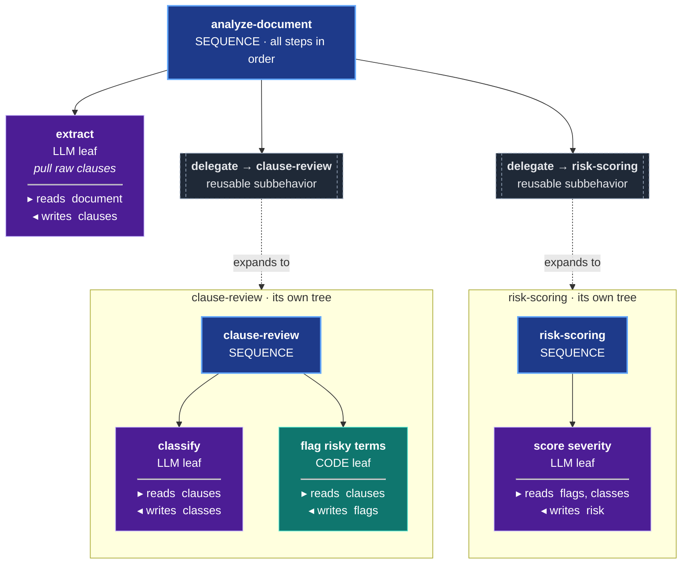
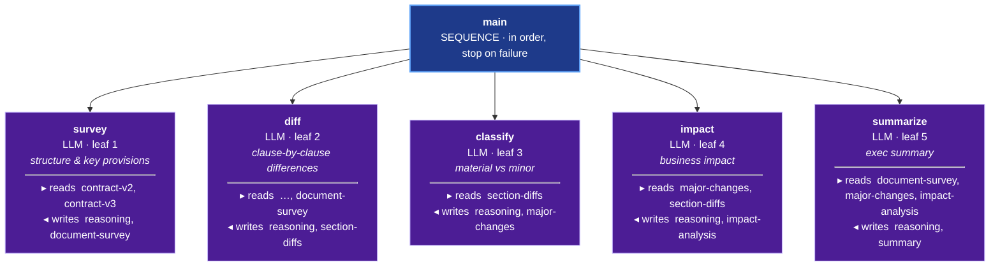
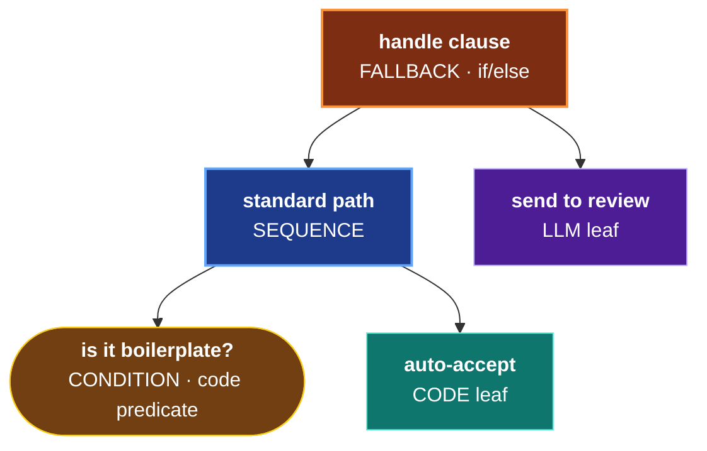
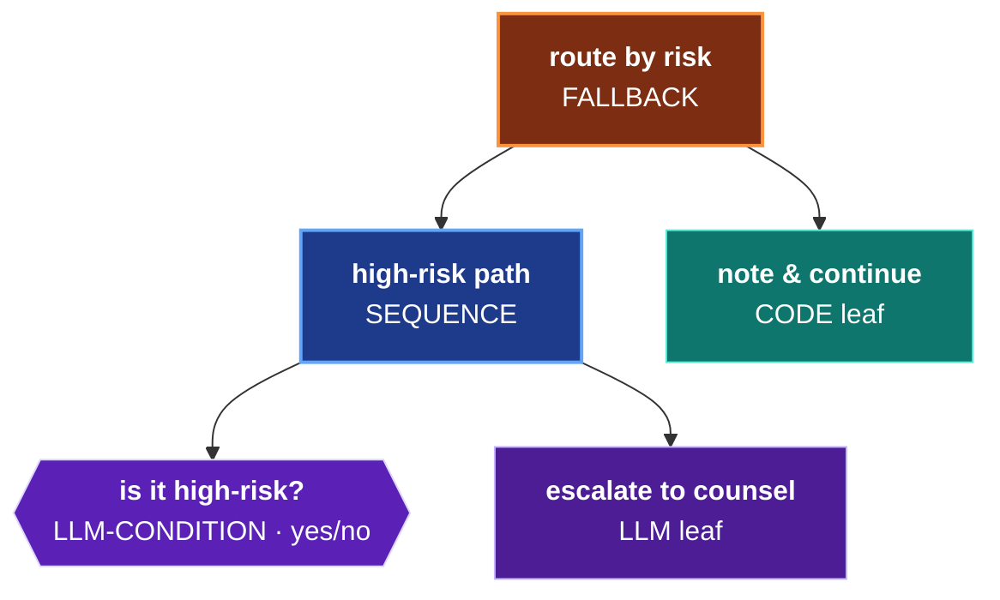
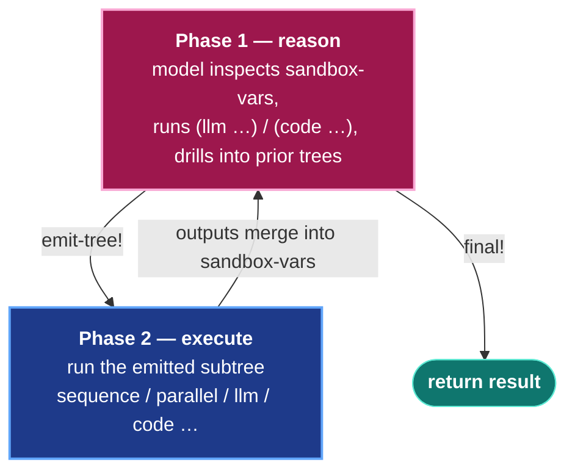

# Getting Started with ORC

> A progressive getting-started guide in **six phases** — each adds one
> capability to the same workflow: core behavior tree → LLM judges → custom
> judges → GEPA prompt optimization → ontology memory → the self-improving loop.
> Start at Phase 1 and stop wherever you have what you need.

---

## What ORC is

ORC is a **behavior-tree execution engine** built on Grain (event sourcing +
CQRS). You compose nodes into a tree; the engine ticks the tree, every step is
an event-sourced fact, and the durable record is a read-model you can query.
LLMs do the knowledge work *at the nodes*; the tree is the deterministic spine
that guarantees the steps run and owns the contracts between them. The leverage
is not "call an LLM" — it is composing the right nodes and sub-behaviors so
your methodology is *structural*, guaranteed by the tree, rather than crammed
into one prompt and hoped for.



*Keep this picture in mind as you read: every phase below adds capability to this
same tree — judges on its leaves, GEPA tuning its prompts, an ontology giving it
memory, and finally a `repl-researcher` leaf that designs its own subtree at
runtime.*

---

## Phase 1 — Core behavior tree

> **What you're adding**
>
> | Layer | Component | Python required |
> |-------|-----------|:---------------:|
> | 0 | `orc-service` | No |
>
> One component, no JVM model loading, no Python process. See
> [COMPONENT-MAP.md](COMPONENT-MAP.md) — Layer 0.

### Wiring a context

Every ORC call takes a **context** (`ctx`) — the Grain handle that carries the
event store, the command/query registries, and your LLM provider. You build it
once with a small [Integrant](https://github.com/weavejester/integrant) system
that wires Grain's pieces together and loads the ORC component you want. Nothing
here depends on anything beyond `grain` and `orc`.

```clojure
(ns my-app.system
  (:require ;; Grain — the event-sourcing substrate
            [ai.obney.grain.event-store-v3.interface :as es]
            [ai.obney.grain.command-processor-v2.interface :as cp]
            [ai.obney.grain.query-processor.interface :as qp]
            [ai.obney.grain.pubsub.interface :as ps]
            [ai.obney.grain.control-plane.interface :as control-plane]
            ;; ORC — load the engine for side-effect registration of its
            ;; commands, queries, and todo-processors
            [ai.obney.orc.orc-service.interface :as orc]
            [integrant.core :as ig]))

(def tenant-id #uuid "00000000-0000-0000-0000-000000000000")

(def system
  {::event-pubsub {:type :core-async :topic-fn :event/type}

   ::event-store  {:event-pubsub (ig/ref ::event-pubsub)
                   :conn {:type :in-memory}}   ; swap for :sqlite / :postgres in prod

   ;; The control plane runs ORC's todo-processors (the async tick engine)
   ::control-plane {:event-store (ig/ref ::event-store)
                    :context     (ig/ref ::context)}

   ::context {:tenant-id        tenant-id
              :event-store      (ig/ref ::event-store)
              :event-pubsub     (ig/ref ::event-pubsub)
              :command-registry (cp/global-command-registry)
              :query-registry   (qp/global-query-registry)
              ;; Your LLM provider keyword — registered with litellm at startup
              :dscloj-provider  :openrouter}})

(defn start [] (ig/init system))
(defn stop  [sys] (ig/halt! sys))
```

Register an LLM provider once (OpenRouter reaches every vendor through one key;
swap the provider keyword for `:openai`, `:anthropic`, etc. as you like):

```clojure
(require '[litellm.router :as r])
(r/register! :openrouter {:provider :openrouter
                          :model "google/gemini-2.5-flash"
                          :config {:api-base "https://openrouter.ai/api/v1"
                                   :api-key  (System/getenv "OPENROUTER_API_KEY")}})
```

Start the system and pull out the context:

```clojure
(require '[ai.obney.orc.orc-service.interface :as orc])

(def sys (start))
(def ctx (::context sys))
;; ctx flows into every ORC call — no global state, no singleton.
```

`:in-memory` needs no external service; everything you build lives for the life
of the REPL. For a durable store, change `:conn` to `{:type :sqlite ...}` or
`{:type :postgres ...}` — the same code runs unchanged. When you're done:

```clojure
(stop sys)
```

### The contract-analysis workflow

The getting-started example is a real contract comparison workflow: five
sequential LLM nodes that survey, diff, classify, impact-assess, and summarize
the differences between two contract versions.

```clojure
(def contract-analysis
  (orc/workflow "contract-analysis"

    ;; Blackboard — typed shared memory for the tree.
    ;; Describe each field here once; orc forwards the description into
    ;; the LLM signature for every node that reads/writes the key.
    (orc/blackboard
      {:contract-v2     [:string {:description "The original contract text (version 2)."}]
       :contract-v3     [:string {:description "The updated contract text (version 3)."}]
       :reasoning       [:string {:description "Step-by-step reasoning before drawing conclusions."}]
       :document-survey [:string {:description "Summary of structure and key provisions in both versions."}]
       :section-diffs   [:string {:description "Specific clause-by-clause differences between versions."}]
       :major-changes   [:string {:description "Classified list of material vs minor changes."}]
       :impact-analysis [:string {:description "Business impact assessment of material changes."}]
       :summary         [:string {:description "Executive summary of findings for a non-lawyer reader."}]})

    ;; Tree — a sequence of five LLM nodes. Each node declares which
    ;; blackboard keys it reads and writes. :reasoning is always FIRST
    ;; in :writes — the model commits its reasoning to text before any
    ;; substantive output (reason-before-score discipline, also used by judges).
    (orc/sequence "main"
      (orc/llm "survey"
        :model "google/gemini-2.5-flash"
        :instruction "Survey the structure and key provisions of both contracts."
        :reads  [:contract-v2 :contract-v3]
        :writes [:reasoning :document-survey])

      (orc/llm "diff"
        :model "google/gemini-2.5-flash"
        :instruction "Compare specific clauses side-by-side and list all differences."
        :reads  [:contract-v2 :contract-v3 :document-survey]
        :writes [:reasoning :section-diffs])

      (orc/llm "classify"
        :model "google/gemini-2.5-flash"
        :instruction "Classify each difference as material (changes obligations/rights/risk) or minor (editorial/formatting)."
        :reads  [:section-diffs]
        :writes [:reasoning :major-changes])

      (orc/llm "impact"
        :model "google/gemini-2.5-flash"
        :instruction "Analyze the business impact of the material changes."
        :reads  [:major-changes :section-diffs]
        :writes [:reasoning :impact-analysis])

      (orc/llm "summarize"
        :model "google/gemini-2.5-flash"
        :instruction "Write an executive summary of findings for a non-lawyer reader."
        :reads  [:document-survey :major-changes :impact-analysis]
        :writes [:reasoning :summary]))))
```

### Building and executing

`build-workflow!` persists the tree to the event store. It is **idempotent**:
a SHA-256 content hash of the workflow definition is stored on the sheet; if the
hash matches what's already there, the call is a true no-op (zero events). Any
structural change triggers a clear-and-rebuild. Safe to call on every startup.

```clojure
;; Idempotent — safe to call on every startup.
;; Returns a deterministic UUID derived from the workflow name.
(def sheet-id (orc/build-workflow! ctx contract-analysis))

;; Execute: isolated blackboard per tick, returns outputs when the tree completes.
(orc/execute ctx sheet-id
             {:contract-v2 "This Agreement is governed by California law."
              :contract-v3 "This Agreement is governed by California law.
                            Disputes are subject to binding arbitration in San Francisco."}
             :timeout-ms 120000)
```

**Result shape** (the map `orc/execute` returns):

```clojure
;; => {:status  :success
;;     :outputs {:contract-v2     "This Agreement is governed by..."
;;               :contract-v3     "This Agreement is governed by... binding arbitration..."
;;               :reasoning       "Both versions begin with California law as the governing..."
;;               :document-survey "V2 establishes CA law. V3 adds mandatory arbitration clause..."
;;               :section-diffs   "Section 12 — Governing Law: V2: California. V3: California + binding arbitration..."
;;               :major-changes   "Material: addition of mandatory arbitration clause (affects dispute resolution rights)..."
;;               :impact-analysis "The arbitration clause materially shifts dispute resolution from..."
;;               :summary         "Version 3 introduces mandatory arbitration for disputes. This removes both..."}
;;     :duration-ms 14832}
```

The `:status` field is one of `:success`, `:failure`, or `:timeout`.
`:outputs` is the full blackboard snapshot after the tree completes.
`:duration-ms` is wall-clock time for the full execution.

### Seeing the tree

`print-tree` prints the tree structure without running it:

```clojure
(orc/print-tree contract-analysis)
```

**Real captured output** (run against `dsl.clj:print-tree`):

```
├── [sequence] main
  ├── [leaf] survey (ai) model=google/gemini-2.5-flash
  ├── [leaf] diff (ai) model=google/gemini-2.5-flash
  ├── [leaf] classify (ai) model=google/gemini-2.5-flash
  ├── [leaf] impact (ai) model=google/gemini-2.5-flash
  ├── [leaf] summarize (ai) model=google/gemini-2.5-flash
```

The same tree as a labelled behavior tree — each leaf is a card showing its kind and the blackboard keys it **reads** and **writes**:



Right now it's the simplest shape — a flat `sequence`. The same nodes compose
into real control flow as the workflow grows. A `fallback` wrapping a `condition`
is if/else; an `llm-condition` inside a `fallback` is LLM-driven routing:





### Key concepts

**Blackboard.** The blackboard is the typed shared memory for the entire
execution. It is declared once on the workflow. Nodes declare which keys they
`:reads` (available as inputs) and `:writes` (outputs they produce). A node
cannot read or write undeclared keys. Describe each field with
`{:description ...}` — orc forwards those descriptions into the LLM signature
for every node that touches the key, so node instructions only need to say
*what to do*, not re-explain the fields.

**`:reads` / `:writes` data flow.** The tree does not pass values; nodes
communicate through the shared blackboard. Data flows: `survey` writes
`:document-survey`, `diff` reads it. This is the only coupling mechanism
between nodes.

**`:reasoning` first.** Every `:llm` node in this guide writes `:reasoning` as
the first key in `:writes`. This enforces reason-before-score discipline: the
model commits its chain of thought to text before producing any substantive
output. ORC's judges exploit the same discipline (see Phase 2 and
[JUDGE-ARCHITECTURE.md](JUDGE-ARCHITECTURE.md) Property 4).

**Idempotent `build-workflow!`.** The workflow name is the identity. The
sheet-id is a deterministic UUID v5 derived from the name. Node IDs are
deterministic UUID v5 derived from sheet-id + node name. A SHA-256 hash of the
full workflow definition is stored on the sheet. Calling `build-workflow!` on
an unchanged definition emits zero events — the hot path is lock-free. Changing
one node clears and rebuilds the entire sheet in place; the sheet-id stays the
same. This is safe to call on every application start.

---

## Phase 2 — LLM judges

> **What you're adding**
>
> | Layer | Component | Python required |
> |-------|-----------|:---------------:|
> | 1 | `evaluation` | No |
>
> One component added on top of Layer 0. No Python, no ontology, no DJL.
> See [COMPONENT-MAP.md](COMPONENT-MAP.md) — Layer 1.

### The problem: how do you know the survey is accurate?

The `survey` node produced a `:document-survey`. It ran. The tree completed.
But is the output grounded in the actual contract text? Does it cover all the
required provisions? Without judges, you can check manually or not at all. At
scale, you need automation.

Judges are functions that evaluate an LLM node's **trace** (inputs + outputs +
instruction) and emit a score. ORC's built-in judges fire asynchronously as a
side effect of the event log — no change to your workflow's execution path, zero
latency added to `:execute`.

### Declaring and attaching judges

Judges are declared at the workflow level and attached to specific nodes by
name. This is a two-step pattern:

1. `(orc/judges {...})` — declare the judge configs on the sheet.
2. `:judges [...]` on a node — reference declared judges by name.

```clojure
(def contract-analysis-judged
  (orc/workflow "contract-analysis"

    (orc/blackboard
      {:contract-v2     [:string {:description "The original contract text (version 2)."}]
       :contract-v3     [:string {:description "The updated contract text (version 3)."}]
       :reasoning       [:string {:description "Step-by-step reasoning before drawing conclusions."}]
       :document-survey [:string {:description "Summary of structure and key provisions in both versions."}]
       :section-diffs   [:string {:description "Specific clause-by-clause differences between versions."}]
       :major-changes   [:string {:description "Classified list of material vs minor changes."}]
       :impact-analysis [:string {:description "Business impact assessment of material changes."}]
       :summary         [:string {:description "Executive summary of findings for a non-lawyer reader."}]})

    ;; Step 1 — declare the judge configs on the sheet.
    ;; Judge names are keywords here; they're stored as strings internally.
    (orc/judges
      {:survey-grounding    {:type :grounding    :weight 0.5}
       :survey-completeness {:type :completeness :weight 0.5}})

    (orc/sequence "main"
      ;; Step 2 — attach declared judges to the survey node by name.
      ;; Judges fire AFTER the node completes, out of band. Zero latency
      ;; on the execution hot path.
      (orc/llm "survey"
        :model "google/gemini-2.5-flash"
        :instruction "Survey the structure and key provisions of both contracts."
        :reads  [:contract-v2 :contract-v3]
        :writes [:reasoning :document-survey]
        :judges ["survey-grounding" "survey-completeness"])  ; <— attach here

      (orc/llm "diff"
        :model "google/gemini-2.5-flash"
        :instruction "Compare specific clauses side-by-side and list all differences."
        :reads  [:contract-v2 :contract-v3 :document-survey]
        :writes [:reasoning :section-diffs])

      (orc/llm "classify"
        :model "google/gemini-2.5-flash"
        :instruction "Classify each difference as material (changes obligations/rights/risk) or minor (editorial/formatting)."
        :reads  [:section-diffs]
        :writes [:reasoning :major-changes])

      (orc/llm "impact"
        :model "google/gemini-2.5-flash"
        :instruction "Analyze the business impact of the material changes."
        :reads  [:major-changes :section-diffs]
        :writes [:reasoning :impact-analysis])

      (orc/llm "summarize"
        :model "google/gemini-2.5-flash"
        :instruction "Write an executive summary of findings for a non-lawyer reader."
        :reads  [:document-survey :major-changes :impact-analysis]
        :writes [:reasoning :summary]))))
```

Rebuild (idempotent — no-op if unchanged):

```clojure
(def sheet-id (orc/build-workflow! ctx contract-analysis-judged))
```

Execute as before. The judges fire asynchronously after the `survey` node
completes; the `:execute` return value is unaffected.

### What lands in the event store

Each judge emits a `:judge/score-emitted` event per successful invocation.
These are accumulated in the `:evaluation/judge-scores` read-model keyed by
`[sheet-id tick-id node-id]`. Query them after execution:

```clojure
(require '[ai.obney.orc.evaluation.interface :as eval])

;; get-judge-scores: (ctx sheet-id node-id tick-id)
;; tick-id is available from execute-stream (see docs/STREAMING.md).
(eval/get-judge-scores ctx sheet-id survey-node-id tick-id)
```

**Source-verified shape from `judge_runtime.clj:get-judge-scores`** (not a live
run — requires a live execution with ticket IDs):

```clojure
;; => [{:sheet-id   #uuid "..."
;;      :tick-id    #uuid "..."
;;      :node-id    #uuid "..."
;;      :judge-name "survey-grounding"
;;      :judge-config {:type :grounding :weight 0.5}
;;      :score      0.75
;;      :feedback   "Well grounded. Every substantive claim traces to the source..."
;;      :dimensions []
;;      :emitted-at "2024-01-15T10:23:45.123Z"}
;;     {:judge-name "survey-completeness"
;;      :score      0.5
;;      :feedback   "Mixed coverage. The arbitration clause is mentioned but no timeline..."
;;      ...}]
```

### Evaluating a trace off-line

You can also run judges directly against a trace without an active execution.
This is useful for debugging, building evaluation datasets, or testing judge
behavior with `with-mock-llm`:

```clojure
(require '[ai.obney.orc.evaluation.core.judges :as judges])

(let [trace {:inputs  {:contract-v2 "This Agreement shall be governed by California law."
                       :contract-v3 "This Agreement shall be governed by California law.
                                     Disputes subject to binding arbitration."}
             :outputs {:document-survey "Both versions establish California law.
                                         Version 3 adds mandatory arbitration clause."}
             :instruction "Survey the structure and key provisions of both contracts."}]
  (judges/with-mock-llm
    (prn (eval/evaluate-trace trace))))
```

**Real captured output** (run with `judges/with-mock-llm`; mock assigns level 4
to each dimension → score 0.75):

```
#ai.obney.orc.evaluation.core.feedback.ScoreWithFeedback{:score 0.75, :feedback "Good (75%): 4 dimension(s) need improvement: Source Grounding, Instruction Following, Reasoning Quality, Completeness", :dimensions [{:name "Source Grounding", :weight 0.35, :score 0.75, :feedback "Mock evaluation. In production, this analyzes actual grounding against the source."} {:name "Instruction Following", :weight 0.25, :score 0.75, :feedback "Mock evaluation. In production, this audits compliance with each instruction directive."} {:name "Reasoning Quality", :weight 0.2, :score 0.75, :feedback "Mock evaluation. In production, this attacks the weakest link in the inference chain."} {:name "Completeness", :weight 0.2, :score 0.75, :feedback "Mock evaluation. In production, this audits coverage of every required aspect."}]}
```

The `ScoreWithFeedback` record shape:

| Field | Type | What it is |
|-------|------|------------|
| `:score` | `double [0,1]` | Weighted aggregate across all dimension judges |
| `:feedback` | `string` | Human-readable summary; dimensions listed weakest first in the GEPA learning path |
| `:dimensions` | `vector` | Per-dimension `{:name :weight :score :feedback}` |

The `:score` is **never self-reported** by the model. The model chooses a
discrete band (1–5); ORC computes `(level - 1) / 4` deterministically. See
[JUDGE-ARCHITECTURE.md](JUDGE-ARCHITECTURE.md) Properties 2 and 8.

### Coming soon

The four built-in judges (`:grounding`, `:completeness`, `:instruction-following`,
`:reasoning`) have sealed 1–5 band descriptions defined in `rubrics.clj`.
Consumers wanting different domain-specific band wording must write a custom
judge (Phase 3). **Coming soon:** the ability to supply a custom `Scale`
artifact directly to a built-in judge type — e.g.
`{:type :grounding :scale my-domain-scale}` — without rewriting the stance,
output fields, or instruction composition. See
[COMPONENT-MAP.md § Pluggable judge scales](COMPONENT-MAP.md).

---

## Phase 3 — Custom judges

> **What you're adding**
>
> | Layer | Component | Python required |
> |-------|-----------|:---------------:|
> | 1 | `evaluation` | No |
>
> Same component as Phase 2. No new deps.
> See [COMPONENT-MAP.md](COMPONENT-MAP.md) — Layer 1.

### The problem: built-in judges don't know your domain

The built-in `completeness` judge checks "is something required missing?" — but
it doesn't know that *your* domain requires specifically that parties,
obligations, termination clauses, and governing-law provisions are all present.
A generic judge can't distinguish "thin stub of parties clause" from "fully
specified." Custom judges close this gap.

### Building a domain-specific scale

A `Scale` is first-class in ORC — deliberately decoupled from the judge's
criteria and stance. Build it with `scale/discrete-scale`:

```clojure
(require '[ai.obney.orc.evaluation.core.scale :as scale])

(def contract-coverage-scale
  (scale/discrete-scale
    {:min 1 :max 5
     :bands {1 "None of the four required sections present (parties, obligations, termination, governing-law)."
             2 "Only one required section adequately addressed."
             3 "Two or three sections present but at least one is a thin stub."
             4 "All four sections present; one has minor gaps."
             5 "All four sections fully addressed with precise language."}}))
```

**Real captured output**:

```
{:kind :discrete,
 :min 1,
 :max 5,
 :bands {1 "None of the four required sections present (parties, obligations, termination, governing-law).",
         2 "Only one required section adequately addressed.",
         3 "Two or three sections present but at least one is a thin stub.",
         4 "All four sections present; one has minor gaps.",
         5 "All four sections fully addressed with precise language."}}
```

Score derivation is deterministic — `(level - min) / (max - min)`. Real runs:

```clojure
(scale/level->unit-score contract-coverage-scale 3) ;=> 0.5
(scale/level->unit-score contract-coverage-scale 5) ;=> 1.0
```

The model never reports a float. It picks a band; ORC computes the score.

### Path A — Custom code executor judge

The simplest custom judge: an ORC workflow with a `:code` leaf. The function
receives the host node's trace data on the blackboard and writes `:score`
(numeric) + `:feedback` (string). The `:reasoning` key is written first.

```clojure
;; Your judge function. Receives the custom judge blackboard as inputs.
;; Must return a map with :reasoning, :score (double [0,1]), :feedback.
(defn check-contract-coverage
  [{:keys [inputs]}]
  (let [survey-text (get-in inputs [:host-outputs :document-survey] "")
        required    #{"parties" "obligations" "termination" "governing"}
        present     (count (filter #(clojure.string/includes?
                                      (clojure.string/lower-case survey-text) %) required))
        level       (max 1 (min 5 present))
        score       (scale/level->unit-score contract-coverage-scale level)]
    {:reasoning (str "Found " present " of 4 required sections (parties, obligations, "
                     "termination, governing-law). Band " level ".")
     :score     score
     :feedback  (get (:bands contract-coverage-scale) level)}))

;; Wrap it in an ORC workflow. Blackboard contract is fixed:
;; inputs:  :host-inputs, :host-outputs, :host-instruction, :host-trace
;; outputs: :score (double), :feedback (string)
;;          plus any intermediate keys you want observed
(def coverage-code-judge
  (orc/workflow "contract-coverage-code-judge"
    (orc/blackboard
      {:host-inputs      [:map     {:description "Inputs the host node received."}]
       :host-outputs     [:map     {:description "Outputs the host node produced."}]
       :host-instruction [:string  {:description "Instruction the host node executed."}]
       :host-trace       [:vector  {:description "Prior trace context."}]
       :reasoning        [:string  {:description "Reasoning about coverage (produced by code)."}]
       :score            [:double  {:description "Coverage score in [0, 1]."}]
       :feedback         [:string  {:description "Actionable feedback on coverage."}]})
    (orc/code "check-coverage"
      :fn "my.domain/check-contract-coverage"   ; fully-qualified fn symbol
      :reads  [:host-inputs :host-outputs :host-instruction]
      :writes [:reasoning :score :feedback])))
```

### Path B — Custom LLM judge workflow

When the scoring judgment is too nuanced for deterministic code, use an `:llm`
node. The scale's bands become the model's anchoring rubric via `render-bands`.
A subsequent `:code` node converts the model's discrete band choice to a
numeric score using `level->unit-score`.

```clojure
;; The code step: converts the model's :band (integer 1-5) to a numeric :score.
(defn band->score
  [{:keys [inputs]}]
  (let [band (get inputs :band 1)]
    {:score    (scale/level->unit-score contract-coverage-scale band)
     :feedback (get (:bands contract-coverage-scale) band)}))

(def coverage-llm-judge
  (orc/workflow "contract-coverage-llm-judge"
    (orc/blackboard
      {:host-inputs      [:map     {:description "Inputs the host node received."}]
       :host-outputs     [:map     {:description "Outputs the host node produced."}]
       :host-instruction [:string  {:description "Instruction the host node executed."}]
       :host-trace       [:vector  {:description "Prior trace context."}]
       :reasoning        [:string  {:description "Adversarial analysis. Write BEFORE choosing a band."}]
       :band             [:int     {:description "Discrete 1-5 band chosen after reasoning."}]
       :score            [:double  {:description "Coverage score in [0, 1], derived from band."}]
       :feedback         [:string  {:description "Actionable feedback on coverage."}]})
    (orc/sequence "grade"
      ;; Step 1 — LLM picks a band. :reasoning is first in :writes.
      (orc/llm "score-coverage"
        :model "google/gemini-2.5-flash"
        :instruction (str
          "You are a coverage auditor. Defend the null: the survey does NOT fully cover "
          "all required sections.\n\n"
          "Required sections: parties, obligations, termination, governing-law.\n\n"
          "Scoring bands:\n"
          (scale/render-bands contract-coverage-scale) "\n\n"
          "Write your adversarial analysis in :reasoning. Then choose a :band. "
          "Do NOT choose a high band unless ALL four sections are present and precise.")
        :reads  [:host-outputs :host-instruction]
        :writes [:reasoning :band])
      ;; Step 2 — deterministic band → score conversion.
      (orc/code "derive-score"
        :fn "my.domain/band->score"
        :reads  [:band]
        :writes [:score :feedback]))))
```

### Attaching a custom judge

Build the judge sheet, then declare it on the workflow:

```clojure
;; Build the judge sheet first (idempotent).
(def coverage-sheet-id (orc/build-workflow! ctx coverage-llm-judge))

;; Attach it to the workflow via :type :custom + :sheet-id.
(def contract-analysis-custom-judge
  (orc/workflow "contract-analysis"

    (orc/blackboard
      {:contract-v2     [:string {:description "The original contract text (version 2)."}]
       :contract-v3     [:string {:description "The updated contract text (version 3)."}]
       :reasoning       [:string {:description "Step-by-step reasoning before drawing conclusions."}]
       :document-survey [:string {:description "Summary of structure and key provisions in both versions."}]
       :section-diffs   [:string {:description "Specific clause-by-clause differences between versions."}]
       :major-changes   [:string {:description "Classified list of material vs minor changes."}]
       :impact-analysis [:string {:description "Business impact assessment of material changes."}]
       :summary         [:string {:description "Executive summary of findings for a non-lawyer reader."}]})

    (orc/judges
      ;; Built-in judges — live alongside your custom judge.
      {:survey-grounding    {:type :grounding    :weight 0.35}
       :survey-completeness {:type :completeness :weight 0.35}
       ;; Custom judge — sub-executes your judge sheet against the node's trace.
       :survey-coverage     {:type     :custom
                             :sheet-id coverage-sheet-id
                             :weight   0.30}})

    (orc/sequence "main"
      (orc/llm "survey"
        :model "google/gemini-2.5-flash"
        :instruction "Survey the structure and key provisions of both contracts."
        :reads  [:contract-v2 :contract-v3]
        :writes [:reasoning :document-survey]
        :judges ["survey-grounding" "survey-completeness" "survey-coverage"])

      (orc/llm "diff"
        :model "google/gemini-2.5-flash"
        :instruction "Compare specific clauses side-by-side and list all differences."
        :reads  [:contract-v2 :contract-v3 :document-survey]
        :writes [:reasoning :section-diffs])

      (orc/llm "classify"
        :model "google/gemini-2.5-flash"
        :instruction "Classify each difference as material (changes obligations/rights/risk) or minor (editorial/formatting)."
        :reads  [:section-diffs]
        :writes [:reasoning :major-changes])

      (orc/llm "impact"
        :model "google/gemini-2.5-flash"
        :instruction "Analyze the business impact of the material changes."
        :reads  [:major-changes :section-diffs]
        :writes [:reasoning :impact-analysis])

      (orc/llm "summarize"
        :model "google/gemini-2.5-flash"
        :instruction "Write an executive summary of findings for a non-lawyer reader."
        :reads  [:document-survey :major-changes :impact-analysis]
        :writes [:reasoning :summary]))))

;; Rebuild (no-op if unchanged).
(def sheet-id (orc/build-workflow! ctx contract-analysis-custom-judge))
```

The custom judge runtime (`judge_runtime.clj:invoke-custom-judge`) sub-executes
your sheet with:

```clojure
{:host-inputs      <host-node-inputs>
 :host-outputs     <host-node-outputs>
 :host-instruction <host-node-instruction>
 :host-trace       []}
```

It reads `:score` (numeric) and `:feedback` (string) from the outputs. Any
non-numeric `:score` is logged loudly and skipped — no silent zero. Custom
judges are protected by a recursion safeguard (default depth 1) to prevent
runaway sub-execution.

### Further reading

The three design properties that make judges trustworthy — adversarial stance,
reason-before-score field order, and the no-run-through gate — are documented
with source citations in [JUDGE-ARCHITECTURE.md](JUDGE-ARCHITECTURE.md).
That doc also covers:

- The full 8-property "perfect judge" checklist
- How GEPA consumes judge scores for prompt optimization
- Both deployment modes: async learning path vs. in-pipeline behavior gate
- Tier-2 patterns (ensemble, logprob, pairwise) — documented but deferred

---

## Summary: what each phase added

| Phase | Capability | Component | Layer | Python |
|-------|-----------|-----------|-------|:------:|
| 1 | Core behavior tree + event-sourced execution | `orc-service` | 0 | No |
| 2 | LLM-as-judge (grounding, completeness, etc.) | `evaluation` | 1 | No |
| 3 | Custom scale + custom judge workflows | `evaluation` | 1 | No |

Phases 4–6 (prompt optimization with GEPA, live streaming, and the
self-improving loop) are documented in the companion guide.

---

## Phase 4 — GEPA (Prompt Optimization)

> **What you're adding**
>
> | Layer | Component | Python required |
> |-------|-----------|:---------------:|
> | 3 | `gepa` + `evaluation` | No |
>
> Two components added on top of Layers 0–1. No Python, no ontology, no DJL.
> Source-verified: `components/gepa/deps.edn` lists only `mulog` + `orc/evaluation`.
> See [COMPONENT-MAP.md](COMPONENT-MAP.md) — Layer 3.

### GEPA vs. `:auto-classify?` — two orthogonal actuators

These solve different problems and neither requires the other:

- **GEPA** (`gepa/optimize!`) runs an evolutionary search over the instruction strings
  inside your existing static `:llm` nodes. It tests many variants, scores them with
  judges, and returns the best candidates. It does **not** design trees — it improves
  instructions **in** a fixed tree.

- **`:auto-classify?`** (Phase 6 — `:rlm` config on a `:repl-researcher` node)
  prepends a matched corpus pattern's body to the researcher's context before it designs
  its own tree. It does **not** modify instruction text in `:llm` nodes — it shapes how
  a recursive researcher approaches tree design.

You can run GEPA on a static tree with zero RLM and zero ontology. You can use
`:auto-classify?` on a researcher node without GEPA. They plug into separate parts of
the execution stack.

### Making a node optimizable

GEPA optimizes the `:instruction` string on your `:llm` nodes directly. It walks
your workflow, collects each LLM node's instruction **keyed by the node's `:name`**,
proposes improved variants, and applies the winner as a name-matched override at
execution time. So there is **nothing special to wire** — any `:llm` node with a
stable `:name` and an `:instruction` is already optimizable. Your existing tree
qualifies as-is.

```clojure
(require '[ai.obney.orc.orc-service.interface :as orc])

;; This is just your normal tree — the "survey" node is optimizable because it
;; has a stable :name and an :instruction. GEPA will vary that instruction string.
(def contract-analysis-gepa
  (orc/workflow "contract-analysis-gepa"
    (orc/blackboard
      {:contract-v2     [:string {:description "The original contract text (version 2)."}]
       :contract-v3     [:string {:description "The updated contract text (version 3)."}]
       :reasoning       [:string {:description "Step-by-step reasoning before drawing conclusions."}]
       :document-survey [:string {:description "Summary of structure and key provisions."}]})
    (orc/sequence "main"
      (orc/llm "survey"          ; ← GEPA optimizes this node's :instruction, keyed by name "survey"
        :model "google/gemini-2.5-flash"
        :instruction "Survey the structure and key provisions of both contracts."
        :reads  [:contract-v2 :contract-v3]
        :writes [:reasoning :document-survey]))))

(def sheet-id (orc/build-workflow! ctx contract-analysis-gepa))
```

Why this works: GEPA extracts `{"survey" "Survey the structure..."}` from the tree,
runs the workflow against your examples with candidate instructions, scores each with
judges, and the winning candidate lands as `{:instructions {"survey" "...optimized..."}}`.
At execution time, that override replaces the `survey` node's instruction by name —
no blackboard plumbing, no change to your node's `:reads`. (Putting the instruction in
a blackboard key does **nothing** for GEPA; it optimizes the node's own `:instruction`.)

### Running `gepa/optimize!`

Build a small trainset and valset from examples you already have. Each entry is the
input map for one execution — just the blackboard inputs your tree reads:

```clojure
(require '[ai.obney.orc.gepa.interface :as gepa])

(def trainset
  [{:contract-v2 "This Agreement is governed by California law."
    :contract-v3 "This Agreement is governed by California law.
                  Disputes are subject to binding arbitration in San Francisco."}
   {:contract-v2 "Payment is due within 30 days of invoice."
    :contract-v3 "Payment is due within 30 days of invoice.
                  Late payments accrue 1.5% monthly interest."}
   {:contract-v2 "Licensor grants a non-exclusive license to the Software."
    :contract-v3 "Licensor grants a non-exclusive license to the Software.
                  License excludes sub-licensing and resale rights."}])

(def valset
  [{:contract-v2 "Contractor is an independent contractor, not an employee."
    :contract-v3 "Contractor is an independent contractor, not an employee.
                  Client owns all work product as work-made-for-hire."}])

;; make-judge-metric takes a single weight map. Returns a metric fn that scores
;; each output with the named judges (run in parallel). Judges grade against a
;; STABLE grading task — NOT the candidate's own instruction — so a deliberately
;; bad instruction that the model faithfully obeys still scores low. That's what
;; lets GEPA climb away from a weak seed instruction.
(def metric-fn
  (gepa/make-judge-metric {:grounding   0.5
                            :completeness 0.5}))

;; Pareto selection: after scoring all candidates on all examples, any candidate
;; dominated on every example is dropped. Survivors are best on at least one example.
;;
;; Reflective mutation: GEPA samples failing examples, formats them as a reflective
;; dataset (inputs / generated output / judge feedback), and asks a reflection LLM
;; to propose a better instruction. See JUDGE-ARCHITECTURE.md for how the feedback
;; text drives the mutation.
(def result
  (gepa/optimize! ctx
    {:sheet-id   sheet-id
     :trainset   trainset
     :valset     valset
     :metric-fn  metric-fn
     :config     {:max-metric-calls 50}
     :block?     true}))
```

**Result shape** (source-verified from `gepa/interface.clj:157-162`):

```clojure
;; => {:optimization-id  #uuid "..."
;;     :status           :completed
;;     :best-candidate   {:instructions {"survey"
;;                          "Survey both contracts, emphasizing changes to governing-law,
;;                           payment terms, and dispute-resolution provisions. For each
;;                           section that differs from V2, state exactly what changed and
;;                           which version is more restrictive."}
;;                        :score 0.82}
;;     :best-score       0.82
;;     :duration-ms      49200}
```

The `:instructions` map in `:best-candidate` is keyed by node `:name` — here `"survey"`.
That optimized string is applied to the `survey` node automatically as a name-matched
override at execution time (you can persist the winner as an instruction-override, or
seed it back into the next GEPA run to inherit via `:inherit-from-previous true`).

### What you just added

> | Layer | Component | Adds Python | Heavy JVM |
> |-------|-----------|:-----------:|:---------:|
> | 3 | `gepa` + `evaluation` | No | No |
>
> `gepa/deps.edn` depends on `evaluation` and `mulog` — zero `ontology` dep, zero Python
> (source-verified: `components/gepa/deps.edn`). Pareto selection and reflective mutation
> run entirely in the JVM.
>
> For how judge feedback threads back into the mutation prompt and for the full
> mutation loop internals, see [JUDGE-ARCHITECTURE.md](JUDGE-ARCHITECTURE.md) —
> "How GEPA consumes judge scores."

---

## Phase 5 — Ontology as Memory

> **What you're adding**
>
> | Layer | Component | Python required |
> |-------|-----------|:---------------:|
> | 4 / 6 | `ontology` (DJL) | No |
>
> One component. DJL (JVM neural-net framework) downloads `all-MiniLM-L6-v2` (~22 MB)
> on first use and loads it into the JVM — no Python process. First call warms the model;
> subsequent calls reuse it. See [COMPONENT-MAP.md](COMPONENT-MAP.md) — Layers 4 and 6.

### The substrate is general-purpose

The `ontology` component is **not** the three-layer ORC taxonomy (Failure / Success /
Problem). That taxonomy is ORC's own *internal* graph — one tenant of the substrate.
The substrate itself is a general-purpose event-sourced concept graph with DJL embeddings
you can use for anything:

- **Domain knowledge graphs**: contract clauses, medical codes, product classifications
- **Document memory**: ingest a corpus and search by semantic similarity at runtime
- **User memory**: store user preferences or session context as retrievable concepts
- **Any graph that benefits from semantic search + isolation**: the `ontology-id`
  parameter isolates each graph so multiple separate graphs coexist in the same event
  store without interfering with each other

### Building a concept graph from CSV

`build-from-sources` (`interface/evolutionary.clj`) ingests CSV, JSON, text, or SQL and
extracts concepts. No file on disk required — pass content inline via `:content`:

```clojure
(require '[ai.obney.orc.ontology.interface.evolutionary :as evolutionary])

(def clause-csv
  "clause_id,label,description,clause_type
C001,Governing Law,Which jurisdiction's law controls the agreement.,governing-law
C002,Binding Arbitration,Requires arbitration for dispute resolution.,dispute-resolution
C003,Payment Terms,Specifies when and how payments are due.,payment
C004,Late Payment Interest,Interest rate that accrues on unpaid invoices.,payment
C005,License Scope,Grants of rights including sub-licensing exclusions.,licensing")

(def build-result
  (evolutionary/build-from-sources ctx
    {:sources [{:content clause-csv :type "csv"}]
     :config  {:base-uri "http://contracts.local/"}}))
```

**Source-verified result shape** (from `interface/evolutionary.clj:68-80`):

```clojure
;; => {:ontology-id        #uuid "..."     ; keep — needed for scoped searches
;;     :build-id           #uuid "..."
;;     :total-sources      1
;;     :total-concepts     5
;;     :total-triples      18
;;     :entities-resolved  0
;;     :ttl-output         "@prefix rdf: <...> . (SKOS Turtle output)"
;;     :duration-ms        1240}
```

Keep the `:ontology-id`. You pass it to embedding and ColBERT search calls to scope
results to this graph (see BFS scoping note below for an important caveat).

### `embed-text` — 384-dim vector

`ontology/embed-text` wraps DJL's `TextEmbeddingTranslatorFactory`. The default model
is `all-MiniLM-L6-v2`. The model loads lazily on the first call; subsequent calls reuse
the cached model.

```clojure
(require '[ai.obney.orc.ontology.interface :as ontology])

(count (ontology/embed-text "arbitration clause in commercial contracts"))
;; => 384
```

**Source-verified**: `embedding.clj:27-28` defines `default-model-id = "sentence-transformers/all-MiniLM-L6-v2"`
and `default-dimensions = 384`. The `embed-text` return type is `[:vector :double]`
(float[] from DJL is coerced to doubles by `(mapv double ...)` at `embedding.clj:167`).

Swap the model for any HuggingFace sentence-transformer that DJL supports:

```clojure
;; 768-dim model (larger; slower first load; higher-quality embeddings)
(ontology/embed-text "arbitration clause"
  {:model-id "sentence-transformers/all-mpnet-base-v2"})
;; => vector of 768 doubles
```

### Semantic search over the graph

`semantic-search-concepts` generates an embedding for the query and finds concepts by
cosine similarity. Requires concept embeddings to be generated first via
`embed-concepts-batch!`:

```clojure
;; Source-verified signature (interface.clj:1019-1025):
;; (semantic-search-concepts event-store query-text & {:keys [scope limit min-similarity model-id]})
(ontology/semantic-search-concepts ctx
  "arbitration clause in commercial contracts"
  :limit          3
  :min-similarity 0.4)
```

**Source-verified return shape** (from `interface.clj:1007-1017` docstring):

```clojure
;; => [{:uri        "http://contracts.local/C002"
;;      :similarity 0.83
;;      :label      "Binding Arbitration"
;;      :description "Requires arbitration for dispute resolution."}
;;    {:uri        "http://contracts.local/C001"
;;     :similarity 0.62
;;     :label      "Governing Law"
;;     :description "Which jurisdiction's law controls the agreement."}]
```

### `ontology-id` isolation

Each `build-from-sources` call returns a fresh `:ontology-id` UUID. All events for
that graph are tagged with that ID. Multiple separate graphs coexist:

```clojure
;; Build a second graph — totally independent from build-result above.
(def products-result
  (evolutionary/build-from-sources ctx
    {:sources [{:content products-csv :type "csv"}]
     :config  {:base-uri "http://products.local/"}}))

;; (:ontology-id products-result) ≠ (:ontology-id build-result)
;; Embedding search respects :ontology-id — pass it to scope results.
;; BFS does NOT respect it on main (see Known issue below).
```

### Hybrid search — graph + embeddings via RRF

`hybrid-search` fuses BFS graph traversal and embedding similarity via Reciprocal Rank
Fusion (RRF). ColBERT is optional — control signals with `:signals`:

```clojure
;; No ColBERT — graph + embedding signals only. No Python required.
;; (source-verified: retrieval.clj:860 — signals default is #{:graph :embedding :colbert};
;;  passing #{:graph :embedding} disables ColBERT)
(ontology/hybrid-search ctx
  {:query-text "dispute resolution mechanisms in contracts"
   :signals    #{:graph :embedding}
   :limit      5})

;; With ColBERT (Layer 5 + Python required).
;; colbert-index-id is obtained from (colbert/build-index! ctx ...) first.
(ontology/hybrid-search ctx
  {:query-text       "dispute resolution mechanisms in contracts"
   :colbert-index-id colbert-index-id
   :signals          #{:graph :embedding :colbert}
   :limit            5})
```

**Source-verified**: `:signals` parameter documented at `retrieval.clj:860-861`.
Default when omitted: `#{:graph :embedding :colbert}`.

### Known issue — BFS scoping on `main`

> **The graph (`BFS`) signal crosses ontology boundaries on the current `main` branch.**
> `expand-concept-neighborhood` (called internally when `:graph` is in `:signals`) walks
> all concepts in the event store regardless of `:ontology-id`. If you have multiple
> ontologies in the same event store, BFS results may include concepts from other graphs.
>
> **Workaround today:** call `hybrid-search` with `:signals #{:embedding}` or
> `:signals #{:graph :embedding}` AND pass `:ontology-id` — the embedding signal IS
> correctly scoped. For purely ontology-scoped results without BFS, use
> `semantic-search-concepts` directly.
>
> **Fix landed in `feature/ontology-architecture`** — `expand-concept-neighborhood` now
> accepts `:ontology-id`/`:ontology-ids` and scopes the BFS accordingly. Merges to `main`
> when that branch lands.
>
> **Source:** `COMPONENT-MAP.md § BFS scoping — fixed in feature branch, not yet on main`.

### What you just added

> | Layer | Component | Adds Python | Heavy JVM |
> |-------|-----------|:-----------:|:---------:|
> | 4 / 6 | `ontology` | No | DJL downloads model on first use (~22 MB, cached) |
>
> The JVM download is one-time. DJL manages the PyTorch engine natively — no Python
> process is spawned. `ontology/close-all-embedding-models!` releases model memory
> for REPL cleanup.

---

## Phase 6 — Self-Improving Loop

> **What you're adding**
>
> | Layer | Component | Python required |
> |-------|-----------|:---------------:|
> | 7 | `orc-service` + `evaluation` + `ontology` + `colbert` | **Yes** |
>
> The self-improving loop is the only ORC capability that requires Python. The `colbert`
> component spawns a Python subprocess (`.venv-colbert`) for late-interaction re-ranking
> and index search. See [COMPONENT-MAP.md](COMPONENT-MAP.md) — Layer 7.

### First: seed the corpus

`:auto-classify?` prepends patterns from the seed corpus to the researcher's context.
Before it can retrieve anything, the corpus must be seeded. The baseline seed corpus
ships with the `ontology` component — 68 hand-authored descriptions covering common
node types, structural tree-classes, and behavioral subtrees.

Call `seed-baseline-corpus!` on first application start (idempotent — safe to call
on every start):

```clojure
(require '[ai.obney.orc.ontology.interface :as ontology])

;; Source-verified: interface.clj:132-151 (seed-baseline-corpus! docstring).
;; Without this, the R-Inject classifier has nothing to retrieve against and
;; the Living Description consolidator has no seed bodies to refine.
;; Total dispatches: 68 (23 structural tree-class seeds, node-type seeds,
;; behavioral-subtree seeds). Idempotent.
(ontology/seed-baseline-corpus! ctx)

;; Then trigger the initial ColBERT index build:
(ontology/bootstrap-reindex! ctx)
```

### `:repl-researcher` as a node inside a larger tree

A `:repl-researcher` node can be embedded inside a larger behavior tree. The outer
`:llm` nodes handle fast structured extraction; the researcher handles the iterative
knowledge-work phase:

```clojure
(require '[ai.obney.orc.orc-service.interface :as orc])

(def contract-self-improving
  (orc/workflow "contract-self-improving"

    (orc/blackboard
      {:contract-v2      [:string {:description "The original contract text (version 2)."}]
       :contract-v3      [:string {:description "The updated contract text (version 3)."}]
       :reasoning        [:string {:description "Step-by-step reasoning before conclusions."}]
       :document-survey  [:string {:description "Structure and key provisions of both versions."}]
       :research-notes   [:string {:description "Detailed research findings from the researcher."}]
       :risk-analysis    [:string {:description "Risk-assessed findings on all identified differences."}]
       :summary          [:string {:description "Executive summary for a non-lawyer reader."}]})

    (orc/sequence "main"

      ;; Step 1 — static survey node: fast, cheap, no iteration.
      (orc/llm "survey"
        :model "google/gemini-2.5-flash"
        :instruction "Survey the structure and key provisions of both contract versions."
        :reads  [:contract-v2 :contract-v3]
        :writes [:reasoning :document-survey])

      ;; Step 2 — self-improving researcher: iterative research phase.
      ;; :auto-classify? true — before Phase 1 starts, ORC classifies the task against
      ;;   the seed corpus, reranks the top matches, and prepends the best-fitting
      ;;   pattern's full body (capabilities, worked-example DSL snippets, observed
      ;;   strengths with evidence-counts, observed weaknesses with recommended fixes,
      ;;   representative uses) to the researcher's instruction.
      ;; :recursive? true — the model iterates: design a tree, run it, inspect the
      ;;   results with drill-down primitives (tree-detail, tree-failures, node-output),
      ;;   refine, and call (final! ...) when satisfied.
      (orc/repl-researcher "researcher"
        :model "google/gemini-2.5-flash"
        :instruction "Research the contract changes identified in the survey.
                      Focus on legal risk, obligation shifts, and dispute-resolution changes."
        :reads  [:contract-v2 :contract-v3 :document-survey]
        :writes [:research-notes :risk-analysis]
        :rlm    {:auto-classify? true
                 :recursive?     true})

      ;; Step 3 — summarize: structured output from the researcher's work.
      (orc/llm "summarize"
        :model "google/gemini-2.5-flash"
        :instruction "Write an executive summary of findings for a non-lawyer reader."
        :reads  [:document-survey :research-notes :risk-analysis]
        :writes [:reasoning :summary]))))

(def sheet-id (orc/build-workflow! ctx contract-self-improving))
(orc/execute ctx sheet-id
             {:contract-v2 "This Agreement is governed by California law."
              :contract-v3 "This Agreement is governed by California law.
                            Disputes are subject to binding arbitration in San Francisco."}
             :timeout-ms 900000)
```



```mermaid
flowchart TB
  seq["<b>analysis pipeline</b><br/>SEQUENCE"]:::seq
  seq --> pre["<b>prepare</b><br/>LLM · leaf<br/><i>static prompt</i><hr/>▸ reads&nbsp;&nbsp;contract-v2, contract-v3<br/>◂ writes&nbsp;&nbsp;brief"]:::llm
  seq --> rlm["<b>investigate</b> &#9662;<br/>REPL-RESEARCHER · leaf<br/><i>designs + runs its own subtree (Phase 1 ↔ 2)</i><hr/>▸ reads&nbsp;&nbsp;brief<br/>◂ writes&nbsp;&nbsp;findings"]:::rlm
  seq --> post["<b>summarize</b><br/>LLM · leaf<br/><i>static prompt</i><hr/>▸ reads&nbsp;&nbsp;findings<br/>◂ writes&nbsp;&nbsp;summary"]:::llm
  classDef seq fill:#1e3a8a,stroke:#60a5fa,color:#fff,stroke-width:2px;
  classDef llm fill:#4c1d95,stroke:#c4b5fd,color:#fff;
  classDef rlm fill:#9d174d,stroke:#f9a8d4,color:#fff,stroke-width:2px;
```

### Recursive is the default

Terminal mode is the deprecated opt-out. Every `:repl-researcher` is recursive unless
you explicitly disable it.



*In recursive mode the researcher loops: Phase 1 (the model) inspects state and
`emit-tree!`s a subtree, Phase 2 executes it, and the outputs flow back into
Phase 1 — so the leaf keeps designing and running new subtrees until it calls
`final!`.*

**Source-verified — `executor.clj:2172-2176` verbatim comment + binding:**

```clojure
;; R-Default: recursive is now the default mode. Terminal mode is the
;; explicit opt-out via :rlm {:recursive? false}. :rlm true, :rlm {},
;; and :rlm {:debug? true} (no explicit :recursive? key) all default
;; to recursive.
recursive-mode? (not= false (get-in node [:rlm :recursive?]))
```

`:rlm true`, `:rlm {}`, and `:rlm {:debug? true}` are all recursive.
`:rlm {:recursive? false}` is **deprecated** (preserved for backward compatibility;
will be removed after bench migration). Migrate by dropping the `:recursive? false`
key — the default is already recursive.

### `:auto-classify?` — what turns on

Enabling `:auto-classify? true` on a `:repl-researcher` fires the following
before the model starts Phase 1:

1. **Classification**: the task signature runs through `classify-task` (structural
   tree-class match) and `classify-behaviors` (behavioral-subtree match) against the
   seeded corpus.
2. **LLM reranker**: top-N matched patterns are reranked by an LLM against your task's
   intent — each candidate receives a fitness-score and a reasoning string.
3. **Corpus prepend**: the top-fitting pattern's full body is prepended to the model's
   instruction — capabilities, worked-example DSL snippets, observed strengths with
   evidence-counts, observed weaknesses with recommended fixes, representative uses.
4. **Post-execution body evolution**: after the tree runs, the execution events feed the
   Living Description loop. Strength/weakness confidence counts increment; when the
   pattern hits the consolidation threshold, a consolidator cycle updates the pattern
   body so the next task that matches the same pattern sees enriched examples.

`:auto-classify?` is independent of `:recursive?` — you can enable either without the
other. The corpus prepend improves tree **design**; recursive mode improves tree
**execution** via iterative refinement.

### Alpha-state framing

The self-improving loop is **alpha-stage**. The table below reflects the
current state from a 21-task OOD evidence sweep, mirroring
[`SELF-IMPROVING-LOOP.md § current capabilities`](SELF-IMPROVING-LOOP.md):

| Aspect | Today |
|--------|-------|
| **In-distribution classification** | **Solid** — tasks resembling shipped seed patterns (legal-issue-detection, contract-comparison, risk-analysis, chunked-extraction) match at confidence 1.00; prepend carries full worked-example DSL |
| **Recursive RLM + drill-down** | **Solid** — `(tree-detail)`, `(tree-failures)`, `(node-output node-id)` work; model recovers mid-tree failures via focused single-node resume trees |
| **Consolidator-driven body evolution** | **Solid** — repeated traffic on a pattern increments body version with new strengths grounded in observed execution; history is append-only |
| **`mint-behavior!` mechanics** | **Solid** — defcommand path, persistence, ColBERT re-index, and same-iteration lookup all work as documented |
| **Out-of-distribution classification** | **Rough** — OOD tasks force-fit to structurally-closest corpus pattern at confidence 0.85–0.95; reranker gives mechanically-plausible reasoning that misses domain specialization |
| **`mint-behavior!` firing rate** | **Rough** — fired on 1 of 21 deliberately-OOD tasks; today's classifier does not surface "no good semantic match" as a strong signal; model treats top-N matches as coverage |
| **Hierarchical seed gaps** | **Rough** — 12 abstract behavioral seeds describe shape but not domain (no "Analysis-of-legal-documents" or "Validation-of-schedule-constraints" specializations yet) |

If your workflow aligns with the shipped seed corpus, the loop is useful from day one.
If your tasks fall far outside the corpus, author your own seeds via
`:ontology/record-tree-description` (structural) or `:ontology/mint-behavioral-subtree`
(behavioral). The affordance works; it rarely fires autonomously today without curator
involvement.

### What you just added

> | Layer | Component | Python | Notes |
> |-------|-----------|:------:|-------|
> | 7 | `ontology` + `colbert` | **Yes** | `colbert` spawns `.venv-colbert` Python subprocess |
>
> **Setup required before the loop runs:**
> 1. Install ColBERT dependencies in `.venv-colbert`
>    (see `components/colbert/README.md`)
> 2. `(ontology/seed-baseline-corpus! ctx)` — once on first start
> 3. `(ontology/bootstrap-reindex! ctx)` — triggers the initial ColBERT index build
>
> **Graceful degradation**: without a built ColBERT index, `search-descriptions` returns
> `[]` and the R-Inject prepend is silently skipped. The `:repl-researcher` node still
> runs in recursive mode — the self-improving corpus loop simply doesn't fire until the
> index is ready.

---

## Summary: what every phase added

| Phase | Capability | Component(s) | Layer | Python |
|-------|-----------|-------------|-------|:------:|
| 1 | Core behavior tree + event-sourced execution | `orc-service` | 0 | No |
| 2 | LLM-as-judge (grounding, completeness, etc.) | `evaluation` | 1 | No |
| 3 | Custom scale + custom judge workflows | `evaluation` | 1 | No |
| 4 | GEPA — evolutionary instruction optimization | `gepa` + `evaluation` | 3 | No |
| 5 | Ontology — general-purpose semantic memory | `ontology` (DJL) | 4 / 6 | No |
| 6 | Self-improving loop — corpus-driven tree design | `ontology` + `colbert` | 7 | **Yes** |

---

## What's next

### Coming soon

- **Pluggable judge scales**: supply your own band definitions to built-in judges
  (`:grounding`, `:completeness`, etc.) without writing a full custom judge sheet.
  See [COMPONENT-MAP.md § Pluggable judge scales](COMPONENT-MAP.md).
- **Subbehavior-specialist evolutionary builder**: hierarchical seed authoring tooling
  that extends the behavioral seed layer with domain specializations
  (e.g., "Analysis-of-legal-documents", "Validation-of-schedule-constraints").
- **Terminal RLM full removal**: `:rlm {:recursive? false}` is preserved for backward
  compatibility but will be removed after bench migration completes. Migrate by dropping
  the `:recursive? false` key (or by removing `:rlm` entirely for in-distribution tasks
  that don't need the self-improving loop).

### Full reference documentation

| Topic | Document |
|-------|---------|
| Judge types, adversarial stance, reason-before-score, 8-property checklist | [JUDGE-ARCHITECTURE.md](JUDGE-ARCHITECTURE.md) |
| Recursive RLM — sandbox primitives, drill-down, budget controls, sub-LLM | [RLM-GUIDE.md](RLM-GUIDE.md) |
| Self-improving loop — corpus architecture, Living Descriptions, alpha-state | [SELF-IMPROVING-LOOP.md](SELF-IMPROVING-LOOP.md) |
| Layer table, dependency graph, known issues, slim-ORC setup | [COMPONENT-MAP.md](COMPONENT-MAP.md) |
