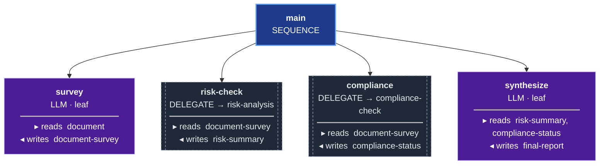
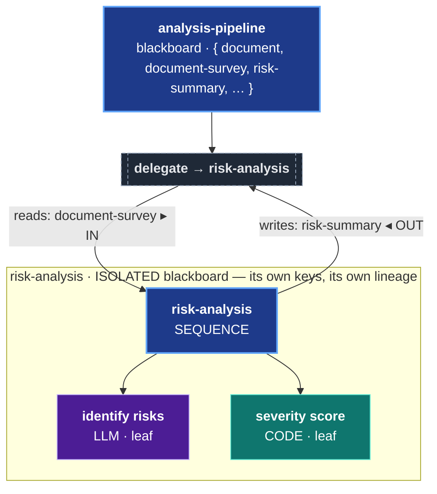

# ORC Principles — how to think about and build with ORC

> A short, durable reference for anyone building with ORC. Read it before you
> design a workflow or verify one. It is not a changelog or a roadmap — each
> principle is self-contained: the principle, why it matters, a concrete how, and
> a pointer to the relevant guide. These principles are framework-level: they hold
> for any domain you apply ORC to.

**Start at** [GETTING-STARTED.md](GETTING-STARTED.md) for a progressive introduction. **See** [COMPONENT-MAP.md](COMPONENT-MAP.md) for the dependency decision table.

## What ORC is

ORC (Orchestrator) is a **behavior-tree execution engine** built on the Grain
event-sourcing framework. You build a workflow by composing nodes into a tree; the
engine ticks the tree, every step is an event-sourced fact, and the durable record
of what happened is a projection you can read back. LLMs do the knowledge work *at
the nodes*; the tree is the deterministic spine that guarantees the steps run and
owns the contracts between them.

The leverage of ORC is **not** "call an LLM." It is *composing* the right nodes and
the right subbehaviors so your methodology is structural — guaranteed by the tree —
instead of crammed into one prompt and hoped for. The principles below are the
distilled lessons of building real systems this way, and most of them are about
resisting the pull back toward "one big prompt."

---

## 1. ORC is a behavior-tree engine — compose from the right node palette

ORC gives you a real palette: `:leaf` (with executor `:ai`/`:llm` for an LLM turn,
or `:code` for deterministic work), `:sequence`, `:fallback`, `:parallel`,
`:map-each`, `:condition`, `:llm-condition`, `:delegate`, and `:repl-researcher`.
Each exists for a reason. **Right-size the node to the work:**

- single-turn reasoning → `:llm`
- deterministic transform/compute → `:code`
- run steps in order → `:sequence`; concurrently → `:parallel`
- branch on a value → `:condition`; branch on a judgment → `:llm-condition`
- recovery / try-an-alternative → `:fallback`
- per-item over a collection → `:map-each`
- genuinely freeform, multi-iteration exploration where the right tree shape isn't
  known up front → `:repl-researcher` (the heaviest node — **reserve it**)

**Recursive mode is the default** — `:rlm true` and `{}` both resolve to `{:recursive? true}`; terminal mode (`{:recursive? false}`) is deprecated and will be removed. Source: `executor.clj line 2176: recursive-mode? (not= false (get-in node [:rlm :recursive?]))`.

**Why it matters.** The most common mistake is the "prompt-bloat treadmill":
expressing a multi-step methodology as one enormous instruction on a single
`:repl-researcher` session. More prose never *structurally* guarantees a step runs
— the loop keeps quietly dropping a concern. Making each step its own node makes
the step un-skippable. Forcing `:repl-researcher` for single-turn work is the
over-powered-node smell: prompt bloat, wasted code-gen overhead, per-iteration
timeouts, and prompts that end up pleading "do NOT do X".

**How.** Before reaching for `:repl-researcher`, ask "is the tree shape known?" If
yes, compose `:llm`/`:code`/`:condition`/`:fallback` directly. Reserve
`:repl-researcher` for the one step that genuinely needs to explore. See also:
`docs/GETTING-STARTED.md` (progressive guide to the node palette), `docs/COMPONENT-MAP.md` (dependency decision table), `docs/DSL-REFERENCE.md`, `docs/ORC-SERVICE-GUIDE.md`, `docs/contributors/CONTRIBUTOR-GRAIN-PATTERNS.md`,
and `docs/RLM-GUIDE.md` (when `:repl-researcher`/RLM is the right tool).

## 2. Compose complex behavior as durable, delegatable subtrees

A complex workflow is a **central tree that delegates to subbehavior trees** — each
subbehavior a first-class, reusable, independently *versioned* artifact rather than
an inlined block. The shape of the central tree *falls out* of composing
behaviors; you don't hand-draw one flat pipeline of stages.

**Why it matters.** A flat pipeline is the shape almost every workflow drifts
toward, and it's hard to test, reuse, or change safely. Treating each behavior as
its own composable tree makes it testable in isolation, reusable across many
workflows, versionable (so consumers pinned to an older version aren't rebuilt out
from under them), and independently evolvable (Principle 4).

**How.** Give each subbehavior a stable, versioned name so a new version is a new,
separately-evolvable artifact rather than a silent mutation of the old one.
Registering a workflow derives a deterministic identity from its name and is
idempotent — re-registering an unchanged definition is a no-op, so you can look a
subbehavior up by name and point a `:delegate` at it without rebuilding it. Give
each subbehavior its *own* resilience (Principle 1's `:fallback`/`:condition` plus
a validate/diagnose step) so one bad step self-corrects or fails *with a diagnosis*
before poisoning downstream. See also: `docs/ORC-SERVICE-GUIDE.md`,
`docs/DSL-REFERENCE.md`.



```clojure
;; The central tree delegates to independently-versioned sub-sheets
(def analysis-pipeline
  (orc/workflow "analysis-pipeline"
    (orc/blackboard
      {:document          :string
       :document-survey   :string
       :risk-summary      :string
       :compliance-status :string
       :final-report      :string})
    (orc/sequence "main"
      (orc/llm "survey"
        :reads [:document] :writes [:reasoning :document-survey])
      (orc/delegate "risk-check"
        :target-sheet-id risk-analysis-id       ; pre-built child sheet
        :reads  [:document-survey]
        :writes [:risk-summary])
      (orc/delegate "compliance"
        :target-sheet-id compliance-check-id    ; another pre-built child sheet
        :reads  [:document-survey]
        :writes [:compliance-status])
      (orc/llm "synthesize"
        :reads [:risk-summary :compliance-status]
        :writes [:reasoning :final-report]))))
```

## 3. `:delegate` is the composition mechanism

`:delegate` sends a unit of work to another tree: it runs as a **child tick** with
an **isolated blackboard**, the parent's values mapped in via the child's `:reads`
and the child's outputs mapped back out via its `:writes`, with full lineage and
streaming. This is the seam that lets a central tree route work to specialized
subbehaviors *and* lets a subbehavior be reused across many different parents.

**Why it matters.** Composition + delegation is the backbone that makes
subbehaviors first-class: without a clean delegate seam they can't be reused or
evolved independently. The child's isolated blackboard is what keeps a
subbehavior's internals from leaking into — or being clobbered by — its caller.

**How.** Map the contract explicitly via `:reads`/`:writes`. Child-tick overhead is
small relative to LLM-call latency, but measure it at *your* scale rather than
assuming. Getting a *map* to arrive **parsed** across the seam is node-type-specific
— see Principle 10. See also: `docs/ORC-SERVICE-GUIDE.md`, `docs/STREAMING.md`
(lineage/observability across delegated ticks).



## 4. Subbehaviors can evolve

A subbehavior body need not be frozen prose. ORC supports **pattern injection at
design time** (the top-fitting pattern from a shared corpus is prepended before the
model designs its tree), **evolution from execution evidence** (a reflection step
updates a body's strengths/weaknesses/traits as runs accumulate), and **minting a
new behavior** when the model meets work no existing pattern fits. So a system can
get *better with use*.

**Why it matters.** Composition + delegation is precisely what makes
*per-subbehavior* learning possible: because each behavior is its own delegatable
artifact with a clear contract, its body can become a living, self-improving
description without rewriting the surrounding tree. This is the payoff of
Principles 2 and 3. (It is an opt-in capability, and like any learning loop its
quality is strongest in-distribution — adopt it with that in mind, not as magic.)

**How.** Opt in at the node level, and assemble each subbehavior's prompt through
**one seam** so a static prompt today can be flipped to a living, corpus-sourced
body later without a node rewrite. See also: `docs/SELF-IMPROVING-LOOP.md`,
`docs/LIVING-DESCRIPTIONS.md`, `docs/RLM-GUIDE.md`.

## 5. Make a fitness gate the loop's objective, not a terminal report

When a workflow loops toward a goal, the **exit gate should be the objective the
loop pursues**, not a report you read after it stops. The loop runs, checks itself
against the gate, and on a failure **routes the gap to the step that can close it**
and re-works *focally* — rather than rebuilding everything or stopping regardless of
whether it produced what the goal needed. A genuinely-unachievable goal should
**terminate honestly** — surfaced, not spun, not declared green.

**Why it matters.** "It ran" is not "it's fit for purpose." Without a closing
objective, a workflow runs once and stops whether or not it did the job. With the
gate as the objective, "done" *means* "meets the bar" — and the routing evidence
(which check failed, and why) is the natural feed for future learning.

**How.** Derive the gate's criteria from the actual goal and inputs (so they fit
what's really there), persist them as the gate spec, and make the loop branch on the
verdict: pass → done; fail → one adaptive routing step maps the failing criterion to
the subbehavior that closes it → re-invoke → re-gate; unachievable → honest
terminate. Keep the loop budget-bounded so it always terminates. (In the ontology
domain this gate is a set of competency questions; the pattern is general.) See
also: `docs/contributors/CONTRIBUTOR-GRAIN-PATTERNS.md`, `docs/ONTOLOGY.md` (the competency-question
gate as a worked instance).

## 6. A deterministic skeleton wrapping LLM work is not "LLM-free"

A robust workflow usually has a **deterministic spine** that owns the contracts —
parsing/normalization, validation, persistence, indexing, the exit gate — with
**LLMs doing the knowledge work at the nodes** inside that spine. "Deterministic
skeleton" describes the *orchestration*; it never means the absence of LLMs.

**Why it matters.** The skeleton makes runs reproducible, gateable, and debuggable
even though the knowledge work is LLM-driven. But the framing is a recurring trap:
calling it "the deterministic pipeline" tempts you to verify only the deterministic
half and trust the LLM half blind.

**How.** Keep contracts/validation/exit-gate deterministic; let the LLM reason at
the nodes. When you verify, **verify BOTH** — a green deterministic skeleton wrapped
around garbage LLM output is still a failure. See also: `docs/ARCHITECTURE.md`.

## 7. Re-orchestrate, don't rewrite — and don't rediscover the obvious shape

Ground a new design in what already exists; reuse proven capabilities; don't redraw
a shape that's already well-known. For many problem families there's an "obvious"
flat pipeline that every prior attempt converges on — re-drawing it adds nothing.

**Why it matters.** The leverage is rarely in the obvious sequence of stages; it's
in **deepening** it — the parts every shallow version skips. Mistaking "a fresh
pipeline of stages" for progress is how a rewrite burns effort re-discovering the
shape someone already found, while the hard, valuable parts stay undone.

**How.** Before building, ask whether you're just redrawing the known shape. Reuse
proven capabilities by **re-housing** them into the right composition rather than
forking them, and put the new effort into the parts that are genuinely hard. See
also: `docs/ARCHITECTURE.md`, `docs/contributors/CONTRIBUTOR-GRAIN-PATTERNS.md`.

## 8. Events-first: commands → events → projections (no bare appends)

Every write goes through a **command → schema-validated event → projection**. There
are **no bare event-store appends**. Any read model (including the usable result of
a workflow) is a *projection* of the event log — auditable, rebuildable, and
consistent with the rest of a Grain application.

**Why it matters.** Bare appends bypass validation and break the auditable,
rebuildable contract the whole system depends on. And a function's *return value* is
not proof anything landed — only the projection is.

**How.** Use the Grain building blocks (`defcommand` / `defreadmodel` / `defquery`
/ `defprocessor`); never a raw append. **Assert events LANDED by reading the
projection back** — read the relevant read model and confirm the expected
keys/values are present — rather than trusting what a call returned. See also:
`docs/EVENT-STORE-PATTERNS.md`, `CLAUDE.md` (Grain v2 / Architecture).

## 9. Put a `:reasoning` field first on `:llm` nodes

Have every `:llm` node write a `:reasoning` field *first* — make it the first
declared `:writes` key, so the model reasons before it emits the structured output.

**Why it matters.** Forcing the thinking before the answer measurably improves the
structured output — and it's the right way to get chain-of-thought: as node
structure, not as another paragraph bolted onto a mega-prompt. It also leaves an
inspectable trace of *why* the node decided what it did.

**How.** Declare `:reasoning` as the first `:writes` key on the `:llm` node. In
`:parallel` and `:map-each`, **node-scope** the reasoning key (give it a per-node
name) so concurrent siblings don't trample each other's reasoning on the shared
blackboard. See also: `docs/DSL-REFERENCE.md`.

## 10. Getting a map across `:delegate` parsed is node-type-specific

`:delegate` passes values **verbatim** — keys are normalized, but values are **not
coerced**. So whether a *map* contract arrives parsed (vs. as a JSON string) is
determined by the **producing node type**, not by the seam:

- **`:llm` node** — the LLM's text is parsed against the node's `:writes` schema. A
  bare `:map` schema arrives as a **JSON string**; you MUST declare a **structured
  `[:map …]` / `[:map-of …]` Malli schema** for the executor to reassemble a parsed
  map.
- **`:repl-researcher`** — when it finalizes with a real (SCI-evaluated) Clojure
  map, that map is persisted parsed verbatim. The load-bearing part is the
  **prompt**: require it to finalize with EDN data and avoid routing the value back
  out through an emitted tree's `:llm` leaf (which would re-stringify it). A
  structured schema is good defense-in-depth here.
- **`:code` node** — returns native Clojure, so a map arrives parsed naturally.

**Why it matters.** "I declared `:writes [:profile]`, so it'll be a map" is wrong
for `:llm` (and a foot-gun for `:repl-researcher`). Get it wrong and a downstream
`:code` node chokes on a JSON string it expected to be a map.

**How.** Pick the fix for the producing node type (above), then **verify** the
contract arrives parsed by reading the parent blackboard back from the projection
(Principle 8) and asserting it's a map, not a string. See also:
`docs/ORC-SERVICE-GUIDE.md`, `docs/EVENT-STORE-PATTERNS.md`.

## 11. Keep reusable workflows domain-agnostic

A workflow meant to be reused should carry **no baked-in vertical knowledge**. Its
focus comes from its runtime inputs (the goal, the documents, the configuration),
not from hardcoded industry taxonomies or field names. Format/medium specialists
(CSV, SQL, Excel, text) are fine and useful; *industry* tuning baked into the code
is not.

**Why it matters.** Any consumer in any domain should get correct behavior with
zero domain-specific tuning. Baking a single vertical into the implementation turns
a general tool into a one-vertical tool and a maintenance liability.

**How.** When you review, scan the **implementation** (not just the test driver) for
domain leakage — hardcoded vertical taxonomies, industry-specific field names,
phrase lists. The focus belongs in the runtime inputs, not the code. (Relatedly,
don't ship hardcoded phrase-matching as a quality gate — prefer schemas, judges,
and retrieval.) See also: `docs/ARCHITECTURE.md`.

## 12. Verify adversarially — capability is not correctness

Treat a "done / all green / it works" report as a **claim to falsify, not a fact to
accept** — including your own. Re-run the proof yourself; re-read the actual code,
not the summary; try to **break** it (empty/null/malformed input, boundaries,
out-of-order or duplicate events, the "can't happen" case); root-cause anything off
instead of writing it off as "flaky" or "model variance"; and check what is *not*
said (silent caps, skipped criteria, an honest "couldn't verify X").

**Why it matters.** Shape-valid (a schema passes, a DSL parses, the structure looks
right) is the **floor**, not the ceiling. The nastiest failures come from runs that
"completed" but produced the wrong thing — a degenerate/empty/fallback path, or an
output that's well-formed but wrong — a green nobody actually watched.

**How.** Live verification with the **real** dependencies (real Grain, real LLM,
real retrieval/embeddings) is the ceiling; synthetic tests are the floor. No
invented fixtures, no mocks behind a "done" claim. **No false green:** a run that
finished but produced nothing useful (zero results, dangling references, a raw dump
instead of the modeled output) is a FAIL. Distinguish "the work is wrong" from "my
measurement is wrong" — rule out a stuck flag, a stale fixture, a harness that
stores results oddly. Then report faithfully, including your own missteps. See also:
`docs/EVENT-STORE-PATTERNS.md` (projection read-back as proof).

## 13. Operational hygiene: bounded runs and no truncation

Run live verifications **bounded** (a timeout, a clean shutdown) and **clean up
processes** when done — a lingering hot-loop JVM is a *finding*, not background
noise: it consumes resources and can fake symptoms (a stuck loop, a held port) in
the next run. And **never truncate model-authored output** — code, trees, results —
when capturing it or feeding it back into a later prompt; pass it verbatim.

**Why it matters.** Orphaned processes silently poison the next run's measurement.
Truncating model output corrupts the evidence: a clipped tree or result is no longer
what the model produced, and feeding a clipped artifact into the next prompt
poisons the loop.

**How.** Bound each live run and confirm no orphan processes survive it (stop them
by their specific process id, never with a blunt kill-all that would take down other
work). When capturing or comparing model-authored artifacts, record them verbatim.

## 14. A parallel `:map-each` leaf must be a primitive with explicit `:writes`

A `:map-each` collects each iteration's result from the leaf's **explicit declared `:writes`,
isolated per iteration** — that isolation is exactly what makes `:parallel` safe. A **composite**
leaf (`:fallback`/`:sequence`) completes with *empty* parent `:writes`, so the engine falls back to
reading **all non-special keys off the per-iteration blackboard**. That composite-read path is
**not** parallel-safe (results scramble across concurrent iterations) and **bleeds stale keys** (a
key the taken branch didn't write keeps a prior iteration's value).

**Why it matters.** Wrapping a `:map-each` leaf in a `:fallback` — the natural reach for per-item
recovery — silently switches collection from the isolated explicit-writes path to the racy
composite-read path. Under `:parallel` the per-item results get **misattributed across items**; even
sequentially, a key written by only one branch **bleeds forward** to later items. Shape/structural
tests pass blind to this (the tree is well-formed) — only a **live, multi-iteration** run with a real
per-item failure exposes it: the Principle-12 ceiling, not the floor.

**How.** Keep every parallel `:map-each` leaf a **primitive** (`:llm`/`:code`) that declares its
`:writes` explicitly; don't wrap the leaf in a composite whose writes you then depend on. For per-item
recovery, handle failure **outside** the per-iteration collection: when a leaf fails the engine
**isolates** it — the workflow does not abort (status `:partial`), the failed leaf is **dropped and
the result vector compacts** (no index gap), and top-level `:failure-indices` is nil — so recovering
*which* item failed comes from the **event/trace channel**, not the result map. Re-run or surface the
gap at the parent; never present a compacted partial as complete. (Relatedly, node-scope shared keys
in `:parallel`/`:map-each` — Principle 9.) Verify any `:map-each` fault handling with a live run that
induces a real per-item failure. See also: `docs/ORC-SERVICE-GUIDE.md` (`map-each`), Principles 9 and 12.

---

## Where these come from

These principles were distilled from building real systems on ORC and repeatedly
hitting the failure modes that come from fighting the engine's grain — a mega-prompt
that keeps dropping a step, one over-powered node forced to do everything, a run
that "completed" but produced nothing useful. They're written to be framework-level:
they should hold for whatever you build on ORC. The companion guides go deeper on
specific capabilities:

- **Getting started / progressive guide:** `docs/GETTING-STARTED.md`, `docs/COMPONENT-MAP.md`
- **The DSL and node palette:** `docs/DSL-REFERENCE.md`, `docs/ORC-SERVICE-GUIDE.md`,
  `docs/contributors/CONTRIBUTOR-GRAIN-PATTERNS.md`
- **`:repl-researcher` / RLM mode:** `docs/RLM-GUIDE.md`
- **Self-improvement, living descriptions, feedback:** `docs/SELF-IMPROVING-LOOP.md`,
  `docs/LIVING-DESCRIPTIONS.md`, `docs/PATTERN-RECORDING.md`
- **Events-first / Grain patterns:** `docs/EVENT-STORE-PATTERNS.md`, `CLAUDE.md`
- **Live streaming / observability:** `docs/STREAMING.md`
- **Architecture overview:** `docs/ARCHITECTURE.md`
