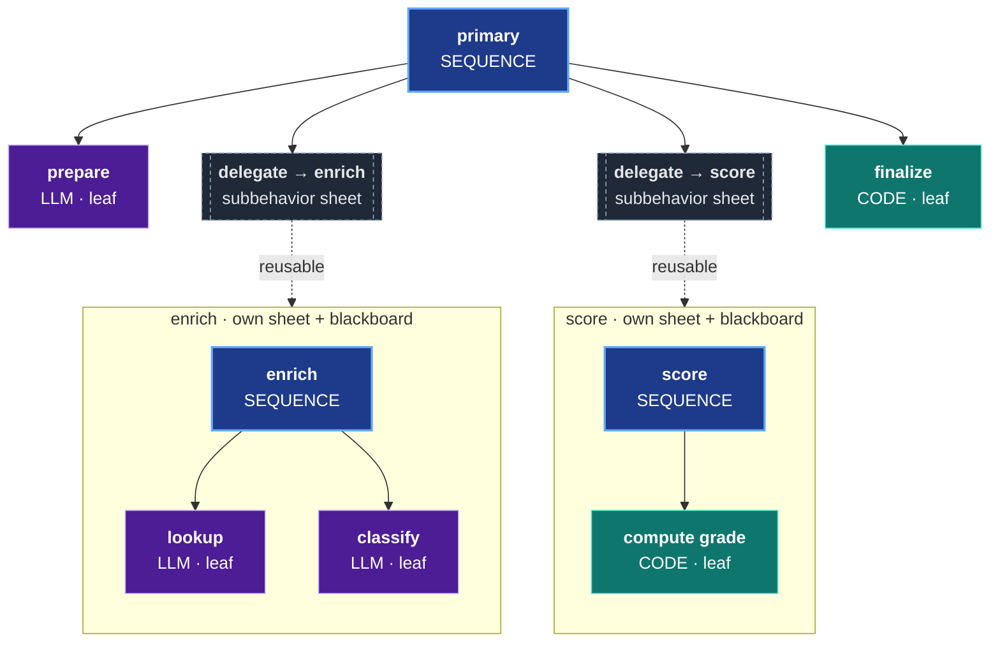
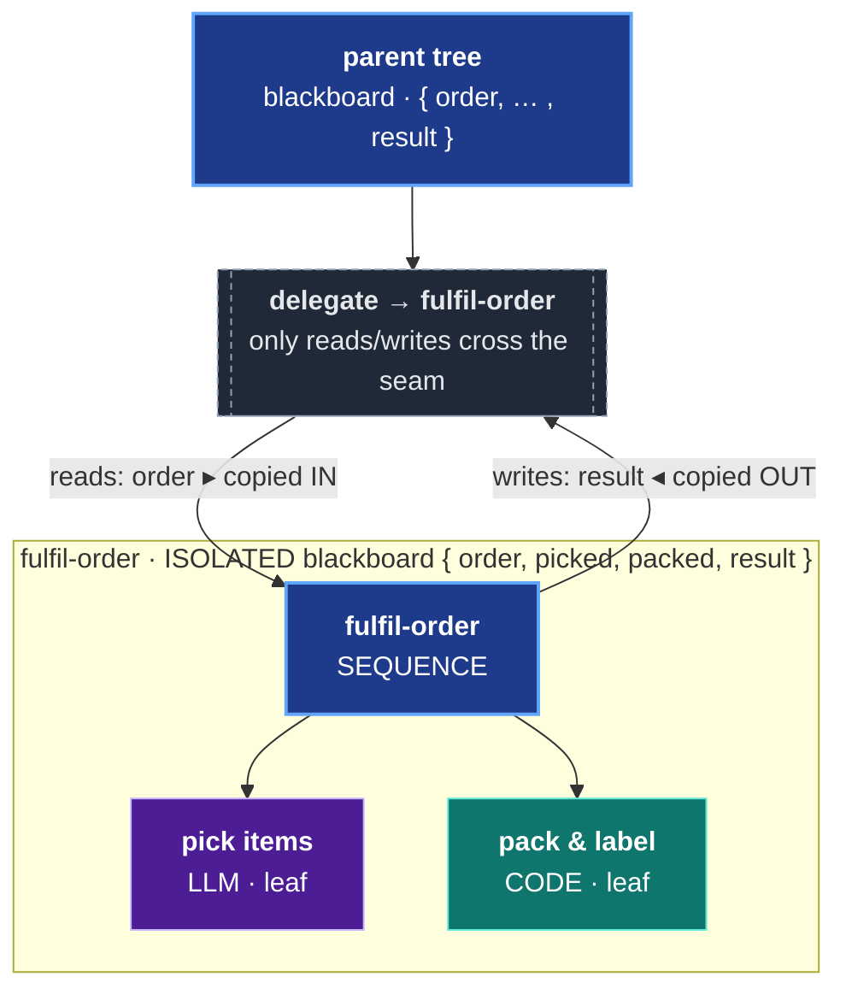
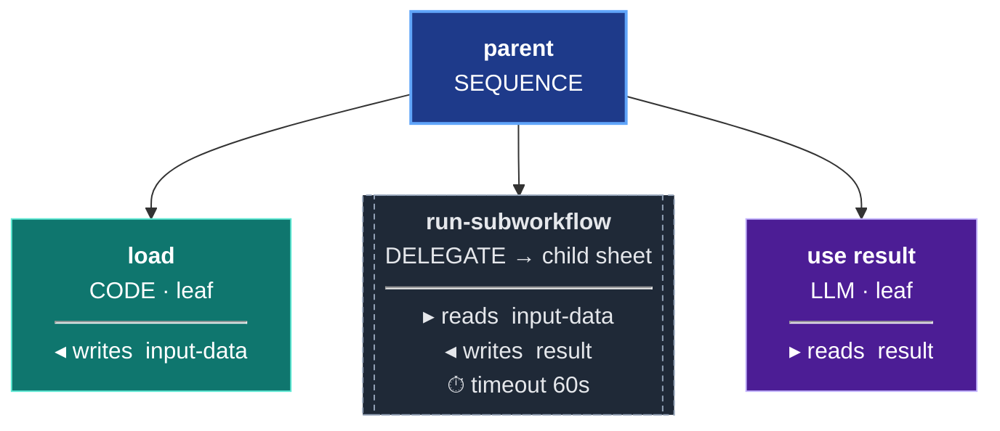

# Sheet Service Guide

A comprehensive guide to the orc-service component, which provides the ORC (Orchestration Runtime for Clojure) behavior tree engine for building and executing AI workflows.

> For a progressive introduction see [GETTING-STARTED.md](GETTING-STARTED.md). This doc is the complete DSL and execution reference.

## You build a workflow by composing nodes into a tree

Everything in ORC starts from one idea: **you build a workflow by composing nodes into a tree.** There is no special "workflow object" to learn — there is a small palette of nodes, and you nest them.

- **Start with a `:sequence` of `:llm` and `:code` nodes.** A sequence runs its children in order; an `:llm` node calls a model; a `:code` node runs a Clojure function. That's a complete, runnable workflow. Most workflows begin exactly here.
- **As your methodology grows, factor reusable pieces into their own sheets and `:delegate` to them.** A step that has become its own little methodology — "summarize a document", "score a candidate", "extract entities" — graduates into its own sheet. Your central tree then `:delegate`s to it. Your primary tree becomes a *composition of subbehaviors* rather than one giant flat list of leaves. This is the same move you make when you extract a function out of a long block of code.
- **When one step is genuinely open-ended, reach for `:repl-researcher`.** Some work can't be laid out as a fixed tree ahead of time — the right shape depends on what the data turns out to be. That's where the exploratory `:repl-researcher` node earns its weight: the model designs (and re-designs) a tree at runtime.

Read the rest of the guide in that order — it goes from simple, to composed, to exploratory, then to the cross-cutting concerns you add on top.

### How to read this guide

1. **Simple trees first.** [Control Nodes](#control-nodes) (`sequence`, `parallel`, `fallback`, `map-each`) and [Leaf Nodes](#leaf-nodes) (`llm`, `code`, `condition`, `llm-condition`). Compose these and you can already build real workflows.
2. **Composition next.** [`delegate`](#delegate) is how you compose reusable subbehaviors into a primary tree — the heart of how ORC workflows grow. See ORC-PRINCIPLES Principles 2–3.
3. **The heavy exploratory node.** [`repl-researcher`](#repl-researcher) for genuinely open-ended steps. Powerful, but reach for it only when a fixed tree truly can't express the work.
4. **Cross-cutting concerns, each gated by an opt-in layer.** [Judges](#attaching-judges-to-nodes) (Layer 1 — needs `evaluation`), [GEPA optimization](#gepa-integration) (Layer 3 — needs `gepa` + `evaluation`), and [live streaming](STREAMING.md). These layer *on top of* a working tree; you add them when you need them, never to get started.

> **New here?** Walk [GETTING-STARTED.md](GETTING-STARTED.md) first — it's the gentle, hand-held on-ramp that builds your first tree step by step. Come back here for the full node palette. For the exhaustive, every-option-listed node reference, see [DSL-REFERENCE.md](DSL-REFERENCE.md).

## Table of Contents

1. [Overview](#overview)
2. [Quick Start](#quick-start)
3. [Workflow DSL Reference](#workflow-dsl-reference)
4. [Blackboard Patterns](#blackboard-patterns)
5. [Execution Model](#execution-model)
6. [Event Store Integration](#event-store-integration)
7. [Code Executors](#code-executors)
8. [Testing Workflows](#testing-workflows)
9. [GEPA Integration](#gepa-integration)
10. [API Reference](#api-reference)

---

## Overview

> **Layer 0** — `orc-service` only, no Python. See [COMPONENT-MAP.md](COMPONENT-MAP.md).

The orc-service component is the core of ORC's behavior tree execution engine. It provides:

- **Declarative Workflow DSL** - Define AI workflows as composable data structures
- **Event-Sourced Persistence** - All workflow definitions and executions are stored as events
- **Behavior Tree Semantics** - Industry-standard control flow (sequence, parallel, fallback)
- **Integrated LLM Execution** - First-class support for LLM nodes
- **Comprehensive Tracing** - Full observability of every execution

### Architecture

```
┌─────────────────────────────────────────────────────────────────┐
│                         orc-service                            │
├─────────────────────────────────────────────────────────────────┤
│  interface.clj                                                   │
│  ├── Workflow DSL (workflow, blackboard, sequence, llm, ...)   │
│  ├── Execution (execute, build-workflow!)                       │
│  └── Queries (get-sheet, get-nodes-for-sheet, get-trace)       │
├─────────────────────────────────────────────────────────────────┤
│  core/                                                           │
│  ├── dsl.clj          - DSL builder functions                  │
│  ├── commands.clj     - Event-sourced command handlers          │
│  ├── runtime.clj      - Behavior tree traversal                 │
│  ├── executor.clj     - Node execution (AI + code)              │
│  ├── read_models.clj  - Event projections & queries             │
│  └── gepa.clj         - GEPA prompt optimization                │
└─────────────────────────────────────────────────────────────────┘
```

---

## Quick Start

### Minimal Workflow

```clojure
(ns my-app.workflows
  (:require [ai.obney.orc.orc-service.interface :as sheet]))

;; 1. Define a workflow
(def hello-workflow
  (sheet/workflow "hello-world"
    (sheet/blackboard
      {:name :string
       :greeting :string})

    (sheet/llm "greet"
      :model "google/gemini-2.0-flash-001"
      :instruction "Generate a friendly greeting for the given name."
      :reads [:name]
      :writes [:greeting])))

;; 2. Build the workflow (stores in event store)
(def sheet-id (sheet/build-workflow! ctx hello-workflow))

;; 3. Execute with inputs
(def result (sheet/execute ctx sheet-id {:name "Alice"}))

;; 4. Check outputs
(:status result)   ;; => :success
(:outputs result)  ;; => {:greeting "Hello Alice! ..."}
```

### Running in the REPL

```clojure
;; Load development context (see development/src/repl_stuff.clj)
;; This gives you: ctx, event-store, service

;; Build and execute
(def sheet-id (sheet/build-workflow! ctx my-workflow))
(sheet/execute ctx sheet-id {:input "value"})
```

---

## Workflow DSL Reference

> **Layer 0** — `orc-service` only, no Python. See [COMPONENT-MAP.md](COMPONENT-MAP.md).

### `workflow`

Create a named workflow container.

```clojure
(sheet/workflow "my-workflow-name"
  (sheet/blackboard {...})
  (sheet/sequence "main"
    ...))
```

The workflow name is used to generate a deterministic UUID v5, so rebuilding the same workflow produces the same sheet-id. A SHA-256 content hash is stored on each build — if the definition hasn't changed, `build-workflow!` is a true no-op (zero events emitted). This makes it safe to call on every application startup.

### `blackboard`

Define typed shared state using Malli schemas.

```clojure
(sheet/blackboard
  {:input-text :string
   :word-count :int
   :items [:vector :string]
   :analysis [:map
              [:score :double]
              [:reasoning :string]]})
```

### Control Nodes

#### `sequence`

Execute children in order. Fails immediately if any child fails.

```clojure
(sheet/sequence "main-flow"
  (sheet/code "step-1" ...)
  (sheet/llm "step-2" ...)
  (sheet/code "step-3" ...))
```

#### `parallel`

Execute children concurrently.

```clojure
(sheet/parallel "concurrent-work"
  :success-policy :all    ;; :all (default) or :any
  :failure-policy :any    ;; :any (default) or :all
  (sheet/llm "task-a" ...)
  (sheet/llm "task-b" ...)
  (sheet/llm "task-c" ...))
```

#### `fallback`

Try children until one succeeds (selector pattern).

```clojure
(sheet/fallback "try-options"
  (sheet/code "try-cache" ...)
  (sheet/llm "try-llm" ...)
  (sheet/code "use-default" ...))
```

#### `map-each`

Iterate over a collection.

```clojure
(sheet/map-each "process-items"
  :collection-key :items
  :item-key :current-item
  :result-key :processed-items
  :parallel 3               ;; Optional parallelism
  (sheet/llm "process" ...))
```

> **Parallel-safety — the leaf must be a primitive.** `map-each` collects each iteration from the
> leaf's **explicit `:writes`, isolated per iteration** — that's what makes `:parallel` safe. A
> **composite** leaf (`fallback`/`sequence`) completes with *empty* parent writes, so the engine
> instead reads **all non-special keys off the per-iteration blackboard**; under `:parallel` that
> **scrambles results across items**, and even sequentially a key written by only one branch
> **bleeds** to later items. Keep a parallel `map-each` leaf a **primitive** (`llm`/`code`) with
> explicit `:writes`; do **not** wrap it in a `fallback` whose writes you depend on. On a leaf
> failure the engine isolates it — status `:partial`, the failed item **dropped and the result
> vector compacted** (no index gap), and top-level `:failure-indices` is nil — so recover *which*
> item failed from the event/trace channel and re-run/surface it at the parent (never ship a
> compacted partial as complete). See ORC-PRINCIPLES Principle 14.

### Leaf Nodes

#### `llm`

Call an LLM.

```clojure
(sheet/llm "analyze"
  :model "google/gemini-2.0-flash-001"
  :instruction "Analyze the input and provide insights."
  :reads [:input-data]
  :writes [:analysis])
```

**Options:**

| Option | Description |
|--------|-------------|
| `:model` | LLM model identifier (OpenRouter format) |
| `:instruction` | System prompt for the LLM |
| `:reads` | Vector of blackboard keys to read as input |
| `:writes` | Vector of blackboard keys to write as output |
| `:temperature` | Sampling temperature (default: 0.7) |

#### `code`

Execute a Clojure function.

```clojure
(sheet/code "transform"
  :fn "my-app.executors/transform-data"
  :reads [:input]
  :writes [:output])
```

#### `condition`

Check a boolean expression on the blackboard.

```clojure
(sheet/condition "check-valid"
  :check {:key :valid? :op :equals :value true})  ;; True when :valid? blackboard key is true
```

#### `llm-condition`

Use an LLM for yes/no decisions.

```clojure
(sheet/llm-condition "is-spam"
  :model "google/gemini-2.0-flash-001"
  :question "Is this message spam?"
  :reads [:message])
```

#### `delegate`

**This is how you compose subbehaviors into a primary tree.** `:delegate` executes another workflow (a separate sheet, with its own isolated blackboard) as a node inside the current tree. When a step in your workflow has grown into its own little methodology, you factor it into its own sheet and `:delegate` to it — and your central tree becomes a *composition of subbehaviors* rather than one flat list of leaves. This is the same instinct as extracting a function: the subbehavior is durable, independently testable, independently optimizable, and reusable across many parent trees. See ORC-PRINCIPLES [Principle 2 — *Compose complex behavior as durable, delegatable subtrees*](ORC-PRINCIPLES.md#2-compose-complex-behavior-as-durable-delegatable-subtrees) and [Principle 3 — *`:delegate` is the composition mechanism*](ORC-PRINCIPLES.md#3-delegate-is-the-composition-mechanism).

A primary tree composing two reusable subbehaviors via `:delegate`:



Each `:delegate` is a clean seam — the child runs against its own isolated blackboard, and only the declared `:reads`/`:writes` cross the boundary:



Execute another workflow with isolated blackboard.

```clojure
(sheet/delegate "run-subworkflow"
  :target-sheet-id child-sheet-uuid
  :reads [:input-data]           ;; Pass to child
  :writes [:result]              ;; Receive from child
  :timeout-ms 60000)             ;; Optional timeout
```



**Options:**

| Option | Description |
|--------|-------------|
| `:target-sheet-id` | UUID of the workflow to execute |
| `:reads` | Blackboard keys to pass as inputs |
| `:writes` | Blackboard keys to receive as outputs |
| `:timeout-ms` | Execution timeout (default: 300000ms) |
| `:inherit-ontology?` | Share ontology context (default: true) |

> **Map-parsing across the seam (Principle 10).** `:delegate` passes values **verbatim** — values are not type-coerced. Whether a map contract arrives parsed (vs. as a JSON string) depends on the **producing node type**: an `:llm` node produces a JSON string unless you declare a structured `[:map …]` Malli schema on the blackboard key; a `:code` node returns native Clojure, so maps arrive parsed naturally; a `:repl-researcher` node finalizes with real EDN (parsed) when prompted to emit a Clojure map. Declare structural Malli schemas on keys that cross the seam. See [ORC-PRINCIPLES.md § Principle 10](ORC-PRINCIPLES.md).

#### `repl-researcher`

Execute a two-phase recursive research loop. In Phase 1 the model inspects the task context and emits a behavior tree DSL. In Phase 2 that tree runs against the sandbox. In recursive mode (the default) Phase 2 outputs are merged back into the sandbox and control returns to Phase 1 — the model can iterate, drill down, emit follow-up trees, and call `(final! ...)` to terminate.

```clojure
(sheet/repl-researcher "researcher"
  :model "google/gemini-2.5-flash"
  :instruction "Research the topic and produce a structured analysis."
  :reads  [:input-data]
  :writes [:research-result]
  :rlm    {:recursive? true})   ;; recursive is the default; omit for same effect
```

> **Recursive is the default.** `:rlm true`, `:rlm {}`, and `:rlm {:debug? true}` all default to recursive mode (`:rlm {:recursive? true}`). Terminal mode (`:rlm {:recursive? false}`) is **deprecated** — preserved for backward compatibility; migrate by dropping the `:recursive? false` key. Source: `executor.clj:2172-2176`.

**Options:**

| Option | Description |
|--------|-------------|
| `:model` | LLM model identifier (OpenRouter format) |
| `:instruction` | Task instruction for the researcher's Phase 1 |
| `:reads` | Blackboard keys passed to the Phase 1 context |
| `:writes` | Blackboard keys to receive from `(final! ...)` |
| `:rlm` | RLM config map, or `true` for defaults (recursive mode) |

See [RLM-GUIDE.md](RLM-GUIDE.md) for the complete recursive-mode reference, drill-down primitives (`tree-detail`, `tree-failures`, `node-output`), budget controls, and how to compose `:repl-researcher` inside a larger tree.

---

## Blackboard Patterns

### LLM Output Schemas

**CRITICAL: Never use `:any` or `:map-of :keyword :any` for LLM outputs.**

LLMs need explicit field structure to generate reliable outputs.

#### Bad Pattern (returns nulls)

```clojure
;; DON'T DO THIS
(sheet/blackboard
  {:analysis [:map-of :keyword :any]})
```

#### Good Pattern (explicit fields + descriptions)

```clojure
;; DO THIS — each field is explicit AND carries a :description.
;; The explicit structure gives the LLM a reliable output shape;
;; the descriptions tell it what each field means. Both matter:
;; structure prevents nulls, descriptions improve field quality.
(sheet/blackboard
  {:analysis [:map
              [:score      [:double {:description "Overall fit score from 0.0 (poor) to 1.0 (excellent)"}]]
              [:reasoning  [:string {:description "Step-by-step justification for the score, written before the score is decided"}]]
              [:keyFactors [:vector {:description "The 3-5 factors that most influenced the score"} :string]]]})
```

Describe **every** key you care about — top-level keys and nested fields alike.
A field with a description consistently produces better output than the same field
without one, because the description is injected into the LLM's output signature
(see [Field Descriptions](#field-descriptions) below).

### Field Descriptions

Add semantic hints using Malli's `:description` property:

```clojure
(sheet/blackboard
  {:question [:string {:description "The user's question to answer"}]
   :answer [:string {:description "A concise, factual answer"}]})
```

Descriptions are included in LLM prompts:

```
Your output fields are:
- answer: A concise, factual answer (string)
```

### Nested Map Schemas

Descriptions work at every level of nesting — describe the nested fields too:

```clojure
(sheet/blackboard
  {:student-analysis
   [:map
    [:academicStrengths [:vector {:description "Subjects/skills the student excels at"} :string]]
    [:careerInterests   [:vector {:description "Career fields the student has expressed interest in"} :string]]
    [:preferenceWeights [:map
                         [:costSensitivity   [:double {:description "How much cost matters, 0.0-1.0"}]]
                         [:locationPreference [:double {:description "How much location matters, 0.0-1.0"}]]]]]})
```

---

## Execution Model

> **Layer 0** — `orc-service` only, no Python. See [COMPONENT-MAP.md](COMPONENT-MAP.md).

### Execution Flow

```
sheet/execute(ctx, sheet-id, inputs)
       │
       ▼
┌──────────────────────┐
│ 1. Load Sheet from   │
│    Event Store       │
└──────────┬───────────┘
           ▼
┌──────────────────────┐
│ 2. Initialize        │
│    Blackboard        │
└──────────┬───────────┘
           ▼
┌──────────────────────┐
│ 3. Traverse Tree     │──► Events: :sheet/tree-tick-started
│    (BFS/DFS)         │              :sheet/node-execution-started
└──────────┬───────────┘              :sheet/node-execution-completed
           ▼
┌──────────────────────┐
│ 4. Execute Nodes     │
│    (AI or Code)      │
└──────────┬───────────┘
           ▼
┌──────────────────────┐
│ 5. Assemble Trace    │──► Event: :sheet/trace-assembled
└──────────┬───────────┘
           ▼
┌──────────────────────┐
│ 6. Return Result     │
│    {:status :outputs │
│     :duration-ms     │
│     :trace-id}       │
└──────────────────────┘
```

### Execution Result

```clojure
(def result (sheet/execute ctx sheet-id {:input "value"}))

result
;; => {:status :success           ;; :success, :failure, :timeout
;;     :outputs {:key "value"}    ;; Final blackboard state
;;     :duration-ms 1234          ;; Total execution time
;;     :trace-id #uuid "..."}     ;; Unique trace identifier
```

### Node Status Semantics

| Status | Meaning |
|--------|---------|
| `:success` | Node completed successfully |
| `:failure` | Node failed (may trigger fallback) |
| `:running` | Node still executing (async) |

### LLM Call Budget (Opt-in)

Prevent runaway workflows in nested iteration scenarios by setting an LLM call limit.

**IMPORTANT:** Budget is opt-in only. If not specified, **no limit is enforced**.

```clojure
;; No budget (default - unlimited)
(sheet/execute ctx sheet-id inputs)

;; With budget (fails if exceeded)
(sheet/execute ctx sheet-id inputs :llm-call-budget 100)
```

**When budget is exceeded:**
- Workflow fails with error: `"LLM call budget exceeded: 100/100"`
- No partial results - fails immediately when limit reached

**When to use:**
- `map-each` over large collections calling LLMs
- Recursive/iterative workflows (repl-researcher)
- Production safety nets for untested workflows

**Tracking:**
- Budget is per-tick (per execution)
- Counter cleared automatically on completion
- Only AI executor calls count (not code nodes)

---

## Event Store Integration

> **Layer 0** — `orc-service` only, no Python. See [COMPONENT-MAP.md](COMPONENT-MAP.md).

The orc-service uses Grain's event store for persistence and observability.

### Events Emitted

| Event Type | When Emitted | Body Fields |
|------------|--------------|-------------|
| `:sheet/sheet-created` | `build-workflow!` (first build only) | `:sheet-id`, `:name` |
| `:sheet/node-created` | `build-workflow!` (first build or change) | `:sheet-id`, `:node-id`, `:type` |
| `:sheet/key-declared` | `build-workflow!` (first build or change) | `:sheet-id`, `:key-name`, `:schema` |
| `:sheet/content-hash-set` | `build-workflow!` (first build or change) | `:sheet-id`, `:content-hash` |
| `:sheet/tree-tick-started` | `execute` start | `:sheet-id`, `:tick-id` |
| `:sheet/node-execution-started` | Node begins | `:sheet-id`, `:node-id`, `:tick-id` |
| `:sheet/node-execution-completed` | Node ends | `:sheet-id`, `:node-id`, `:status`, `:duration-ms` |
| `:sheet/tree-tick-completed` | `execute` end | `:sheet-id`, `:tick-id`, `:root-status` |
| `:sheet/trace-assembled` | Trace ready | `:trace-id`, `:sheet-id`, full trace data |

### Read Model Queries

```clojure
;; Get sheet metadata
(sheet/get-sheet event-store sheet-id)
;; => {:id sheet-id :name "my-workflow" :created-at ...}

;; Get all nodes for a sheet
(sheet/get-nodes-for-sheet event-store sheet-id)
;; => [{:id node-id :type :leaf :name "step-1" :reads [...] :writes [...]} ...]

;; Get blackboard schema
(sheet/get-blackboard-by-key event-store sheet-id)
;; => {:input {:schema :string} :output {:schema [:map ...]}}

;; Get execution trace
(sheet/get-trace event-store trace-id)
;; => {:trace-id ... :node-traces [...] :input-snapshot ... :output-snapshot ...}

;; Get traces for a sheet
(sheet/get-traces-for-sheet event-store sheet-id)
;; => [{:trace-id ... :status :success ...} ...]
```

### Rolling Metrics

Track node performance over a sliding window:

```clojure
;; Metrics for a specific node
(sheet/get-node-rolling-metrics event-store sheet-id node-id)
;; => {:execution-count 150
;;     :success-rate 0.967
;;     :avg-duration-ms 423.5
;;     :recent-trend :stable}  ;; :improving, :degrading, :stable

;; Metrics for all nodes in a sheet
(sheet/get-tree-rolling-metrics event-store sheet-id)
;; => {:sheet-id ... :nodes [{:node-id ... :success-rate ...}] :total-executions 500}
```

### Querying Events Directly

**IMPORTANT:** `es/read` returns a reducible collection that must be materialized with `(into [] ...)` before calling `count` or other sequence functions.

```clojure
(require '[ai.obney.grain.event-store-v2.interface :as es])

;; Query events by type and tags
(into [] (es/read event-store
           {:types #{:sheet/node-execution-completed}
            :tags #{[:sheet sheet-id]}
            :limit 100
            :order :desc}))
```

See [EVENT-STORE-PATTERNS.md](./EVENT-STORE-PATTERNS.md) for detailed query patterns.

---

## Code Executors

> **Layer 0** — `orc-service` only, no Python. See [COMPONENT-MAP.md](COMPONENT-MAP.md).

Code nodes execute Clojure functions. The function receives an inputs map and returns an outputs map.

### Basic Executor

```clojure
(defn my-executor
  [{:keys [inputs]}]
  (let [input-val (:input-key inputs)]
    {:output-key (process input-val)}))
```

### Full Context

Executors receive the full execution context:

```clojure
(defn advanced-executor
  [{:keys [inputs context node-id sheet-id]}]
  ;; inputs: map of blackboard keys → values
  ;; context: Grain context with :event-store
  ;; node-id: UUID of this node
  ;; sheet-id: UUID of the workflow
  {:result (compute inputs)})
```

### Registering Executors

Reference executors by fully-qualified function name:

```clojure
(sheet/code "process"
  :fn "my-app.executors/my-executor"
  :reads [:input]
  :writes [:output])
```

---

## Testing Workflows

> **Layer 0** — `orc-service` only, no Python. See [COMPONENT-MAP.md](COMPONENT-MAP.md).

### Test Context Setup

Use `with-async-test-context` for tests that need full event flow:

```clojure
(ns my-app.workflow-test
  (:require [clojure.test :refer [deftest testing is]]
            [ai.obney.orc.orc-service.test-helpers :as h]
            [ai.obney.orc.orc-service.interface :as sheet]))

(deftest my-workflow-test
  (testing "workflow executes correctly"
    (h/with-async-test-context [ctx]
      ;; Create workflow using test helpers
      (let [sheet-result (h/run-and-apply! ctx (h/make-create-sheet-command :name "Test"))
            sheet-id (-> sheet-result :command-result/events first :sheet-id)]

        ;; ... add nodes, execute, verify
        ))))
```

### Mock Executors

Create deterministic executors for testing:

```clojure
(defn mock-qa-executor
  [{:keys [inputs]}]
  (let [question (:question inputs)
        instruction (:instruction inputs)]
    {:answer (str "Mock answer for: " question)}))
```

### Verifying Events

```clojure
(deftest events-test
  (h/with-async-test-context [ctx]
    (let [{:keys [sheet-id]} (create-workflow! ctx)
          event-store (:event-store ctx)

          ;; Execute
          result (sheet/execute ctx sheet-id {:input "test"})

          ;; Query events (must materialize!)
          events (into [] (es/read event-store
                           {:types #{:sheet/node-execution-completed}
                            :tags #{[:sheet sheet-id]}}))]

      (is (= :success (:status result)))
      (is (>= (count events) 1)))))
```

### Mock Judges for Evaluation Tests

```clojure
(require '[ai.obney.orc.evaluation.core.judges :as judges])

(binding [judges/*use-mock-llm* true]
  ;; Evaluation calls will use mock responses
  (eval/evaluate-trace trace-data {:judges [:grounding]}))
```

---

## Attaching Judges to Nodes

> **Layer 1** — requires `evaluation` component. See [COMPONENT-MAP.md](COMPONENT-MAP.md) and [JUDGE-ARCHITECTURE.md](JUDGE-ARCHITECTURE.md).

Judges are evaluators that grade a node's outputs after execution and emit `:judge/score-emitted` events. The judge system is **general** — any `:leaf` or `:repl-researcher` node can have judges attached. RLM-specific defaults (the 5 default judges auto-attached to `:repl-researcher` when the Living Description opt-in flag is on) are covered separately in [`RLM-GUIDE.md`](RLM-GUIDE.md#judges-on-repl-researcher-nodes-rlm-specific-defaults--living-description-loop); this section is the general attachment surface.

### Two-step attachment

Judges attach in two steps via existing commands (no DSL change needed):

```clojure
;; 1. Declare the judge on the host sheet
(cp/process-command
  (assoc ctx :command
         {:command/name :sheet/declare-judge
          :command/id (random-uuid)
          :command/timestamp (time/now)
          :sheet-id host-sheet-id
          :judge-name "my-grounding"
          :judge-config {:type :grounding}}))   ;; or :reasoning / :completeness /
                                                ;; :instruction-following / :heuristic-structural /
                                                ;; :custom

;; 2. Attach declared judges to a specific node
(cp/process-command
  (assoc ctx :command
         {:command/name :sheet/set-node-judges
          :command/id (random-uuid)
          :command/timestamp (time/now)
          :sheet-id host-sheet-id
          :node-id leaf-or-repl-researcher-node-id
          :judges ["my-grounding"]}))   ;; vector of declared judge-names
```

`:sheet/set-node-judges` accepts ONLY `:leaf` and `:repl-researcher` node types. Composite nodes (`:sequence`, `:parallel`, etc.) can't have judges directly — attach to their leaf children instead.

### Judge types

| Type | What it does | Code path |
|---|---|---|
| `:grounding` | LLM judge — checks if outputs are supported by inputs | `judges/grounding-judge` |
| `:instruction-following` | LLM judge — did the LLM follow the instruction? | `judges/instruction-following-judge` |
| `:reasoning` | LLM judge — logical consistency of the response | `judges/reasoning-judge` |
| `:completeness` | LLM judge — does the output cover all required aspects? | `judges/completeness-judge` |
| `:heuristic-structural` | Deterministic — grades shape of `:writes :generated-tree-raw` if present | `heuristic-structural/evaluate-tree-structure` |
| `:custom` | Consumer-defined ORC workflow as judge — see below | `invoke-custom-judge` |

> The four built-in LLM judges (`:grounding`, `:instruction-following`, `:reasoning`, `:completeness`) run the **tier-1 shape** (ADR 0011): a decoupled discrete **1–5 `Scale`**, an adversarial reviewer stance, **reason-before-score**, typed-blackboard output (no `:output-schemas`, no JSON-in-prompt), and a no-run-through gate. The emitted `:score` is `[0,1]` derived deterministically from the band. See [`EVALUATION-COMPONENT.md`](EVALUATION-COMPONENT.md#tier-1-judge-model-2026-06-decoupled-discrete-scale--reason-before-score--all-four-llm-judges).

### When judges fire

When the **Living Description opt-in flag is on**, the per-event evaluator runtime (`components/evaluation/src/.../core/judge_runtime.clj`) subscribes to `:sheet/node-execution-completed` events and fires attached judges in parallel via futures with a 60s per-judge timeout. Score events land as `:judge/score-emitted`.

Opt-in:

```clojure
(cp/process-command
  (assoc ctx :command
         {:command/name :ontology/set-living-description-enabled
          :command/id (random-uuid)
          :command/timestamp (time/now)
          :enabled? true}))
```

When the flag is OFF (default), the processor returns immediately with zero overhead — no LLM calls, no events emitted. Existing tests + the legacy retrospective evaluation path continue to work unchanged.

### Building a custom judge

A custom judge is a separate ORC workflow that grades the host node's outputs. The eval workflow's blackboard MUST declare:

- **Reads** (provided by the runtime at execution time): `:host-inputs`, `:host-outputs`, `:host-instruction`, `:host-trace`
- **Writes** (the judge's outputs): `:score` (double 0.0-1.0), `:feedback` (string), optionally `:dimensions` (vector)

Two shapes:

**Deterministic `:code` judge:**

```clojure
;; Eval fn — resolved by FQ-name STRING at execution time
(defn schema-compliance-judge
  "Score 1.0 if host outputs contain required keys, 0.0 otherwise."
  [{:keys [inputs]}]
  (let [host-outputs (:host-outputs inputs)
        required-keys #{:issues :recommendations}
        present (set (keys host-outputs))]
    {:score (if (every? present required-keys) 1.0 0.0)
     :feedback (str "Missing keys: " (clojure.set/difference required-keys present))}))

;; Build the judge as a single-node workflow
(def schema-judge-workflow
  (sheet/workflow "schema-compliance"
    (sheet/blackboard {:host-inputs :any :host-outputs :any
                       :host-instruction :any :host-trace :any
                       :score :double :feedback :string})
    (sheet/code "eval"
      :fn "myapp.judges/schema-compliance-judge"     ; FQ-name STRING — not a symbol
      :reads [:host-outputs]
      :writes [:score :feedback])))

(def schema-judge-sheet-id (sheet/build-workflow! ctx schema-judge-workflow))
```

**LLM-graded judge** (same structured-output pattern as the 4 built-in LLM judges):

```clojure
(def hallucination-risk-judge
  (sheet/workflow "hallucination-risk"
    (sheet/blackboard {:host-inputs :any :host-outputs :any
                       :host-instruction :any :host-trace :any
                       :score :double :feedback :string})
    (sheet/llm "grade"
      :model "google/gemini-3-flash-preview"
      :instruction "Evaluate the hallucination risk of the host's outputs against
                    the original inputs. Higher risk = claims unsupported by inputs.
                    Return :score (0.0-1.0, where 1.0 = no risk) and :feedback."
      :reads [:host-outputs :host-instruction]
      :writes [:score :feedback])))

(def hallucination-sheet-id (sheet/build-workflow! ctx hallucination-risk-judge))
```

### Attaching a custom judge

```clojure
(cp/process-command
  (assoc ctx :command
         {:command/name :sheet/declare-judge
          :command/id (random-uuid)
          :command/timestamp (time/now)
          :sheet-id host-sheet-id
          :judge-name "hallucination-risk"
          :judge-config {:type :custom :sheet-id hallucination-sheet-id}}))

(cp/process-command
  (assoc ctx :command
         {:command/name :sheet/set-node-judges
          :command/id (random-uuid)
          :command/timestamp (time/now)
          :sheet-id host-sheet-id
          :node-id host-node-id
          :judges ["hallucination-risk"]}))
```

When the host node's `:sheet/node-execution-completed` event fires, the runtime sub-executes the eval sheet with the host's writes, harvests `:score` + `:feedback` + `:dimensions` from the outputs, and emits a `:judge/score-emitted` event tagged with `(sheet, node, tick)`.

### Querying scores

```clojure
(require '[ai.obney.orc.evaluation.interface :as eval])

(eval/get-judge-scores ctx host-sheet-id host-node-id tick-id)
;; => [{:judge-name "my-grounding" :score 0.85 :feedback "..." :dimensions [...] ...}
;;     {:judge-name "hallucination-risk" :score 0.92 :feedback "..." :dimensions [...] ...}]
```

### Current limits

- **Multi-judge composite scoring is available.** When 2+ judges fire on a (sheet, node, tick), the runtime also emits a `:judge/composite-score-computed` event with the weighted composite. Default policy: even-weight (1/N) when consumers don't set explicit weights; consumer-set `:judge-config :weight` values normalize to sum to 1.0. The `:contributing-judges` field on the event shows the effective normalized weight each judge applied — useful for debugging "how did this composite get computed?"
- **Recursion ceiling.** A `:custom` judge sheet whose internal nodes have their own `:judges` attached → those nested judges are SKIPPED (default `:judge-depth` ceiling = 1). Prevents runaway sub-tick chains.
- **Per-judge timeout** defaults to 60 seconds. Override per-judge via `:judge-config.:timeout-ms`.
- **`:code` node `:fn` must be a FQ-name STRING**, not a symbol literal. The runtime calls `requiring-resolve` on the string.
- **Dimension `:weight`** is required by the `:judge/score-emitted` event schema. The runtime auto-fills `:weight 1.0` when consumers don't provide it, so simple consumers can omit it from their LLM rubric.

---

## GEPA Integration

> **Layer 3** — requires `gepa` + `evaluation`. See [COMPONENT-MAP.md](COMPONENT-MAP.md).

Make workflows optimizable by GEPA (Genetic-Pareto Prompt Optimizer).

### GEPA-Compatible Pattern

**Critical:** Instructions must be in `:reads` for dynamic optimization.

```clojure
(def optimizable-workflow
  (sheet/workflow "qa-optimizable"
    (sheet/blackboard
      {:question [:string {:description "User's question"}]
       :instruction [:string {:description "How to answer"}]
       :answer [:string {:description "The answer"}]})

    (sheet/llm "answer"
      :model "google/gemini-2.0-flash-001"
      :instruction "Follow the instruction in the 'instruction' field."
      :reads [:question :instruction]  ;; <-- instruction in reads!
      :writes [:answer])))
```

### Running GEPA Optimization

```clojure
(def trainset
  [{:inputs {"question" "What is 2+2?"}}
   {:inputs {"question" "Capital of France?"}}])

(sheet/optimize-instruction ctx sheet-id trainset
  :judges [:grounding :instruction-following :reasoning]
  :max-metric-calls 30
  :seed-instruction "Answer the question.")

;; => {:initial-score 0.75
;;     :final-score 0.82
;;     :best-instruction "Answer directly and concisely..."}
```

See [GEPA-GUIDE.md](./GEPA-GUIDE.md) for comprehensive GEPA documentation.

---

## API Reference

### Workflow Building

| Function | Description |
|----------|-------------|
| `sheet/workflow` | Create workflow container |
| `sheet/blackboard` | Define typed state |
| `sheet/sequence` | Sequential execution |
| `sheet/parallel` | Concurrent execution |
| `sheet/fallback` | Try-until-success |
| `sheet/map-each` | Collection iteration |
| `sheet/llm` | LLM node |
| `sheet/code` | Code node |
| `sheet/condition` | Boolean check |
| `sheet/llm-condition` | LLM yes/no decision |
| `sheet/build-workflow!` | Store workflow in event store |

### Execution

| Function | Description |
|----------|-------------|
| `sheet/execute` | Run workflow with inputs |

### Queries

| Function | Description |
|----------|-------------|
| `sheet/get-sheet` | Get sheet metadata |
| `sheet/get-nodes-for-sheet` | Get all nodes |
| `sheet/get-blackboard-by-key` | Get blackboard schema |
| `sheet/get-trace` | Get execution trace |
| `sheet/get-traces-for-sheet` | Get all traces for sheet |
| `sheet/get-node-rolling-metrics` | Get node performance metrics |
| `sheet/get-tree-rolling-metrics` | Get all node metrics |

### GEPA

| Function | Description |
|----------|-------------|
| `sheet/optimize-instruction` | Run GEPA optimization |
| `sheet/evaluate-candidate` | Evaluate single instruction |
| `sheet/manual-evaluation-loop` | Baseline evaluation |

---

## Related Documentation

- [DSL-REFERENCE.md](./DSL-REFERENCE.md) - Complete DSL reference with examples
- [ARCHITECTURE.md](./ARCHITECTURE.md) - System architecture overview
- [GEPA-GUIDE.md](./GEPA-GUIDE.md) - GEPA prompt optimization
- [EVENT-STORE-PATTERNS.md](./EVENT-STORE-PATTERNS.md) - Event store query patterns
- [EVALUATION-COMPONENT.md](./EVALUATION-COMPONENT.md) - Judges + evaluation internals
- [RLM-GUIDE.md](./RLM-GUIDE.md) - Recursive Language Model mode + how judge scores feed back into the next run
- [LIVING-DESCRIPTIONS.md](./LIVING-DESCRIPTIONS.md) - How rolling description updates incorporate judge signal
