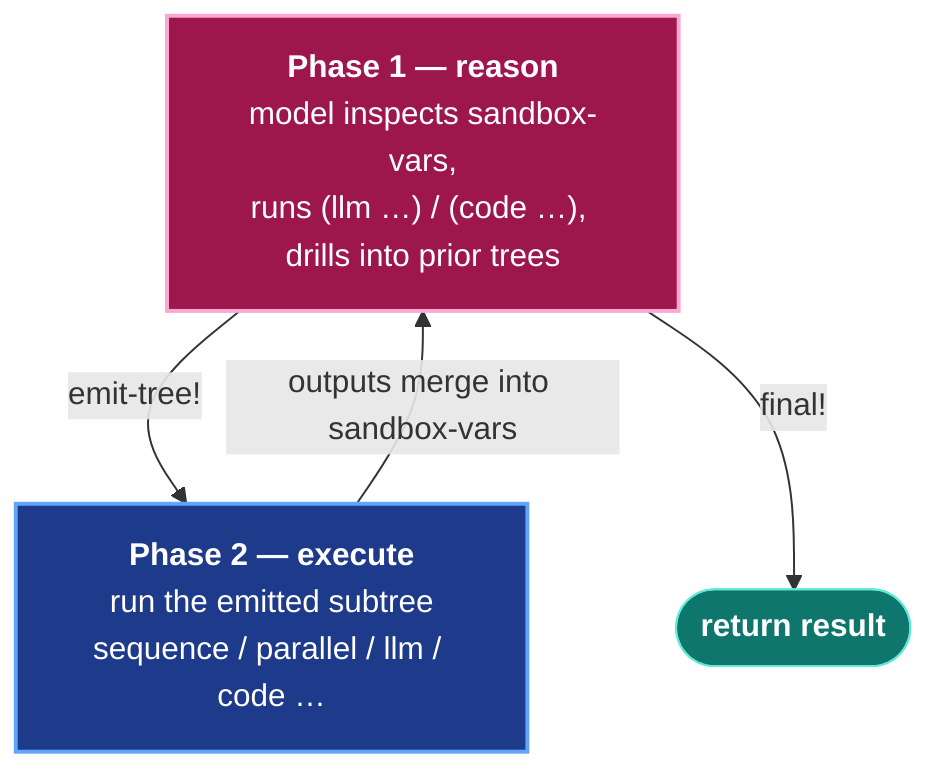

# RLM (Recursive Language Model) Mode

## You already have a tree. One step is open-ended.

Picture the workflow you've already built. Most of it is a *known shape* — survey the document, then diff it against the prior version, then summarize the changes. You knew the nodes up front, so you wired them as a fixed `:sequence` of `:llm` and `:code` nodes. That's exactly right: when you know the shape, hardcode the shape.

But sometimes **one step is genuinely open-ended.** You don't know up front whether it needs a single `:llm` call or a chunk-and-map-reduce over 40 sections. Maybe it depends on how big the input turns out to be, or what the survey step found, or whether a first pass succeeded. You can't draw that sub-tree in advance because its right shape depends on data you won't have until runtime.

**That's the one step you hand to `:repl-researcher` (RLM).** Instead of you drawing the sub-tree, the researcher node *designs and runs its own sub-tree* at runtime, inspects the result, and iterates until the step is done. The rest of your workflow stays exactly as it is — `:repl-researcher` is just another leaf node you drop into your existing sequence.

The rest of this guide walks you from your existing tree to using RLM well:

1. **[When to reach for RLM](#when-to-use-rlm)** vs. a fixed `:llm` / `:code` node — the key judgment. This is the heaviest node in the palette; reserve it for genuinely unknown-shape work.
2. **[Dropping a single `:repl-researcher` node into your existing sequence](#composition-repl-researcher-as-a-node-inside-a-larger-workflow)** — the pre-process → research → post-process pattern.
3. **[What recursive mode does](#recursive-mode-rlm-recursive-true)** — the Phase 1 ↔ Phase 2 loop. Recursive is the **default**; terminal mode is deprecated.
4. **[How the researcher emits its own sub-trees](#phase-2-tree-dsl-node-types)** and composes them during exploration.
5. **[`:auto-classify?`](#pattern-injection-via-r-inject-auto-classify)** — an opt-in that helps the researcher *design* better trees from a shared corpus of patterns. (Distinct from GEPA, which tunes *static instruction strings* — see [GEPA-GUIDE.md](GEPA-GUIDE.md).)

---

**Under the hood**, RLM is a two-phase execution pattern for the `:repl-researcher` node type. The model iteratively generates Clojure code in a sandboxed REPL (Phase 1) and can emit behavior trees that ORC executes as child ticks (Phase 2). **Recursive mode is the default** — each `emit-tree!` returns control to Phase 1 so the model can inspect outputs, accumulate sandbox-vars across iterations, and call `(final! ...)` when ready. Terminal mode (`:rlm {:recursive? false}`) is preserved as an explicit opt-out for the rare case a single tree emission is genuinely terminal. Phase 1 is the recursive code-generation loop; Phase 2 is the spawned sub-computation (the emitted tree); the recursive merge folds Phase 2 outputs back into Phase 1 sandbox-vars for further iteration.

The building blocks the model emits via `emit-tree!` are the same ones you already know — `:llm`, `:code`, `:map-each`, `:parallel`, `:sequence`, and `:final`. RLM is "a model that can spawn sub-computations, inspect their outputs, and continue reasoning," expressed entirely in ORC's behavior-tree decomposition space — and that's what this guide walks through.

---

> **Recursive mode is the default.** Every `:repl-researcher` node runs recursively unless you explicitly set `:rlm {:recursive? false}`. Source — `executor.clj line 2176`: `recursive-mode? (not= false (get-in node [:rlm :recursive?]))`.
>
> **Terminal mode is deprecated.** `:rlm true` / `:rlm {}` / `:rlm {:debug? true}` all resolve to recursive mode. `:rlm {:recursive? false}` is the explicit escape hatch — it is preserved for backward compatibility and will be removed after all bench tasks migrate.

> For a progressive introduction to RLM, see [GETTING-STARTED.md](GETTING-STARTED.md) Phase 6.

---

## When to use RLM

This is the most important judgment in this guide. `:repl-researcher` is the **heaviest node in the palette** — it pays for an LLM to write and reason about Clojure code on every Phase 1 iteration before any real work happens. Reach for it only when that cost buys you something a fixed node can't: a tree shape you genuinely can't draw up front.

**Reach for `:llm` or `:code` (a fixed node) when:**

- You know the step is one prompt → use `:llm`.
- You know the step is a deterministic transform → use `:code`.
- You know it's "chunk, map over chunks, then aggregate" *and the boundaries are fixed* → wire `:map-each` directly.
- In short: **if you can draw the sub-tree on a whiteboard, draw it.** Don't pay the Phase 1 code-gen overhead to rediscover a shape you already know.

**Reach for `:repl-researcher` (RLM) when the shape is genuinely unknown until runtime:**

- **Analytical tasks on large documents** — the model decides whether to chunk at all, how many parallel iterations, and how to synthesize, based on the input it actually receives.
- **Multi-step extraction** — emit a tree to get a summary, *inspect it*, then decide whether a follow-up LLM/code pass for derived metrics is even needed.
- **Adaptive recovery** — when a tree returns `:partial` with some chunks failed, the model decides at runtime whether to retry, fall back, or accept what it has.

A useful test: *would two different inputs to this step want two structurally different sub-trees?* If yes, that's RLM's sweet spot. If every input wants the same sub-tree, hardcode it.

> **RLM tunes tree *shape*, GEPA tunes instruction *text*.** These are complementary, not competing. If your problem is "this fixed `:llm` node's prompt isn't getting good results," that's a [GEPA](GEPA-GUIDE.md) job — it optimizes the static instruction string. If your problem is "I don't know what nodes this step should even have," that's RLM. You can use both: GEPA on the static nodes around the researcher, RLM for the open-ended step.

## Composition: `repl-researcher` as a node inside a larger workflow

`orc/repl-researcher` is a leaf-style node like `orc/llm` or `orc/code` — it sits anywhere in your behavior tree, not just at the root. Upstream nodes can write to blackboard keys the researcher reads; downstream nodes can consume what the researcher wrote.

A common pattern is **pre-process → research → post-process**, using the high-level DSL:

```mermaid
flowchart TB
  seq["<b>pipeline</b><br/>SEQUENCE"]:::seq
  seq --> pre["<b>pre-process</b><br/>LLM · leaf<br/><i>clean / normalize input</i><hr/>▸ reads&nbsp;&nbsp;raw<br/>◂ writes&nbsp;&nbsp;clean"]:::llm
  seq --> rlm["<b>research</b> &#9662;<br/>REPL-RESEARCHER · leaf<br/><i>Phase 1 ↔ Phase 2 loop runs inside this node</i><hr/>▸ reads&nbsp;&nbsp;clean<br/>◂ writes&nbsp;&nbsp;findings"]:::rlm
  seq --> post["<b>post-process</b><br/>CODE · leaf<br/><i>package the output</i><hr/>▸ reads&nbsp;&nbsp;findings<br/>◂ writes&nbsp;&nbsp;report"]:::code
  classDef seq fill:#1e3a8a,stroke:#60a5fa,color:#fff,stroke-width:2px;
  classDef llm fill:#4c1d95,stroke:#c4b5fd,color:#fff;
  classDef code fill:#0f766e,stroke:#5eead4,color:#fff;
  classDef rlm fill:#9d174d,stroke:#f9a8d4,color:#fff,stroke-width:2px;
```



```clojure
(require '[ai.obney.orc.orc-service.interface :as orc])

(def my-workflow
  (orc/workflow "research-pipeline"
    (orc/blackboard
      {:raw-input          :string
       :cleaned-input      :string
       :researched-summary :string
       :final-report       :string})

    (orc/sequence "main"
      (orc/llm "pre-process"
        :model "google/gemini-2.5-flash"
        :instruction "Clean the raw input. Remove extra whitespace, normalize punctuation."
        :reads  [:raw-input]
        :writes [:cleaned-input])

      (orc/repl-researcher "research"
        :model "google/gemini-2.5-flash"
        :instruction "Produce a one-paragraph summary highlighting key facts."
        :reads  [:cleaned-input]
        :writes [:researched-summary]
        :max-iterations 3
        :rlm true)                       ; or {:recursive? true} / {:debug? true}

      (orc/llm "post-process"
        :model "google/gemini-2.5-flash"
        :instruction "Wrap the summary as a brief executive report."
        :reads  [:researched-summary]
        :writes [:final-report]))))

;; Build (idempotent — no-op if definition hasn't changed) and execute.
;; build-workflow! returns the deterministic sheet-id derived from the
;; workflow name, so you can pipe it straight into execute.
(let [sheet-id (orc/build-workflow! ctx my-workflow)]
  (orc/execute ctx sheet-id {:raw-input some-text}))
```

Execution flow:

1. The `sequence` node runs its children in order.
2. `pre-process` writes `:cleaned-input` to the blackboard.
3. The researcher reads `:cleaned-input`, runs its iterative Phase 1 (and Phase 2 if it calls `emit-tree!`), writes `:researched-summary`.
4. `post-process` reads `:researched-summary` and writes `:final-report`.
5. The execute call's `:outputs` includes everything written to the blackboard.

There's nothing special about being a child — the researcher emits the same `:sheet/node-execution-completed` event as any other leaf, and sequence/fallback/parallel parents react to it the same way.

### Things to be aware of when composing

- **Blackboard keys must be declared up front** in `orc/blackboard`. The researcher's `:reads` only see declared keys that prior nodes have written.
- **The researcher reports `:status :success` / `:failure` / `:partial` / `:timeout` like any other node.** Sequence parents continue on `:success` and `:partial`, halt on `:failure`. Fallback continues on `:failure` to the next sibling. So you can place the researcher anywhere in those compositions.
- **Budget composition.** If you set `:timeout-ms` on the researcher, it bounds total Phase 1 + cumulative tree-execution wall-time *for that researcher only* — it doesn't account for sibling nodes. If your overall workflow has a deadline, the researcher's `:timeout-ms` should be set lower than the remaining time you want to allow.
- **Multiple researchers in one workflow** are supported — each gets its own Phase 1 loop and (if it calls `emit-tree!`) its own Phase 2 child tick. Their iteration counts and budgets are independent.

## Basic usage (recursive mode — default)

The simplest case: a workflow whose root is a single `repl-researcher` node.

> **Prefer the composed pattern** — a pre-process node cleans the input, the researcher explores, a post-process node packages the output. See the "Composition" section above for the three-node pattern.



```clojure
(require '[ai.obney.orc.orc-service.interface :as orc])

(def risk-analysis
  (orc/workflow "risk-analysis"
    (orc/blackboard
      {:document          :string
       :risk-matrix       :string
       :executive-summary :string})

    (orc/repl-researcher "researcher"
      :model "google/gemini-2.5-flash"
      :instruction "Analyze the document for risks and obligations. Produce
                    a :risk-matrix mapping each obligation to HIGH/MEDIUM/LOW
                    with justification, and an :executive-summary."
      :reads  [:document]
      :writes [:risk-matrix :executive-summary]
      :max-iterations 5
      :rlm true)))                       ; or {:debug? true} for verbose logging

;; Build (idempotent — no-op if definition hasn't changed) and execute.
;; build-workflow! returns the deterministic sheet-id derived from the
;; workflow name.
(let [sheet-id (orc/build-workflow! ctx risk-analysis)]
  (orc/execute ctx sheet-id {:document doc-text}))
;; => {:status :success
;;     :outputs {:risk-matrix "..." :executive-summary "..."}
;;     :duration-ms ...}
```

The model:

1. Iterates up to `:max-iterations` times, generating Clojure code each iteration.
2. Code can call `(llm ...)`, `(code ...)`, `(store! ...)`, `(get-var ...)`, etc.
3. Optionally calls `(emit-tree! [...])` to design a behavior tree for ORC to execute.
4. Recursive mode (default): when the model calls `emit-tree!`, Phase 2 runs, its `:writes`-declared outputs are merged into the sandbox variables (accessible via `(get-var :key)`), a summary entry is appended to `:tree-results`, and control returns to Phase 1 for another iteration. The loop ends when the model calls `(final! {...})` or `:max-iterations` is exhausted.
5. Terminal mode (`:rlm {:recursive? false}` — explicit opt-out): when the model calls `emit-tree!`, Phase 2 runs and the result returns to the caller immediately — the loop ends without further Phase 1 iterations.

## Configuration reference

All options accepted by the `repl-researcher` node and the `:rlm` config map.

### Top-level options on `repl-researcher`

| Option | Type | Default | Purpose |
|---|---|---|---|
| `:model` | string | required | LLM identifier for the Phase-1 researcher (e.g. `"openai/gpt-5.4"`, `"google/gemini-2.5-flash"`). Also the default for Phase-2 `:llm` sub-calls when `:sub-model` is not set. |
| `:sub-model` | string | nil (uses `:model`) | LLM identifier injected into every Phase-2 `:llm` node that does NOT specify its own `:model`. Lets Phase-1 use a high-capability main LM while Phase-2 sub-calls go through a cheaper/faster sub LM. See [Main LM + Sub-LM](#main-lm--sub-lm-sub-model) below. |
| `:instruction` | string | required | The model's task. Verbatim goal-only is preferred; the framework adds the methodology framing. |
| `:reads` | vector of keywords | `[]` | Blackboard keys to load into Phase-1 sandbox + Phase-2 child sheet. |
| `:writes` | vector of keywords | `[]` | Blackboard keys the model must populate via `(final! ...)` or via the emit-tree! tree's `:final` node. |
| `:max-iterations` | int | 5 | Max Phase-1 iterations. If the model neither calls `(final! ...)` nor calls `(emit-tree! ...)` within this many iterations, the run returns `{:status :failure :error "Max iterations reached without final!"}`. |
| `:timeout-ms` | int | 900000 (15 min) | Hard wall-clock budget for Phase 2. Precedence: node's `:timeout-ms` > parent tick's `:timeout-ms` > hardcoded 15-minute default. When Phase 2 budget is exhausted mid-flight the child tick is cancelled. |
| `:rlm` | map or `true` | `false` | Enables RLM mode. `true` is equivalent to `{}`. See "`:rlm` config map" below. |
| `:context` | map | `nil` | Ontology context injection. When set, the framework queries the ontology for patterns tied to the configured `:tree-id` and prepends a formatted summary to the model's instruction at run time. See [Ontology context injection](#ontology-context-injection-context) below. |

### `:rlm` config map options

| Option | Type | Default | Purpose |
|---|---|---|---|
| `:recursive?` | bool | `true` | Non-terminal `emit-tree!` — after each Phase-2 tree completes, control returns to Phase 1 for inspection / follow-up / `(final! ...)`. Defaults to `true` — recursive is the default; pass `:recursive? false` to opt out (deprecated escape hatch). See [Recursive mode](#recursive-mode-rlm-recursive-true). |
| `:auto-classify?` | bool | `false` | Before Phase 1 starts, classify the task against the seed corpus and prepend the top-fitting pattern's body (capabilities + worked-example DSL snippets in `:strengths.:recommended-pattern` + observed weaknesses + representative-uses) to the model's instruction. Pairs naturally with `:recursive? true`. See [Pattern injection via R-Inject](#pattern-injection-via-r-inject-auto-classify) below. |
| `:debug?` | bool | `false` | Verbose `[DEBUG RLM]` / `[DEBUG Tree]` stderr logging useful during development. Default off for production. |
| `:available-code-nodes` | string | nil | Markdown catalog of pre-built `:code` fns the model can reference via `[:code {:fn "ns/sym"}]`. Surfaced as an extra input field on the framework's LLM module. See [Pre-built code-node catalog](#pre-built-code-node-catalog-available-code-nodes). |
| `:sub-model` | string | nil | Alternative location for `:sub-model` — `(:sub-model (:rlm node))` takes precedence over `(:sub-model node)`. Either works. |

### Per-`:llm`-node options inside `emit-tree!` trees

The `:llm` tree-DSL node accepts these options that are NOT part of the top-level `repl-researcher` config:

| Option | Type | Default | Purpose |
|---|---|---|---|
| `:instruction` | string | required | The sub-LLM's prompt. |
| `:reads` | vector of keywords | `[]` | Blackboard keys passed as inputs. |
| `:writes` | vector of keywords | `[]` | Blackboard keys this `:llm` produces. |
| `:model` | string | inherits from `:sub-model` then `:model` | Per-node model override. Useful when one specific node needs a vision-capable model while other nodes go through the cheaper sub-LM. Example: `[:llm {:model "openai/gpt-4o" :reads [:image] :writes [:caption] ...}]`. Per-node `:model` takes precedence over `:sub-model` injection. |
| `:output-schemas` | map | `nil` | Per-write Malli schemas. When the schema is structured (vector / map / etc.) the framework asks the LLM for JSON and parses the response back into Clojure data for downstream `:code` consumers. See [Structured LLM outputs](#structured-llm-outputs-output-schemas). |
| `:retry` | map | `{:max-attempts 3 :backoff-ms [1000 2000 4000]}` | Per-node retry policy. Default is 3 attempts with 1s/2s/4s exponential-ish backoff. Override per node like `[:llm {:retry {:max-attempts 5 :backoff-ms [500 1000 2000 4000 8000]} ...}]`. |

### `:reads` / `:writes` validation

- **`:reads`**: the framework declares each read key on the child sheet's blackboard. If a read key isn't already declared at the parent level OR populated as an input to `tick-tree`, the value is nil at execution time (the framework does not error). A nil read often manifests as the `:llm` or `:code` body crashing on `nil` arithmetic — verify your reads are seeded.
- **`:writes`**: the framework declares each write key on the child sheet and validates that the executor's result populates those keys. For `:llm` nodes, the model is told "you must produce all `:writes` keys"; missing writes leave the key nil. For `:code` nodes, see U7 reconciliation (single-write scalar auto-wraps; multi-write must return a map containing the declared keys, or fails clearly).

### Tree-DSL → canonical translation

When you write `[:sequence [:llm {...}] [:final {...}]]`, the `rlm-dsl/rlm-dsl->orc-dsl` translator produces a canonical S-expression with `sheet/` prefixes:

```clojure
;; You write (DSL form):
[:sequence
 [:llm {:instruction "summarize" :reads [:doc] :writes [:summary]}]
 [:final {:keys [:summary]}]]

;; Framework executes (canonical form):
(sheet/sequence
  (sheet/llm :instruction "summarize"
             :reads [:doc]
             :writes [:summary]
             :retry {:max-attempts 3 :backoff-ms [1000 2000 4000]})
  (final! {:keys [:summary]}))
```

Notable transformations:
- Vector → list with `sheet/<name>` head
- Map options → flat keyword-value pairs
- Default `:retry` config added to every `:llm`
- `:chunk-document` / `:aggregate` expand into `sheet/code` with inline helper fns

When debugging an `emit-tree!` run, examine `:generated-tree-raw` (S-expr DSL — what the model wrote) AND `:generated-tree` (canonical — what the framework executes) on the run result.

## Main LM + Sub-LM (`:sub-model`)

By default, both the Phase-1 researcher and any Phase-2 `:llm` sub-calls use the node's `:model`. For benchmark or cost-optimization workflows you can split them: run a higher-capability **main LM** in Phase 1 (which writes Clojure code and designs trees) and a cheaper/faster **sub-LM** for the per-leaf Phase-2 `:llm` calls.

```clojure
(orc/repl-researcher "researcher"
  :model     "openai/gpt-5.4"        ; Phase-1 main LM (tree design)
  :sub-model "openai/gpt-5.1-chat"   ; Phase-2 sub-LM injected into :llm nodes
  :instruction "Identify PII targets in the provided document pages..."
  :reads  [:page-texts :criteria]
  :writes [:total-redactions :targets-applied]
  :rlm true)
```

The framework walks the canonical emit-tree! tree and injects `:model :sub-model` into every `(sheet/llm ...)` form that does **not** already specify a `:model`. `:llm` nodes the model wrote with an explicit `:model "..."` are left untouched, so the model can still pin a specific model for a specific node (e.g. a vision-specific model for image reads).

Set on the `repl-researcher` node, or alternatively under the `:rlm` map as `:rlm {:sub-model "..."}`. When unset, all calls use `:model`.

This is a common "apples-to-apples" cost pattern: a high-capability main LM for tree design (e.g. `openai/gpt-5.4`) paired with a cheaper sub-LM for the per-leaf calls (e.g. `openai/gpt-5.1-chat`).

## Pattern injection via R-Inject (`:auto-classify?`)

> **Note:** `:auto-classify?` shapes RLM tree design — it prepends a matched corpus pattern to the researcher's context before it designs a tree. It does NOT modify instruction strings inside static `orc/llm` nodes. For instruction optimization on static LLM nodes, see [GEPA-GUIDE.md](GEPA-GUIDE.md).

`:auto-classify? true` on the `:rlm` config opts the node into automatic classification against the corpus of structural patterns (tree-classes) and behavioral patterns (behavioral subtrees). Before Phase 1 starts:

1. The framework builds a task signature from the node's `:instruction` (and parent-tree context when composed).
2. The signature is reranked against ColBERT-indexed pattern descriptions across both granularities.
3. The top-fitting structural pattern's full body — capabilities + observed strengths with worked-example DSL snippets + observed weaknesses with recommended fixes + representative-uses + a prose summary — gets prepended to the model's instruction.
4. The top-N behavioral candidates (default top-3) follow, with reranker reasoning, the same body shape, and a fresh-mint marker when none scored above the confidence floor.

The model sees this block *before* it designs its tree, so its first `emit-tree!` response is informed by patterns that have shipped successfully on similar tasks. The prepend is **examples, not mandates** — the model can adopt, adapt, or design from scratch.

### Config shape

```clojure
(orc/repl-researcher "researcher"
  :model "google/gemini-3-flash-preview"
  :instruction "Review the provided document and produce structured findings."
  :reads  [:document]
  :writes [:findings :recommendations]
  :rlm {:auto-classify? true
        :recursive? true})
```

That's the whole opt-in. No `:tree-id` to manage, no per-task UUIDs to coordinate, no pattern records to keep current — the corpus is shared across all consumers that have `:auto-classify? true` set and updates from observed evidence (see [`LIVING-DESCRIPTIONS.md`](LIVING-DESCRIPTIONS.md) for how bodies evolve).

### What the model actually sees

A real prepend from a scheduling task (truncated for readability):

```
## Suggested patterns from corpus

These are concrete EXAMPLES retrieved from the seed corpus based on
classification of your task. Each example includes:
  - WHY the candidate fits (reranker reasoning)
  - The pattern's prose summary (seed `:summary`)
  - Capabilities it provides
  - Proven STRENGTHS — traits observed to work, each with a worked-
    example DSL snippet you can adapt
  - Observed WEAKNESSES — failure modes others hit, with the
    recommended fix
  - Representative uses where this pattern has shipped

Mimic what works, modify what's risky for your task, OR design from
scratch. They are not mandates — your job is to design the RIGHT tree
for THIS task, using the corpus as evidence not gospel.

### Structural patterns (top 1 from corpus retrieval)
#### Top match (confidence: 1.00)
Why this fits: This candidate explicitly references 'shift assignment'
and 'on-call rotation' as examples...

Pattern guidance (seed `:summary`):
Scheduling tasks fit a staged sequential pipeline: enumerate
constraints → propose assignment → conflict-check with code → emit
final + justification...

Capabilities:
  - :sequence of typically 3-4 stages...

Strengths (proven traits — these patterns have been observed to work):
  - **Trait:** explicit separate stages for constraint enumeration
    vs proposal vs check makes the failure mode visible (confidence
    1.00, evidence-count 1)
    - Good when: the problem has both hard constraints AND soft
      preferences
    - Worked example DSL (corpus reference — adapt to your task):
      ```clojure
      [:sequence
        [:llm {:reads [:team :availability :rules]
               :writes [:hard-constraints :soft-prefs]}]
        [:llm {:reads [:hard-constraints :soft-prefs :history]
               :writes [:proposal]}]
        [:code {:reads [:proposal :hard-constraints]
                :writes [:conflicts]
                :fn (fn [{:keys [proposal hard-constraints]}]
                      {:conflicts []})}]
        [:llm {:reads [:proposal :conflicts]
               :writes [:final-schedule :justification]}]
        [:final {:keys [:final-schedule :justification]}]]
      ```
...
```

The trace is written to `/tmp/r-inject-trace-<sheet-id>.edn` for every
auto-classified run — see [Inspecting the classifier](#inspecting-the-classifier)
in the trace tools section below.

### When `:auto-classify?` pairs with `:recursive?`

The two flags are independently useful but most powerful together:
- `:auto-classify?` shapes the model's *first* design with corpus context.
- `:recursive?` lets the model adapt across iterations as Phase-2 results arrive.

When a Phase-2 leaf fails, `:tree-results` surfaces `:failed-leaves` with
the node-id + error, and the model typically emits a focused single-node
recovery tree rather than rebuilding the whole pipeline. The forward
guidance from the prepend + the backward signal from drill-down + the
"Common pitfalls" section in the prompt compose into a system that
recovers from failures rather than getting stuck.

See [`SELF-IMPROVING-LOOP.md`](SELF-IMPROVING-LOOP.md) for the
end-to-end consumer walkthrough.

### Behavioral mints — contributing new patterns to the corpus

When `classify-behaviors` returns a fresh-mint marker (no candidate
scored above the confidence floor for the task's accomplishment shape),
the model can contribute a new behavior via the sandbox primitive
`(mint-behavior! ...)`:

```clojure
(mint-behavior!
  "iterate-on-simulated-feedback"
  {:capabilities ["iterate parameter adjustments driven by measured feedback"
                  "produce a converged parameter map + per-round metrics history"]
   :strengths [{:trait "pair LLM-driven heuristic adjustments with a deterministic oracle for the feedback signal"
                :good-when "the search space is continuous and the oracle is cheap to evaluate"
                :recommended-pattern "[:sequence [:llm {:writes [:hypothesis]}] [:code {:fn run-oracle :writes [:metrics]}] [:llm {:writes [:adjusted-hypothesis]}] [:condition (fn [{:keys [metrics]}] (converged? metrics)) ...]]"
                :confidence 0.7
                :evidence-count 1}]
   :weaknesses [{:trait "single-pass LLM can miss interactions between adjusted parameters"
                 :avoid-when "the parameter space has known multiplicative interactions"
                 :recommended-alternative "split tree into per-parameter validation loops with cross-checks"
                 :confidence 0.6
                 :evidence-count 1}]
   :representative-uses ["game-balance playtest tuning"]
   :summary "Iterate parameter adjustments driven by measured feedback until a target metric stabilizes. Pair the LLM's hypothesis generation with a trusted oracle (real measurement or deterministic check) so the feedback signal is grounded."
   :version 1
   :consolidated-from-event-count 0}
  :parent nil)
```

The minted body must validate against the description-body Malli
schema. The mint dispatches `:ontology/mint-behavioral-subtree` and
returns the minted UUID as a string. The behavior is immediately
queryable by future `classify-behaviors` calls — the QP-3 force-rebuild
processor re-indexes ColBERT on the new content so the next task that
matches the behavioral shape surfaces it at high confidence (typically
1.00 for direct shape matches), even when the future task is in a
different domain (e.g., game-balance → ML hyperparameter tuning).

### Inspecting the classifier

Every `:auto-classify?` run writes a sidecar trace to
`/tmp/r-inject-trace-<sheet-id>.edn`:

```clojure
{:rendered-at "2026-06-09T..."
 :prepend "## Suggested patterns from corpus..."     ; full text
 :prepend-chars 4186
 :original-instruction-chars 800
 :classifier-payload
 {:structural {:assigned-tree-id #uuid "..."
               :confidence 1.00
               :top-candidates [{:document-metadata {:target-id "..."}
                                  :reasoning "<reranker reasoning>"
                                  :fitness-score 1.00} ...]
               :rerank-fallback? false}
  :behavioral {:behaviors [{:behavior-id #uuid "..."
                            :confidence 0.95
                            :reasoning "<reranker reasoning>"} ...]
               :rerank-fallback? false}}}
```

Read this to confirm which pattern was matched, what the reranker
reasoned, and what the model actually saw. The `:rerank-fallback?` flag
is the surfacing of reranker failure: when `true`, the classifier fell
back to pure ColBERT-similarity scoring and the result should be
treated with caution.

---

## Ontology context injection (`:context`) — manual / legacy mode

`:auto-classify?` is the typical opt-in. The `:context` map below is
the manual alternative for consumers who want explicit control over
which patterns get retrieved (e.g., they're managing their own
per-task-class UUIDs and have hand-curated pattern records via
`:ontology/record-tree-strength` / `record-tree-weakness`).

When set, the framework looks up patterns recorded under the configured `:tree-id` and prepends a formatted "Relevant Knowledge" section to the researcher's instruction at execute time — so the model sees previously-recorded successful patterns (and patterns to avoid) when it starts designing its tree.

The same `:context` parameter exists on `orc/llm` leaf nodes; the wiring is symmetrical, the consuming pipeline is the same.

### Config shape

```clojure
(orc/repl-researcher "researcher"
  :model "google/gemini-2.5-flash"
  :instruction "..."
  :reads  [:document]
  :writes [:summary :key-dates :entities]
  :rlm    true
  :context {:tree-id          <UUID — the key under which patterns are stored>
            :self-learning?   true
            :include-patterns true     ;; surface success patterns
            :include-failures true     ;; surface failure patterns
            :problem-type     "problem:Extraction"})   ;; optional problem-class URI
```

| Field | Type | Purpose |
|---|---|---|
| `:tree-id` | UUID | The retrieval key. Patterns recorded with this same `:tree-id` (via `ontology/record-tree-strength` / `ontology/record-tree-weakness`) are loaded for injection. Use a *stable* UUID per task class so unrelated runs share the same pattern store. |
| `:self-learning?` | bool | Enables the retrieval path. Without it set to `true`, no ontology lookup happens. |
| `:include-patterns` | bool | When `true`, recorded `:strengths` (success patterns) appear under "Learned Rules from Success Patterns". |
| `:include-failures` | bool | When `true`, recorded `:weaknesses` (failure patterns) appear under "Patterns to Avoid". |
| `:problem-type` | string | Optional URI naming the problem class (e.g. `"problem:Classification"`, `"problem:Extraction"`). Used by the ontology's hybrid retrieval to widen matches via the problem-domain graph. |

### Recording patterns

Patterns are written via the standard ontology commands. A strength (success pattern) command:

```clojure
(require '[ai.obney.grain.command-processor-v2.interface :as cp])

(cp/process-command
  (assoc ctx :command
    {:command/name :ontology/record-tree-strength
     :tree-id <same-uuid-the-node-uses>
     :pattern-uri "success:BoundedMapEachOnChunkedExtraction"
     :confidence 1.0
     :evidence-trace-ids [<tick-id>]
     :avg-score 0.95
     :domain-type "rlm-tree-design"
     :context-conditions {:task-class :chunked-extraction
                          :input-shape :large-document
                          :symptom :rate-limit-risk-on-unbounded-parallelism}
     :action-taken {:type "BoundedMapEach"
                    :target "[:map-each {:from :chunks :as :chunk :into :results :max-concurrency 3} [:llm {...}]]"
                    :reason "Sub-LLM rate limits exhaust on unbounded concurrency"}
     :expected-outcome "Successful per-chunk extraction without rate-limit failures"}))
```

A weakness uses `:ontology/record-tree-weakness` with `:failure-uri`, `:severity`, `:triggers`, `:failure-context`, `:attempted-action`. See [PATTERN-RECORDING.md](PATTERN-RECORDING.md) for the full command schemas.

The structured fields map directly to the rendered output: `:context-conditions` becomes the "when" guard, `:action-taken.target` becomes the recommended pattern snippet (rendered as a Clojure code block), `:action-taken.reason` becomes the "Why" line, and `:expected-outcome` becomes the "Expected outcome" line.

### What the model sees

For a `:tree-id` with one recorded strength, the model's instruction is prepended with a "Relevant Knowledge" block:

```
## Relevant Knowledge

### Learned Rules from Success Patterns
- **BoundedMapEach** — when task-class=:chunked-extraction, input-shape=:large-document, symptom=:rate-limit-risk-on-unbounded-parallelism (95% confidence, 1 episode)
  - Action:
    ```clojure
    [:map-each {:from :chunks :as :chunk :into :results :max-concurrency 3} [:llm {...}]]
    ```
  - Why: Sub-LLM rate limits exhaust on unbounded concurrency
  - Expected outcome: Successful per-chunk extraction without rate-limit failures
```

The model receives this *before* it begins designing its tree, so its first `emit-tree!` response can take the recorded patterns into account. When multiple patterns are recorded, all are rendered (deduplicated and ordered by confidence) up to the `:max-items` default of 5.

When the configured `:tree-id` has no recorded patterns (or `:self-learning?` is not set, or `:context` is absent entirely), no "Relevant Knowledge" section is injected — the researcher behaves identically to a node without `:context`.

### When to use it

- **Stable task classes** — pick a UUID per task class (e.g. document extraction, contract comparison) and tag all relevant principles with that UUID.
- **High-confidence patterns only** — the same channel surfaces every recorded principle. If you want curated patterns instead of everything ever recorded, write a custom retrieval layer; the default loads all `:strengths`/`:weaknesses` for the configured `:tree-id`.
- **Failures matter as much as successes** — `:include-failures true` is on by default in the examples for a reason. A "Patterns to Avoid" entry can be a stronger steering signal than a strength.

## Recursive mode (`:rlm {:recursive? true}`)

When the `:recursive?` flag is set, `emit-tree!` is no longer terminal:

```clojure
{:rlm {:recursive? true :debug? true}}
```

After Phase 2 completes:
- Tree's `:writes`-declared outputs merge into sandbox-vars (model calls `(get-var :summary)` naturally)
- A lightweight summary entry appends to `:tree-results` (chronological history)
- Control returns to Phase 1 loop
- Model gets a fresh iteration to reason about the result, run follow-up `(llm ...)` / `(code ...)`, emit another tree, or call `(final! ...)` to terminate

The loop ends ONLY when:
- Model calls `(final! {...})` with the declared `:writes` keys
- `:max-iterations` is exhausted (returns `:failure :error "Max iterations reached without final!"`)
- The total `:timeout-ms` budget is exhausted

### What the model sees after a tree

Each entry in `:tree-results` (visible via `(get-var :tree-results)`):

```clojure
{:tick-id <uuid>
 :tree-raw [:sequence [...]]                   ; the tree the model designed
 :status :success | :partial | :failure | :timeout
 :elapsed-ms 4523
 :outputs-keys [:summary :chunk-summaries]     ; what's now in sandbox-vars
 :outputs-previews {:summary "first ~500 chars…"
                    :chunk-summaries {:count 22 :sample-3 [...]}}
 :nodes-succeeded 22
 :nodes-failed 2
 :nodes-total 24
 :usage {:prompt-tokens N :completion-tokens N :total-tokens N}

 ;; ONLY when declared writes came back nil/empty even on :status :success —
 ;; soft signal that the tree finished but a downstream aggregator produced
 ;; nothing useful for that key.
 :nil-writes [:obligations :penalties]

 ;; ONLY when direct (non-map-each) leaves failed — each entry identifies
 ;; the failing leaf so the model can target a recovery without
 ;; rebuilding the whole tree.
 :failed-leaves [{:node-id <uuid> :status :failure :error "Duplicate key: null"}]

 ;; ONLY when :status is :partial or :failure for map-each children
 ;; (verbatim from the underlying map-each's :partial-summary):
 :failure-indices [7 17]
 :failure-reasons {7 "Rate limit exhausted" 17 "Schema validation failed"}

 ;; ONLY when :status is :timeout (Phase 2 budget cancellation):
 :phase2-elapsed-ms 4500
 :budget-remaining-ms 0
 :nodes-completed-before-cancel 4}
```

The summary is **descriptive, not prescriptive** — raw enums, factual counts, verbatim error strings. The model interprets for its own task. No `:severity :high`, no `:recommended-action`. The executor doesn't editorialize.

The `:failed-leaves` field is the per-leaf attribution for non-map-each
failures: when a `:code` leaf throws or an `:llm` leaf fails schema
validation, the entry carries the node-id and the verbatim error
message. The model uses this to localize the failure within `:tree-raw`
and typically emits a focused single-node recovery tree that reads the
surviving sandbox-vars rather than redesigning the pipeline.

### Drill-down primitives (when the summary isn't enough)

In recursive mode the SCI sandbox also exposes five primitives that read directly from the event store for any tree the model has run. These let the model pull structural detail on demand — per-node `:status`, `:input-profile`, full trajectories, per-failure errors — without us baking everything into the lightweight `:tree-results` summary.

| Primitive | Returns |
|---|---|
| `(tree-detail)` / `(tree-detail tick-id)` | `{:tick-id :status :tree-raw :outputs :nodes [...]}` for the most-recent / specific tree. Each node entry has `:node-id :status :duration-ms :writes :usage :input-profile` and (for map-each parents) a verbatim `:partial-summary`. |
| `(tree-trajectory)` / `(tree-trajectory tick-id)` | Chronological per-event log from the tree's `:sheet/rlm-tree-execution-completed` bookend `:trajectory` field. |
| `(tree-failures)` | Vector of failure entries for the most-recent tree — joins direct leaf failures and map-each `:partial-summary` failure indices into one list, each with `:error` and (where available) `:input-profile`. |
| `(node-output node-id)` | `:writes` map of the named node's `:sheet/node-execution-completed` event in the most-recent tree. |
| `(node-input-profile node-id)` | `:input-profile` (chunk shape, byte/word counts, etc.) of the named node's `:sheet/rlm-tree-node-completed` event in the most-recent tree. |

Usage guidance baked into the system prompt: **prefer the `:tree-results` summary; drill down only when the summary doesn't give you enough to decide your next step.** A `(tree-trajectory)` call can return multi-KB data — pulling it into every iteration's history bloats the next prompt.

These primitives are bound in the sandbox **only in recursive mode (the default)** — the only callers that won't have them are those explicitly opting out with `:rlm {:recursive? false}`.

### Common pitfalls (forward guidance baked into the prompt)

The Phase-1 instructions block includes a "Common pitfalls" section that
warns the model about recurring SCI/Clojure footguns and pairs each with
a concrete workaround. The full list (paraphrased):

- **Set literals with computed elements fail SCI's reader.**
  `#{(get-in m k1) (get-in m k2)}` — use `(set [(expr1) (expr2)])` for sets
  built from runtime values.
- **`frequencies` over collections that may contain `nil`** produces a
  `{nil N}` entry that collides downstream — filter first:
  `(frequencies (filter some? coll))`.
- **`(get-var :foo)` returns `nil` after a Phase-2 `:failure`** — always
  guard: `(when-let [v (get-var :foo)] ...)`. The writes were intent;
  not all of them landed.
- **Namespaced symbols don't resolve in the SCI sandbox** —
  `clojure.string/join` etc. won't load. Use bound primitives (`str`,
  `apply`, `interpose`, `reduce`, `map`, `filter`, `into`, `vec`) or
  re-derive locally with `let`.
- **`:output-schemas` must match the downstream consumer's shape** —
  Malli structure: `[:map [:a :string] [:b :int]]`, NOT
  `[:map :a :string :b :int]`.
- **Inline-fn unbound-name captures fail at execution, not at emit** —
  every name in the `:fn` body must be destructured from `(:keys [inputs])`,
  bound in a `let`, or a sandbox primitive.
- **`(get-in m [...])` on `nil` returns `nil` silently** — verify the top
  of the data is non-nil before deep `get-in`.
- **For-comprehensions return lazy seqs** — `(mapv ...)` or
  `(doall ...)` when you need eager evaluation or predictable error
  attribution.

This section appears in every Phase-1 prompt, before the model designs
its tree. It's intended to prevent first-iteration failures rather than
serve as backward retry signal (R-6's line+caret context handles the
backward path).

### Example: two-step task

```clojure
;; Task: summarize document, then count distinct entities, return both.

;; The model writes (in iteration 1):
(emit-tree!
  [:sequence
   [:llm {:instruction "Produce a one-paragraph summary"
          :reads [:document]
          :writes [:summary_text]}]
   [:final {:keys [:summary_text]}]])
;; → Phase 2 runs, recur fires

;; The model writes (in iteration 2 — :tree-results now visible):
(let [summary (get-var :summary_text)
      entities (llm "extract-entities"
                    :instruction "List all distinct named entities"
                    :reads [:document]
                    :writes [:entities_list])]
  (final! {:summary summary
           :entity-count (count (clojure.string/split (:entities_list entities) #","))}))
;; → final! reached, loop terminates with both outputs
```

Real LLM verification: `:status :success`, `:entity-count` reflects actual entity count from the doc, `:cumulative-thinking-ms` + `:cumulative-tree-ms` surface where wall-time was spent.

## Sandbox primitives

When the model's Phase 1 code executes in the SCI sandbox, the following primitives are available:

| Primitive | Purpose |
|---|---|
| `(llm "name" :instruction ... :reads [...] :writes [...])` | Sub-LLM call (synchronous; result merged into sandbox-vars) |
| `(code "name" :writes [...] :body ...)` | Pure Clojure computation (no LLM call) |
| `(sequence ...)` | Run primitives in order |
| `(parallel ...)` | Run primitives concurrently, merge results |
| `(map-each ...)` | Iterate over a collection with a child primitive |
| `(fallback ...)` | Behavioral combinator — first success wins |
| `(condition ...)` | Conditional execution |
| `(store! :key value)` | Store a value in sandbox-vars |
| `(get-var :key)` | Retrieve a value from sandbox-vars |
| `(list-vars)` | List all sandbox-vars with previews |
| `(get-input :key)` | Read a declared input |
| `(final! {...})` | **Terminate** with validated output |
| `(emit-tree! [...])` | Emit a behavior tree for Phase 2 execution |
| `(mint-behavior! "name" body)` / `(mint-behavior! "name" body :parent parent-id)` | Contribute a new behavioral subtree to the corpus. Returns the minted behavior's UUID-string. The minted body must validate against the description-body Malli schema (capabilities + principle-shaped strengths/weaknesses + representative-uses + summary). Persists for future `classify-behaviors` calls across all consumers — see [`SELF-IMPROVING-LOOP.md`](SELF-IMPROVING-LOOP.md#new-patterns-get-minted-when-the-model-encounters-genuinely-new-work). |

The drill-down primitives `(tree-detail)`, `(tree-trajectory)`, `(tree-failures)`, `(node-output node-id)`, `(node-input-profile node-id)` are also bound in the sandbox when `:recursive? true` — see [Drill-down primitives](#drill-down-primitives-when-the-summary-isnt-enough).

All primitives execute IMMEDIATELY and return results to sandbox-vars. The model can compose them freely, reason about results across iterations (the history is rebuilt into each subsequent prompt), and decide its next move.

## Phase 2 tree DSL node types

When the model calls `(emit-tree! [...])`, the literal S-expression it writes is the **Phase 2 tree DSL** — a separate language from the Phase 1 SCI sandbox above. The supported node types are:

| Node | Shape | Purpose |
|---|---|---|
| `:sequence` | `[:sequence child1 child2 ...]` | Run children in order, stop on first failure |
| `:parallel` | `[:parallel child1 child2 ...]` | Run children concurrently (must be independent) |
| `:fallback` | `[:fallback child1 child2 ...]` | Run children in order, return first success |
| `:map-each` | `[:map-each {:from :coll :as :item :into :results :max-concurrency N} child]` | Apply child to each item; `:max-concurrency` defaults to 1 |
| `:llm` | `[:llm {:instruction "..." :reads [...] :writes [...]}]` | Sub-LLM call with declared I/O. Optional `:output-schemas {<write-key> <Malli-schema>}` declares the shape of each write. When the schema is structured (vector/map/etc.), the framework asks the LLM for valid JSON and parses the response back to Clojure data — useful for chaining structured outputs into downstream `:code` consumers (see "Structured LLM outputs" below). Optional `:model "..."` pins a specific LLM for this node (otherwise inherits `:sub-model` if set, else `:model`). |
| `:code` | `[:code {:reads [...] :writes [...] :fn (fn [{:keys [inputs]}] ...)}]` | Pure-Clojure transform inside the tree. `:fn` receives `{:inputs <map-of-read-keys>}` and must return a map keyed by the declared `:writes`. Use for deterministic transforms (counts, joins, reductions) instead of paying a sub-LLM. `:fn` may also be a `"qualified.symbol/string"` resolved at execution time. |
| `:chunk-document` | `[:chunk-document {:from :doc :size 8000 :into :chunks}]` | Helper: split a string into chunks |
| `:aggregate` | `[:aggregate {:from :coll :writes [...]}]` | Helper: merge map-each results into per-key vectors |
| `:condition` | `[:condition pred then-child else-child]` | Conditional execution |
| `:final` | `[:final {:keys [...]}]` | Marker — declares which sandbox keys form the tree's outputs |

Note that `:code` here is a **tree-DSL node** (Phase 2, runs inside a child sheet), distinct from the Phase 1 sandbox `(code ...)` primitive listed in the table above. The Phase 1 primitive runs immediately in the model's SCI context; a Phase 2 `:code` node compiles down to a `sheet/code` leaf, registered via the ephemeral-fn registry so the inline function value survives the child-sheet boundary.

### Structured LLM outputs (`:output-schemas`)

When an `:llm` node's downstream consumer is a `:code` node, you typically want the LLM's `:writes` value as parsed Clojure data, not a raw JSON string. Declare `:output-schemas` on the `:llm` node:

```clojure
[:llm {:instruction "Identify PII targets on this page."
       :reads  [:page-text]
       :writes [:targets]
       :output-schemas
       {:targets [:vector [:map [:page :int]
                                [:text :string]
                                [:category :string]
                                [:reason :string]]]}}]
```

The framework propagates the declared schema to the child sheet's blackboard key. The framework's LLM module detects the structured shape, instructs the LLM to respond with JSON matching that schema, and parses the response back into Clojure data before the downstream `:code` node reads it.

`:output-schemas` is a map from write-key to Malli schema. Keys without a declared schema fall back to `:any` and arrive as text.

### Pre-built code-node catalog (`:available-code-nodes`)

For benchmarks/tasks that ship deterministic helper functions (e.g. `apply-redactions`, `count-letter-frequencies`), set `:available-code-nodes` on the repl-researcher to surface a markdown catalog as an extra input field on the framework's LLM module. The model sees the catalog as `inputs.available-code-nodes` and can reference any function via `[:code {:fn "ns/sym" :reads [...] :writes [...]}]` instead of writing the transform inline.

```clojure
(orc/repl-researcher "redactor"
  :model "openai/gpt-5.4"
  :instruction "Redact PII targets from the document."
  :reads  [:page-texts :criteria]
  :writes [:redacted-text-per-page :total-redactions :targets-applied :targets-missing]
  :rlm {:available-code-nodes (slurp "resources/redaction_catalog.md")})
```

The catalog format is freeform markdown; describe each function's purpose, `:reads` shape, `:writes` shape, and any behavioral notes. The model is reminded at the end of the framework prompt to consult this input before designing `:code` nodes.

### Vision inputs (`:field-type :image`)

For Phase-1 sub-LLM calls AND Phase-2 `:llm` leaf nodes that read image-typed blackboard values, declare the blackboard key's schema with `:field-type :image`:

```clojure
(orc/blackboard
  {:page-images [:vector {:field-type :image} :string]   ; vector of data URIs
   :query       :string})
```

The framework propagates `:field-type :image` into the LLM module's input field, which routes the value as a multimodal `image_url` content block rather than as inline text. Without `:field-type :image`, vision tasks ship base64 data URIs as inline text — wrong content shape AND ~480K tokens per image vs ~1K for image-tile billing.

The same schema is preserved from the parent sheet to the Phase-2 child sheet via `:blackboard-schemas`, so leaf `:llm` nodes inside `emit-tree!` trees inherit the correct routing.

## Output Contract

The model is told:

```
You MUST call (final! {...}) with keys: [<the :writes-declared keys>]
```

And, for the prompt format the framework's LLM module parser expects:

```
Your response MUST start with `[[ ## code ## ]]` on its own line, followed by
RAW Clojure code (NO markdown code fences, NO ```clojure tags), and end with
`[[ ## completed ## ]]`.
```

Some models (notably gemini-2.5-flash) default to markdown fences which the framework's marker-based parser silently drops. The "CRITICAL OUTPUT FORMAT" prompt section is what keeps them aligned.

## Safety surface

| Knob | Purpose |
|---|---|
| `:max-iterations` (default 10) | Caps the number of Phase 1 code-gen iterations |
| `:timeout-ms` (default 900_000) | Total wall-time budget for Phase 1 + cumulative tree execution |
| `:llm-call-budget` (opt-in, no default) | Hard cap on total LLM call count per tick |

Trees are "free" from the iteration counter — `:max-iterations` only counts code-gen calls. Budget exhaustion in Phase 1 skips Phase 2 entirely with `:status :failure :error "Budget exhausted in Phase 1"`. Phase 2 timeouts trigger `:sheet cancel-tick` on the child tick with ~500 ms drain.

## How partial outcomes propagate

When a `map-each` inside a Phase 2 tree completes with some children succeeded and some failed:

- **All succeeded** → `:status :success`, output is the full vector
- **Some succeeded** (`0 < failed < total`) → `:status :partial`, output is **successes-only** vector
- **All failed** → `:status :failure`, output is `[]`
- **Empty source list** → `:status :success`, output is `[]`

Sequence and fallback parents treat `:partial` as continuation (downstream synthesis runs on successes). Sequences propagate `:partial` *stickily* — if any child was partial, the overall sequence reports `:partial`.

The map-each's `:sheet/node-execution-completed` event body carries a `:partial-summary`:

```clojure
{:total N :succeeded N :failed M
 :failure-indices [...]
 :failure-reasons {idx error-string ...}}
```

This is the data your judge layer subscribes to. The model in recursive mode sees the same data via `:tree-results`'s `:failure-indices` / `:failure-reasons` fields.

## Observability events emitted

Per the Grain methodology — every event is monitorable.

| Event | When emitted | Body |
|---|---|---|
| `:sheet/node-execution-completed` | Every node finishes | `:status`, `:writes`, `:duration-ms`, `:usage`, optional `:partial-summary` |
| `:sheet/rlm-tree-node-completed` | Per-node inside RLM Phase 2 trees | Structured `:node-path`, `:usage`, `:input-profile` |
| `:sheet/rlm-tree-execution-completed` | Bookend per Phase 2 tree | `:trajectory` (full per-event log), `:total-usage`, `:task-fingerprint` placeholder |
| `:rlm/tree-generated` | When the researcher emitted a tree (Phase-2 will execute) | `:tree-id`, `:execution-id`, `:raw-dsl` (inline-fns sanitized to `"<inline-fn>"`), `:generated-at` |
| `:rlm/researcher-iterations` | Whenever the researcher ran ≥1 Phase-1 iteration, regardless of mode | `:execution-id`, `:iterations` (vector of `{:code :result :stdout :error :vars-created}`), `:iteration-count`, `:emitted-at` |
| `:sheet/tick-cancelled` | When Phase 2 budget cancellation fires mid-flight | `:sheet-id`, `:tick-id` |

Judges in future work can subscribe to any of these for granular signal.

### Live streaming (ephemeral)

In addition to the durable events above, a live subscription
(`orc/subscribe-execution` / `orc/execute-stream`, see
[`docs/STREAMING.md`](STREAMING.md)) receives **ephemeral** RLM events that
are never persisted: `:rlm-iteration-started`, `:rlm-code-generated`
(capped), `:rlm-sandbox-completed` per Phase 1 iteration, and
`:rlm-phase2-started` / `:rlm-phase2-completed` around each Phase 2 child
tick. Phase 2 child ticks carry `:parent-tick-id` lineage on their
`:sheet/tree-tick-started` events, and the subscription automatically
covers the whole child-tick cascade. `orc/cancel!` cancels a tick plus its
known children (best-effort; in-flight LLM calls complete).

## Result shape

When you call `orc/execute`, the result delivered to your caller has:

```clojure
{:status :success | :partial | :failure | :timeout
 :outputs {<your declared :writes keys> ...}
 :usage {:prompt-tokens N :completion-tokens N :total-tokens N
         :by-node {<structured-path> {tokens per node}}}      ; per-node breakdown
 :duration-ms N                                                ; total wall-time
 :trace-id <uuid>                                              ; the tick-id, for drill-down via event store
 :error <string?>                                              ; present when :status is :failure / :timeout
 :generated-tree-raw [...]}                                    ; the raw S-expr tree when the model emitted one
```

This is what `runtime/deliver-completion!` forwards to the synchronous caller — same shape regardless of whether the researcher ran in terminal or recursive mode.

**Phase-level timing breakdown** (`:phase1-elapsed-ms`, `:phase2-elapsed-ms`, `:phase2-tick-id`, `:cumulative-thinking-ms`, `:cumulative-tree-ms`) is **not currently surfaced through the `sheet/execute` envelope**. It exists in the inner researcher response (visible if you invoke `execute-repl-researcher-rlm` directly), and the underlying events (`:sheet/node-execution-completed`, `:sheet/rlm-tree-execution-completed`) carry the per-node and per-tick timing data that observability consumers can reconstruct from the event store. Surfacing the breakdown on the top-level execute result is a planned enhancement.

## Generalization benchmark

The repo ships a 5-task benchmark that demonstrates RLM generalizes — the model designs **structurally different trees** for **structurally different tasks** given only goal-only instructions (no example trees, no algorithm hints). See [`development/bench/RESULTS.md`](../development/bench/RESULTS.md) for the headline report and [`development/bench/README.md`](../development/bench/README.md) for run instructions.

The bench tasks now run in recursive mode by default — each `emit-tree!` returns to Phase 1, the model can inspect outputs via `(get-var ...)`, accumulate state across iterations, and call `(final! ...)` to terminate. The 5-benchmark verification sweep confirmed recursive matches or beats terminal-mode quality at equal or lower token cost.

## Quick reference

```clojure
;; Recursive mode (default — emit-tree! returns to Phase 1; model decides next move)
{:rlm true}
{:rlm {:debug? true}}
{:rlm {:recursive? true}}            ;; explicit
{:rlm {:recursive? true :debug? true}}

;; Terminal mode (explicit opt-out — model designs ONE tree, Phase 2 runs, done)
{:rlm {:recursive? false}}
{:rlm {:recursive? false :debug? true}}
```

Same node config either way. The `:recursive?` flag controls one thing: whether Phase 2's result is returned to the caller (terminal) or merged back into sandbox-vars + recurred (recursive).

### Recursive-mode extras

When `:recursive? true` is set, the sandbox also exposes the drill-down primitives `tree-detail`, `tree-trajectory`, `tree-failures`, `node-output`, and `node-input-profile` for reading the full event-store record of any tree the model has already run. The lightweight `:tree-results` summary is the primary signal; drill-downs are there for when the summary isn't enough. See [Drill-down primitives](#drill-down-primitives-when-the-summary-isnt-enough) above.

### Phase 2 tree DSL

The DSL the model writes inside `(emit-tree! [...])` supports `:sequence`, `:parallel`, `:fallback`, `:map-each`, `:llm`, `:code`, `:chunk-document`, `:aggregate`, `:condition`, and `:final`. See [Phase 2 tree DSL node types](#phase-2-tree-dsl-node-types) above for the full shape of each.

### Ontology context

Opt in via `:context` on the node. The framework loads patterns recorded under the configured `:tree-id` and prepends a "Relevant Knowledge" block to the instruction. See [Ontology context injection](#ontology-context-injection-context) above for config, recording, and rendered output.

## Judges on repl-researcher nodes (RLM-specific defaults + Living Description loop)

The general judge system — declaring judges, attaching them to leaf or repl-researcher nodes, building custom judges with `:code` or `:llm` workflows — is covered in [`ORC-SERVICE-GUIDE.md` § Attaching Judges to Nodes](ORC-SERVICE-GUIDE.md#attaching-judges-to-nodes). The rest of this section is what's RLM-specific.

### 5 default judges auto-attach to `:repl-researcher`

When the Living Description opt-in flag is on, every `:repl-researcher` node that DOESN'T have an explicit `:judges` field set gets these 5 default judges automatically:

| Judge | What it grades | Implementation |
|---|---|---|
| `heuristic-structural` | The shape of the tree the model emitted in Phase 1 | Pure heuristic over `:generated-tree-raw` (deterministic, no LLM; keeps its `[0,1]` shape directly) |
| `grounding` | Are the output claims supported by the original inputs? | Tier-1 LLM judge: adversarial source-grounded, reason-before-score, discrete 1–5 `Scale` |
| `reasoning` | Logical consistency of the model's chain of thought | Tier-1 LLM judge: adversarial logician, reason-before-score, discrete 1–5 `Scale` |
| `completeness` | Does the output cover what the instruction asked? | Tier-1 LLM judge: adversarial coverage auditor, reason-before-score, discrete 1–5 `Scale` |
| `instruction-following` | Did the model follow the explicit task requirements? | Tier-1 LLM judge: adversarial compliance auditor, reason-before-score, discrete 1–5 `Scale` |

> **Tier-1 judge shape (ADR 0011 / [`EVALUATION-COMPONENT.md`](EVALUATION-COMPONENT.md#tier-1-judge-model-2026-06-decoupled-discrete-scale--reason-before-score--all-four-llm-judges)):** the four LLM judges score on a decoupled discrete **1–5 `Scale`** (explicit per-level bands, mapped deterministically to `[0,1]`), take an **adversarial reviewer stance**, and **reason before they score** (field order forces `:reasoning` + evidence lists before the `:level` band). Output is carried by the **typed blackboard** — no `:output-schemas`, no JSON-in-the-prompt — and a **no-run-through gate** throws on empty/garbage output rather than emitting a silent 0. The `:judge/score-emitted` event still carries a `[0,1]` `:score`, so the consolidator pipeline below is unchanged; the score is just no longer a self-reported float — it's derived from the band.

Consumers can override defaults by explicitly calling `:sheet/set-node-judges` on a repl-researcher node — then ONLY their list applies. To turn the loop on:

```clojure
(cp/process-command
  (assoc ctx :command
         {:command/name :ontology/set-living-description-enabled
          :command/id (random-uuid)
          :command/timestamp (time/now)
          :enabled? true}))
```

After that, every repl-researcher terminal `:sheet/node-execution-completed` event produces 5 `:judge/score-emitted` events (plus 1 per intermediate `:rlm/tree-generated` for `heuristic-structural`, which has its own processor for per-Phase-1-iteration grading).

### The data flow back to the model's next run

This is what makes judge signal RLM-specific (vs. retrospective batch evaluation). Judge scores feed the consolidator → consolidator updates the tree-class description body → R-Inject's prepend on the NEXT run reads the updated body:

```
host repl-researcher fires :sheet/node-execution-completed (terminal) +
                            :rlm/tree-generated (per emit-tree iter)
   ↓
per-event evaluator processors (judge_runtime)
   ↓ (for each attached judge, in parallel via futures)
   - default LLM judges → invoke-llm-judge → the framework's LLM `predict` call
   - heuristic-structural → pure heuristic over generated-tree-raw
   - :custom → orc/execute on consumer's eval sheet
   ↓
:judge/score-emitted events land
   ↓
consolidator's gather-recent-tree-class-events joins judges to observations
   ↓
:aggregate-metrics :judge-averages → consolidator's LLM reflection input
   ↓
:tree-description-updated body integrates judge-grounded principles
   (e.g. "vulnerability to zero-score grounding when input context is missing")
   ↓
R-Inject's prepend on the NEXT run reads the updated body
   ↓
model designs a tree informed by what judges saw last time
```

A consumer who attaches a hallucination-risk LLM judge to their repl-researcher (via the general attach flow in `ORC-SERVICE-GUIDE.md`) will see the consolidator's body integrate "vulnerability to hallucinations when ..." weaknesses across cycles, feeding back into the model's tree design via R-Inject. This is the foundation for prebuilt-tree structural evolution via judge feedback — a stronger primitive than GEPA-on-prompts alone because the judge signal is per-execution and structured.

The same mechanism applies to custom judges attached to repl-researcher nodes: their scores flow into `:judge-averages` and the consolidator's reflection input identically to defaults.

## Related guides

- [`docs/ORC-SERVICE-GUIDE.md`](ORC-SERVICE-GUIDE.md) — Core execution engine and DSL reference
- [`docs/DSL-REFERENCE.md`](DSL-REFERENCE.md) — Complete DSL reference
- [`docs/EVENT-STORE-PATTERNS.md`](EVENT-STORE-PATTERNS.md) — Grain event-sourcing patterns
- [`docs/LIVING-DESCRIPTIONS.md`](LIVING-DESCRIPTIONS.md) — How judge scores feed the description-update loop
- [`development/bench/RESULTS.md`](../development/bench/RESULTS.md) — Generalization benchmark headline report
